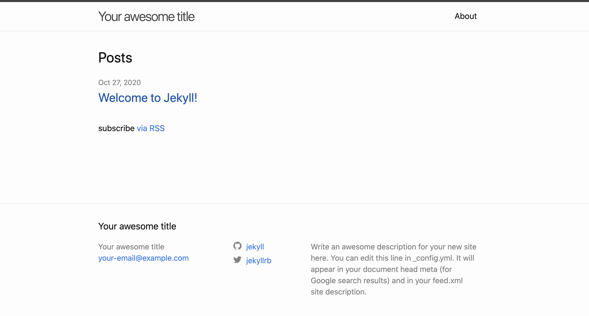
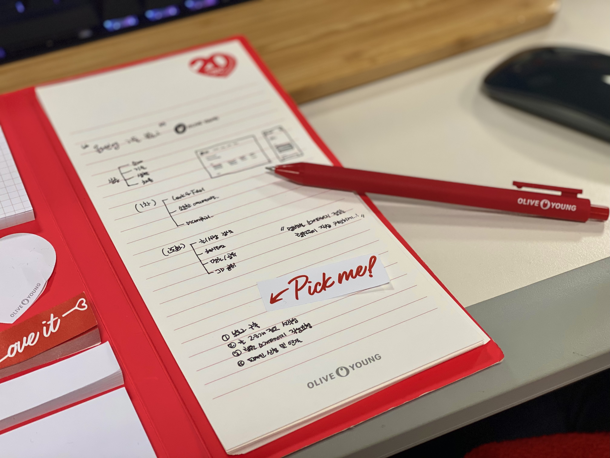
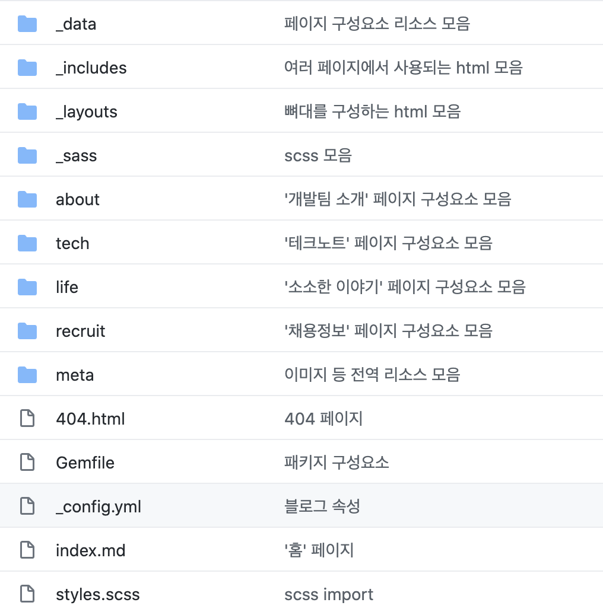

올-하! 💚
안녕하세요. 여러분! 블로그의 첫 포스팅을 맡게된 개발요정입니다.

다들 올리브영은 한번씩 가보셨을테지만, 올리브영에도 멋진 개발팀이 있다는 사실을 모르시는 분들이 많을거라고 생각합니다.
우리도 작게나마 팀 블로그를 만들어 지식과 이야기를 공유하면 어떨까-하는 아이디어를 통해 이렇게 기술블로그로 찾아뵙게 되었습니다!


## 쉽고 빠르면서도 유연한 블로그 플랫폼?
성격급한 개발요정은 블로그 구축 이야기가 나오자마자 빨리 블로그를 런칭하고 싶어 손가락이 근질근질했습니다. 그 과정속에서 [Github Pages](https://pages.github.com/), [Medium](https://medium.com/), [워드프레스](https://wordpress.com/), [티스토리](https://www.tistory.com/), [브런치](https://brunch.co.kr/) 등 여러가지 블로그 플랫폼들이 논의 되었었는데요, 우리는 다음 5가지 주요 포인트를 중점으로 선정을 고민하였습니다.

    1. 자유롭고 유연하게 블로그를 꾸밀 수 있는가?
    2. 편리하게 글을 작성할 수 있는가?
    3. 검색엔진에 노출이 잘 되는가?
    4. 빠르고 가볍게 실행될 수 있는가?
    5. 구축 및 유지비용이 적게 들어가는가?

비록 팀 내에 디자이너는 없지만 나름 '예쁘게 꾸며보자!'는 포부가 있었기 때문에, 커스터마이징이 불가능한 플랫폼들은 1차적으로 논외되었습니다. 또 개발팀인만큼 화려한 에디터보다는 마크다운 문법이 더 익숙한 까닭에 마크다운 문법을 지원하는 플랫폼들로 한번 더 선별하고 나니, [Github Pages](https://pages.github.com/)와 [워드프레스](https://wordpress.com/)가 남게 되었습니다.

[워드프레스](https://wordpress.com/)의 유지비용이 비싸다는 표면적인 이유가 있긴 했으나, 사실 무엇보다 git이 가장 친숙했으므로 최종적으로 [Github Pages](https://pages.github.com/)를 통해 블로그를 구축하자는 의견이 모아졌습니다.

### Jekyll? Hexo? Hugo?
[Github Pages](https://pages.github.com/)는 단순히 사이트 생성을 담당하는 호스팅 플랫폼이기 때문에, 마크다운 문법을 블로그화하기 위해서는 site generator 프레임워크가 따로 필요합니다. 수많은 static site generator 중 [Jekyll](http://jekyllrb-ko.github.io/), [Hexo](https://hexo.io/ko/index.html), [Hugo](https://gohugo.io/) 등이 Github Pages와 함께 연동되는데요, 우리는 그 중 가장 인기가 많은 Jekyll을 선택하게 되었습니다. 또한 Github Pages 자체도 내부적으로 Jekyll에 의해 작동되고 있다는 점에서 Github Pages와 궁합이 가장 좋을 것 같다는 기대감도 작용하였습니다.


## 블로그를 구축해보자!
자, 이제 플랫폼을 결정하였으니 블로그를 구축해야겠죠? 본 내용에서는 Github Pages 구축을 위한 flow를 안내해보겠습니다. 하기 단계를 차근차근 따라하면 여러분도 5분만에 블로그를 개설할 수 있습니다!

(본 내용은 macOS를 기준으로 작성되었습니다. Windows는 [Jekyll on Windows](https://jekyllrb.com/docs/installation/windows/) 가이드를 참고 바랍니다.)

### 환경구성
#### 1. Jekyll 설치
터미널에서 아래 명령어를 실행하여 Jekyll을 설치합니다.
```shell
$ gem install jekyll
```
 기존에 ruby가 설치되어있지 않은 경우 해당 과정에서 ruby를 설치하라는 안내가 뜨기도 합니다. 그럴때는 `brew install ruby` 명령어를 통해 쉽게 ruby를 설치할 수 있습니다.

#### 2. 프로젝트 생성
Jekyll 설치가 완료되었다면 이어서 아래 명령어를 실행하여 새 Jekyll 프로젝트를 생성해줍니다.
```shell
$ jekyll new [github_name].github.io # Jekyll 페이지 생성
$ bundle install # 패키지 설치
$ jekyll serve # 서버 실행
```
Jekyll이 정상적으로 서비스 되었다면, 여기까지 따라온 것만으로도 여러분은 브라우저에서 `http://127.0.0.1/4000` 주소를 입력하여 새 사이트를 접속하실 수 있습니다!

#### 3. Git 업로드
이 자랑스러운 블로그를 로컬에서만 볼 수는 없겠죠? *http://[github_name].github.io* 형태의 멋진 도메인을 갖기 위해서는 [GitHub](https://github.com)에 repository를 생성하여 push 해야합니다. [GitHub](https://github.com) 사이트에 로그인하여 '[github_name].github.io' 이름의 repository를 생성해준 뒤 아래 명령어를 실행하여 블로그를 push 해줍니다.
```shell
$ git init
$ git remote add origin [repository_url]
$ git add .
$ git commit -m "[Commit message]"
$ git push origin master
```

#### 4. 블로그 확인
이제 `http://[github_name].github.io`에 접속하면 성공적으로 블로그가 퍼블리싱 된 것을 확인할 수 있습니다! 🎉


<figcaption>기본 템플릿인 minima 테마의 블로그가 생성되었습니다!</figcaption>


### 기획
현재 단계에서도 충분히 글을 작성하고 공유할 수 있지만, 아직 누군가에게 보여주기에는 좀 밋밋합니다. 깔끔하게 글을 보여주기 위해서는 카테고리도 나눠야하고, 올리브영의 아이덴티티를 나타내기 위해 'OliveGreen'색을 테마로 꾸며보기로 했습니다!

기획 단계에서 크게 정리한 내용은 다음과 같습니다.

    - 페이지 분류: (홈), 소개페이지, 테크노트, 데일리노트, 채용정보 안내
    - Look&Feel: BI color인 OliveGreen, CoralOrange 색상 등을 활용하되 차분하고 세련된 느낌을 줄 것
    - 게시물 별 카테고리를 분류하기 보다는 해시태그 등으로 모아보기 기능 정도로 제공
    - 작성자 별 글 모아보기, 제목/내용 검색 등 필터링 제공
    - 닉네임 체계를 활용하여 친근감있게 접근

이 중 해시태그 모아보기나 검색 기능 등은 고도화 작업으로 구분되어 2차 개발 항목으로 분류되었고, Beta오픈(?)인 1차 개발에서는 페이지 분류 및 블로그 기능을 충실히 제공하는데에 의의를 두었습니다.


<figcaption>블로그 구축을 위한 고민중...</figcaption>

### 프론트 작업
기본적으로 Jekyll은 [마크다운](https://daringfireball.net/projects/markdown/), [Liquid](https://shopify.github.io/liquid/), HTML&CSS를 통해 페이지가 구성됩니다. 마크다운이나 HTML&CSS는 이미 친숙하지만 Liquid는 조금 생소할 듯 한데요, [Liquid](https://shopify.github.io/liquid/)는 Ruby로 작성된 오픈소스 템플릿 language입니다. Jekyll과 함께 사용하면 페이지를 로드하는 시점에 liquid를 통해 컨텐츠를 로드하여 정적인 페이지가 생성됩니다. 사용법 자체가 매우 단순하기 때문에 큰 러닝커브 없이 바로 사용할 수 있다는 점이 매력적입니다.

우리 블로그는 마크다운 + Liquid + HTML&SCSS를 사용하여 아래와 같은 구조로 뼈대를 작업하였습니다.

    단일 페이지 (소개페이지/채용정보)
     └ index.md
    복수 페이지 (테크노트/데일리노트)
     └ yyyymmddhhMM
      └ index.md
        ...
    meta (이미지 등 리소스)
    _data (페이지 구성요소)
     └ members.yml
     └ menu.yml
        ...
    _includes (여러 페이지에서 사용되는 html)
     └ nav.html
     └ home.html
        ...
    _layouts (뼈대를 구성하는 html)
     └ main.html
     └ post.html
    _sass (scss 집합)
     └ _home.scss
     └ _about.scss
        ...
    Gemfile (패키지 구성파일)
    _config.yml (페이지 속성파일)

소개페이지나 채용정보 페이지 등 단일 페이지만으로 구성된 페이지들은 하위에 `index.md` 파일 하나만 두면 됩니다. 테크노트나 데일리노트 페이지는 작성일시를 기준으로 하위폴더를 생성하여 그 내부에 `index.md` 파일을 둡니다. 그 외 기타 구조는 Jekyll의 기본 디자인을 최대한 해치치 않는 선에서 상세하게 폴더를 분류하였습니다.
작성일시를 기준으로 폴더명을 만드는 까닭은 이 폴더명이 곧 하위도메인으로 생성되어 블로그의 url이 되게 되는데요, 한글보다는 숫자가 아무래도 url이 깔끔해보여서 작성일 체계로 가기로 하였습니다.

최상위 루트에서 폴더만 놓고 구조를 보면 다음과 같은 구조가 됩니다.


<figcaption>캡쳐되지 않은 내용에는 README.md, .gitignore 파일 등이 있습니다.</figcaption>

더 자세히 보고 싶다면 [블로그 GitHub repository](https://github.com/oy-alldev/oy-alldev.github.io)를 통해 소스코드가 공개되어 있으니 아무나 오셔서 살펴볼 수 있습니다!


## 포스팅 작성
Github Pages + Jekyll을 선택한 가장 궁극적인 이유인 '마크다운' 문법을 사용하여 포스팅을 작성할 차례입니다. Jekyll 포스팅 작성시에는 포스트 상단에 `key:value` 형식을 사용하여 포스트의 메타 정보를 알려주어야 합니다.
우리 블로그는 다음과 같은 필수요소가 들어가야 합니다.

    - layout: [main or post] // 게시물 레이아웃
    - type: [tech or life] // 페이지 분류
    - date: [yyyy-mm-dd HH:MM] // 글 작성 시간
    - category // 포스트 카테고리
    - title // 포스트 주제
    - subtitle // 포스트 부제
    - writer // 포스트 작성자
    - post-header // 포스트 header 사용 여부
    - header-img // 포스트 header 이미지
    - hash-tag // 포스트 해시태그

포스트 상단에 하기 메타정보들을 작성 후, 마크다운 문법으로 글을 작성하면 Jekyll이 자동으로 블로그에 포스팅 형태로 나타나도록 도와줍니다! 바로 이 특징으로 인해 Jekyll은 '정적 사이트 생성기'라고 불립니다.

지금 보고 계시는 이 포스트도 마크다운 문법으로 작성되어 Jekyll을 통해 퍼블리싱되고, GitHub Pages를 통해 호스팅되어 보여지고 있습니다. 이 포스트의 마크다운을 더 자세히 들여다보고싶은 분들은 [블로그 Github repository](https://github.com/oy-alldev/oy-alldev.github.io/tree/master/tech/2011091042)를 통해 확인하실 수 있습니다!

## 마치며
앞으로도 올리브영의 온라인몰을 포함한 각종 서비스들 개발기부터 사용중이거나 공부중인 기술들, 그리고 그 외의 소소한 작은 이야기들까지 이 블로그를 통해 소통할 예정입니다. 더 풀어나갈 이야기가 무궁무진하니 꾸준한 관심과 많은 사랑 부탁드립니다!
