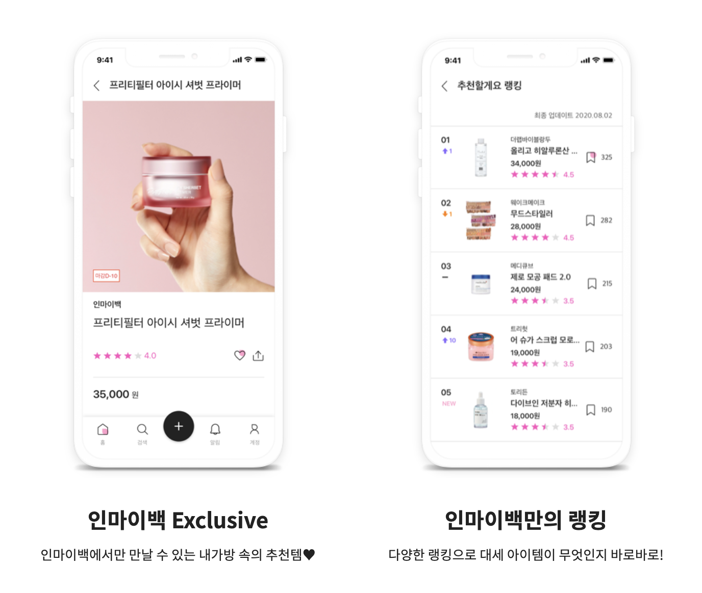
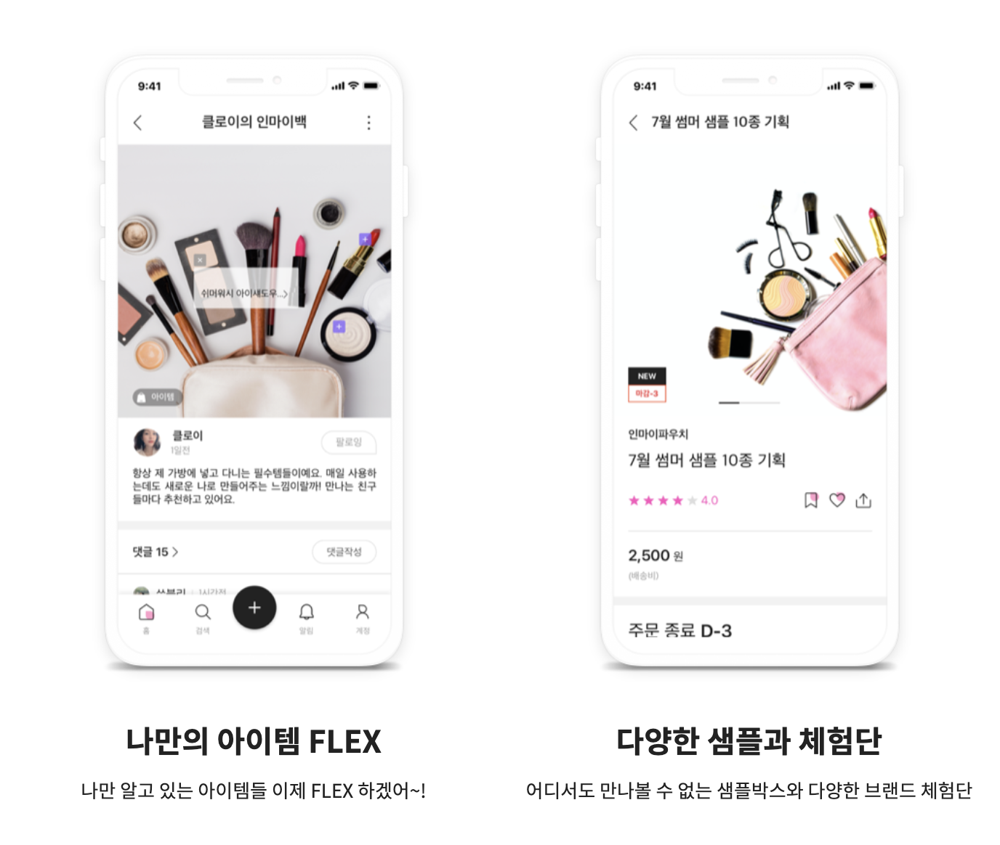
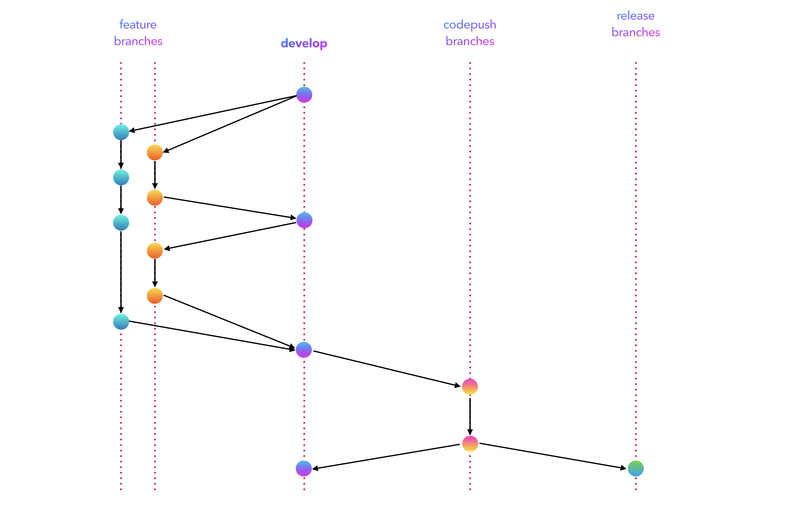

올-하! 💚
안녕하세요. 여러분! 올리브영에서 모바일 앱 개발을 담당하고있는 개발요정입니다. 오늘은 올리브영의 신규 서비스인 '인마이백' 앱 개발기를 이야기해보려고 합니다.

## What's [인마이백](https://inmybag.io/)?



인마이백은 작년에 올리브영에서 출시한 모바일앱으로, SNS와 커머스가 결합된 신개념 복합 플랫폼입니다. 단독특가로만 진행되는 핫한 큐레이션딜을 통해 생생한 아이템 소개와 사용팁을 둘러볼 수 있고, 내 가방 속 아이템을 소개하거나 크리에이터들의 가방 속 아이템을 구경하며 생생하고 다양한 리뷰를 확인할 수 있는 모바일 앱 서비스에요.


## Why ReactNative?
#### 크로스플랫폼 📱
ReactNative의 존재 이유이자 최강 장점인 크로스플랫폼 동시 개발을 위해서가 가장 큰 이유였습니다. 서비스를 위해선 당연하게 Android와 iOS를 모두 지원해야 했는데요, 당시 올디브에는 iOS 앱 개발자가 없었기 때문에 multiple OS 개발이 가능한 플랫폼을 검토 대상에 두었습니다. 또한 한벌의 코드를 작성하고 실행하면, Android와 iOS에서 모두 작동한다는 점은 시간과 비용적인 면에서도 굉장히 큰 절감효과를 가져옵니다. 실제로 인마이백 서비스는 멀티 플랫폼을 지원함에도 불구하고 적은 인원의 개발자로 비교적 단기간에 출시할 수 있던 앱입니다.

#### React로 인해 확 줄어드는 러닝커브 ⚛️
그렇다면 다른 크로스플랫폼인 Flutter, Xamarin, Cordova 등이 아니라 왜 하필 ReactNative로 선정하게 되었는지 궁금할 수도 있는데요, 이미 올디브에서는 React를 사용한 서비스 경험들이 있습니다. React를 다를 줄 아는 팀원들이 많았기 때문에 러닝커브를 반 이상 줄여서 큰 진입장벽 없이 ReactNative를 도입할 수 있었습니다.

#### HIP ✨
아직도 몇년째 버전 1로 올라오지 못했지만, 그럼에도 불구하고 꾸준히 핫한 플랫폼입니다. '우리도 ReactNative 한번 써보자!' 하는 마음이 맞는 개발자들끼리 모여 개발을 시작하게 되었습니다.

## How to develop?
#### Typescript
ReactNative는 [공식 가이드](https://reactnative.dev/docs/typescript)에서도 TypeScript 사용을 장려하고 있습니다. 인마이백도 마찬가지로 TypeScript를 적용하여 코드를 작성하고 있습니다. TypeScript를 사용할 경우 Code look은 다음과 같습니다.
```typescript
import React from 'react';
import { Button, StyleSheet, Text, View } from 'react-native';

export interface Props {
  name: string;
  enthusiasmLevel?: number;
}

const Hello: React.FC<Props> = (props) => {
  const [enthusiasmLevel, setEnthusiasmLevel] = React.useState(
    props.enthusiasmLevel
  );

  const onIncrement = () =>
    setEnthusiasmLevel((enthusiasmLevel || 0) + 1);
  const onDecrement = () =>
    setEnthusiasmLevel((enthusiasmLevel || 0) - 1);

  const getExclamationMarks = (numChars: number) =>
    Array(numChars + 1).join('!');
  return (
    <View style={styles.root}>
      <Text style={styles.greeting}>
        Hello{' '}
        {props.name + getExclamationMarks(enthusiasmLevel || 0)}
      </Text>
      <View style={styles.buttons}>
        <View style={styles.button}>
          <Button
            title="-"
            onPress={onDecrement}
            accessibilityLabel="decrement"
            color="red"
          />
        </View>
        <View style={styles.button}>
          <Button
            title="+"
            onPress={onIncrement}
            accessibilityLabel="increment"
            color="blue"
          />
        </View>
      </View>
    </View>
  );
};

const styles = StyleSheet.create({
  root: {
    alignItems: 'center',
    alignSelf: 'center'
  },
  buttons: {
    flexDirection: 'row',
    minHeight: 70,
    alignItems: 'stretch',
    alignSelf: 'center',
    borderWidth: 5
  },
  button: {
    flex: 1,
    paddingVertical: 0
  },
  greeting: {
    color: '#999',
    fontWeight: 'bold'
  }
});

export default Hello;
```

#### Redux
전역으로 관리해줄 필요가 있는 데이터는 Redux를 사용하여 구성했습니다. 여러가지가 있지만 제가 사용했던 부분은, 상세 화면에서 '좋아요' 상태값 변경 후 목록화면으로 되돌아갈 때 API 재호출을 통해 리스트를 전체적으로 갱신하지 않아도, 업데이트 된 항목의 '좋아요' 상태만 갱신해 줄 수 있도록 하는데에 적용하였습니다.

#### State와 Effect
Redux 오용을 최소화하고자 각 화면별 State를 권장사용하였습니다. 데이터가 바뀌면 View가 갱신되는 flow를 따라갑니다.

### 브랜치 전략

인마이백 저장소는 크게 4가지 브랜치로 분류되며, 메인 브랜치인 develop 브랜치부터 가지 브랜치인 feature, codepush, release 브랜치를 가지고있습니다.
처음에는 release 이후에는 태그를 따는 방식으로 진행했다가 여러 시행착오를 거쳐 브랜치 형태로 가져가는 것이 프로젝트 특성에 알맞아 현재까지 유지되고 있습니다.
* **develop**: 메인 브랜치입니다. 현재 개발중인 가장 최신 코드가 반영되어 있습니다.
* **feature**: 기능 단위별 feature 브랜치입니다. develop 브랜치에서 분기되어 develop 브랜치로 병합됩니다.
* **codepush**: QC를 위한 브랜치입니다. 어느 정도 릴리즈 가능하게끔 개발이 끝나면 develop 브랜치에서 분기되어 QC fix를 진행하게 됩니다. QC가 끝나면 최신 현상을 develop 브랜치에 병합하고 release 브랜치를 checkout 합니다.
* **release**: 기능이 출시되어 운영 기준으로 가장 최신 코드가 반영된 브랜치입니다. QC가 끝난 codepush 브랜치에서 분기되어집니다.

### 컨벤션
[Airbnb Script Convention](https://github.com/airbnb/javascript)을 따릅니다.
indent를 포함한 기본적인 look set은 git hook을 사용하여 커밋시 auto align 시켜줍니다. 이로써 여러명이 작성한 코드도 한명이 작성한 코드처럼 보여질 수 있습니다.

또한 팀 내 개발룰에 맞게, 모든 feature는 PR 승인제를 통해 머지되어집니다. 최소 1명 이상의 승인이 있을 때에만 develop 브랜치에 반영이 가능하고, 리뷰어는 꼼꼼히 코드를 리뷰해줍니다. 활발한 리뷰를 통해 자주적인 토의 및 오류를 선발견함으로써 비교적 양호한 코드 품질을 유지할 수 있었습니다.

### 라이브러리 환경
인마이백에는 크게 다음과 같은 환경이 구성되어 있습니다. 
각 항목별 적용기는 추후 포스팅을 통해 더 자세하게 다룰 예정입니다. 😊

- **네트워크 서비스**: [axios](https://github.com/axios/axios)
- **푸시 메시지**: [Firebase 클라우드 메시징(FCM)](https://firebase.google.com/docs/cloud-messaging)
- **통계/오류보고**: [Firebase Crashlytics](https://firebase.google.com/products/crashlytics)
- **광고 타겟팅**: [Facebook Pixel](https://www.facebook.com/business/learn/facebook-ads-pixel), [Google Tag Manager](https://marketingplatform.google.com/intl/ko/about/tag-manager/)
- **화면 전환/탐색**: [React Navigation](https://reactnavigation.org/)
- **로그인**: [Facebook 로그인](https://developers.facebook.com/docs/facebook-login), [네이버 아이디 로그인(네아로)](https://developers.naver.com/docs/login/overview/), [카카오 로그인](https://developers.kakao.com/docs/latest/ko/kakaologin)
- **배포**: [Code Push](https://microsoft.github.io/code-push/)

## How to deploy?
### 코드푸시
빠른 배포를 위해 MS AppCenter의 [CodePush](https://microsoft.github.io/code-push/)를 적용하였는데요, Code Push는 말 그대로 앱 업데이트 없이 코드를 바로 푸시! 할 수 있는 라이브러리로, 은행앱이나 게임앱에서 앱 실행 전 패치 파일을 받아와서 리소스를 업데이트하는 모습과 비슷합니다.

기존에는 각 스토어에 앱을 업데이트하기 위해서는 [ 스크립트 코드 번들링 > 앱 빌드 > 스토어 게시 > 심사 > 출시 ] 단계를 거쳐야만했는데요, 코드푸시를 적용하게되면 단 명령어 한 줄만으로! 앱을 업데이트할 수 있습니다.

```shell
$ appcenter codepush release-react -a ${PROJECT NAME} -d ${DEPLOY NAME}
```

처음 적용할 때는 과연 오류없이 잘 될까하는 의구심이 있었는데, 출시 이후 수백번의 배포를하는 동안 문제 없이 코드푸시가 이루어지고 있어 매우 유용하게 잘 사용하고 있습니다. ReactNative와의 궁합이 아주 좋기 때문에 ReactNative 프로젝트를 진행하는 경우 CodePush도 함께 적용하기를 적극 권장하고 싶습니다. CodePush 적용에 대한 가이드 포스팅도 추후 자세히 다룰 예정입니다!


## ReactNative를 사용해보며 느낀점
ReactNative를 사용해보니 장점과 단점이 극명한 플랫폼이라는 것을 느꼈습니다. 많은 사이트에서 ReactNaitve의 장단점을 다루고 있지만, 개인적으로 제가 느낀 경험 위주로 장단점을 작성해보려고 합니다.
### 장점
#### 찐으로 Hot한 속도 🔥
Hot Reload를 통해 코드를 작성한 즉시! 빌드를 하지 않아도 바로바로 변경사항을 확인할 수 있습니다. 항상 네이티브 개발, 특히 Android 앱 개발을 해오면서 최대 2분 이상 걸리는 빌드 환경 때문에 늘 코드를 잔뜩 작성해놓고 빌드를 최소화하는게 습관이 되어있던 저로서는 굉장한 기쁨이었습니다. (폭풍코딩하다 빌드 버튼 눌러놓고 한숨 돌리는게 업무 리듬이었는데, Hot Reload 덕분에 쉬지 않고 일할 수 있었습니다.. 따흑🥲)

#### 크로스플랫폼 지원 💻
앞에서도 계속 이야기한것이지만, 제가 이제껏 써온 하이브리드 플랫폼 중에는 가장 탄탄하다고 생각이 드는 플랫폼입니다. 적은 인원과 빠른 시간만에 두 OS로 앱을 출시할 수 있었던 것은 ReactNative의 공이 가장 컸습니다. 심지어 저희 개발자 중에는 Windows 환경에서 개발한 개발자도 있답니다! 🤭 윈도우에서 iOS앱을 개발할 수 있다니 놀랍지 않나요? 

#### 빠른 배포 🚀
코드푸시를 사용함으로써, 스토어에서 앱을 심사받지 않고도 업데이트할 수 있다는 점이 가장 매력적입니다. 심사에 대한 부담감과 업데이트 기간을 단축시켜주고, 긴급 배포가 있을 때에도 정말 요긴했습니다. ReactNative + CodePush와 함께라면 2-3일씩 걸리던 앱 업데이트가 2-3초면 가능해집니다.

#### 라이브러리 풀 📚
기본적인 api외에도 외부 라이브러리가 굉장히 많습니다. '혹시 이런 것도 있을까?' 하는 것 마저 있습니다. '아, 요런거 없을 것 같은데 우리가 이 기회에 라이브러리 하나 만들어보자!' => 있습니다. Native와의 브릿지 개발이 언젠간 필요하겠지싶어 프로젝트 초기 셋팅 때 CustomBridge를 만들 수 있도록 보일러플레이팅 작업을 했었는데요, 그 마저도 필요 없었을 정도로 커스텀 브릿지 하나 없이 프로젝트를 완성했습니다.

### 단점
#### 더블 디버깅 
디버깅이 힘듭니다. 오류보고에는 앱이 죽었다고 나와있는데, 스크립트 영역에서 화면을 그리다가 무언가의 이슈로 Fatal 오류가 나면 추적이 굉장히 어려워집니다. 또한 어떤 UI 이슈가 있을 때 ReactNative의 이슈인지, Native 영역의 이슈인지 두번 확인해야합니다. 일례로 `FlatList`를 사용할 때 Android에서 스크롤 속도가 굉장히 느려지는 이슈가 있었는데요, `FlatList`가 원인임을 찾기 전까지는 렌더링 이슈인지 컴포넌트 이슈인지, 데이터 이슈인지 정확한 원인 분석이 힘들었습니다.

#### 라이브러리 버전 싱크
ReactNative 프로젝트 특성 상 외부 라이브러리를 많이 사용할 수 밖에 없게 되는데요, 각 라이브러리끼리 버전 충돌이 잦습니다. 또 OS 업데이트가 있을 때 ReactNative 버전을 올릴 일이 생기는데, 이런 경우에도 외부 라이브러리 버전을 모두 맞춰줘야합니다. 이번 iOS14 업데이트 당시에도 14 OS를 지원하는 ReactNative 버전으로 올리고나니 외부 라이브러리들이 해당 ReactNative 버전 대응이 늦어서 앱을 업데이트할 수 없었던 아찔한 상황이 있었습니다.

## 마치며
인마이백 프로젝트는 지금 이 순간에도 개발자들의 열정으로 빠르고 꾸준히 리팩토링 되고 있는 프로젝트입니다. 🔥 
아직은 많은 시행착오를 거치고 있지만 조금씩 편리성과 성능을 개선해나가고 있습니다.
향후에는 Recoil, HoC 등 적용 계획이 있는데 올해 상반기 쯤에는 성공적인 리팩토링 적용기로 다시 한번 찾아봴 수 있으면 좋겠습니다!