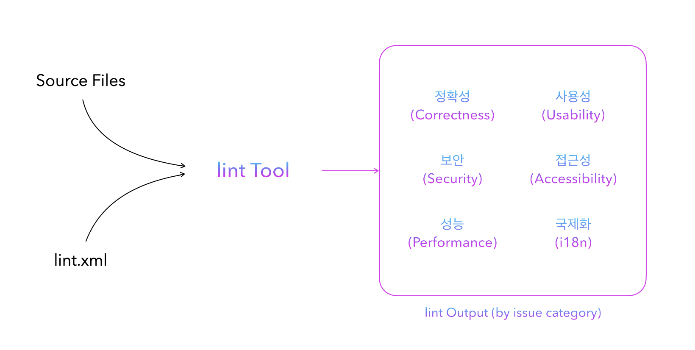
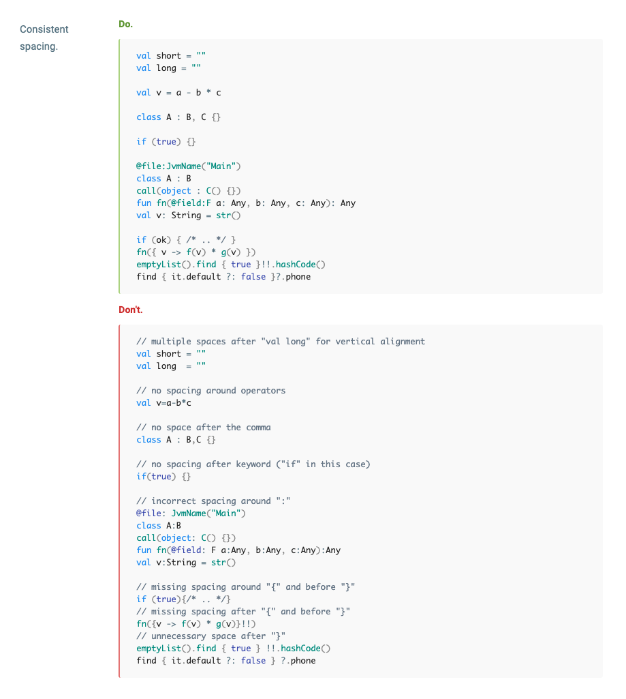
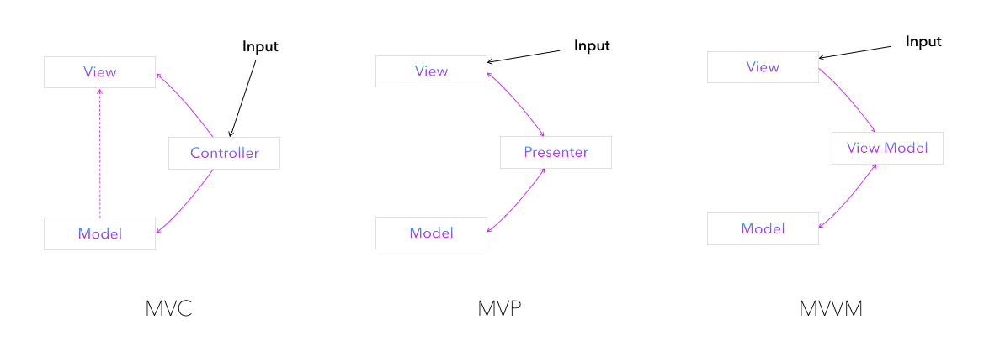
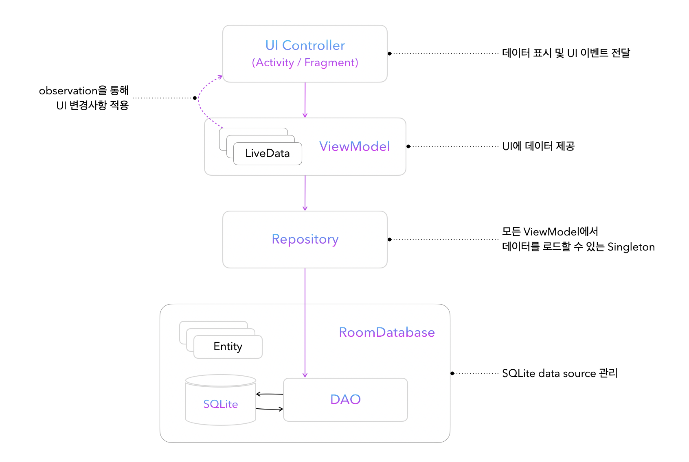
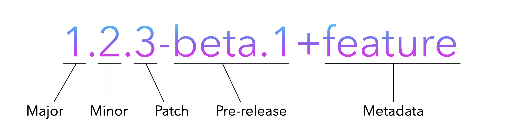
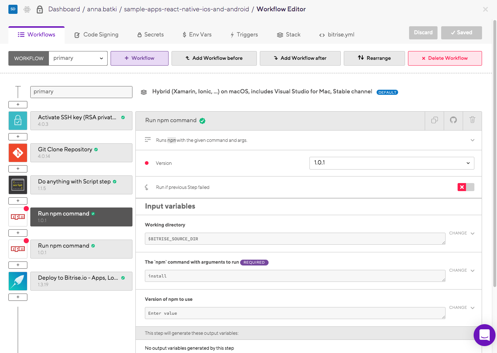
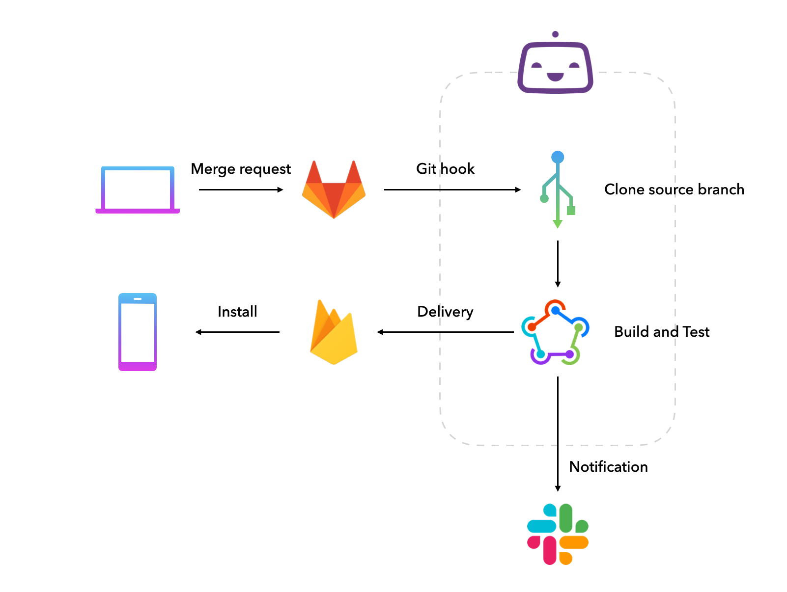
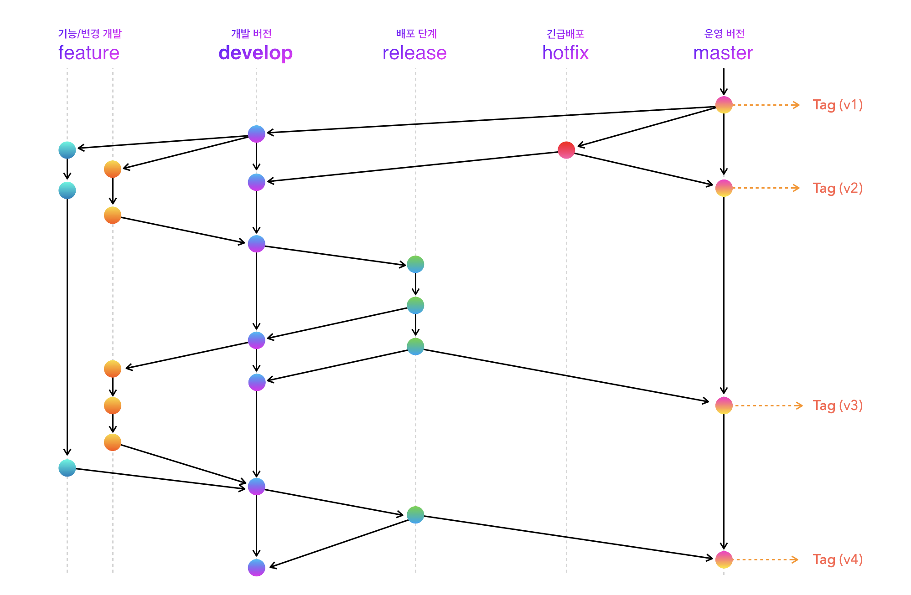

올-하! 💚 안녕하세요. 여러분! 올리브영에서 모바일 앱 개발을 담당하고있는 개발요정입니다. 오늘은 올리브영 앱을 개발하는 앱개발 파트의 업무 프로세스 수립 및 팩토링 과정을 이야기해보려고 합니다.

올리브영앱은 2016년 처음 출시된 이후부터 계속 웹앱으로 유지되고 있었지만, 더 나은 사용자 환경을 위해 하이브리드 플랫폼으로의 개편을 앞두고 있습니다. 그 과정에서 진행된 밑바닥부터 시작하는 프로세스 수립기, 함께 보시죠!


## 🌱 창세기

> 하느님께서 말씀하시기를 “빛이 생겨라.” 하시자 빛이 생겼다. / 빛을 낮이라 부르시고 어둠을 밤이라 부르셨다. 저녁이 되고 아침이 되니 첫날이 지났다.
> 하느님께서 말씀하셨다. “물 한가운데에 궁창이 생겨, 물과 물 사이를 갈라놓아라.” / 하느님께서는 궁창을 하늘이라 부르셨다. 저녁이 되고 아침이 되니 이튿날이 지났다.

월드 베스트셀러 성경의 첫 장 '창세기'는 6일에 걸쳐 신이 세상을 만드는 과정에 대한 이야기입니다. 첫째날에는 빛을 만들고 둘째날에는 하늘을 만들고, 셋째날에는 식물, 그리고 마지막날엔 사람을... 갑자기 웬 성경이냐 하시겠지만, 앱개발 파트의 프로세스 수립기는 흡사 무에서 유를 만드는 성경의 창세기와 비슷합니다. 

파트의 출범을 위해서는 생각보다 할 일이 많습니다. '업무 프로세스', 참 딱딱한 말이지만 어쨌든 개발업무를 위한 프로세스를 수립해 봅시다! 이 문서의 앱개발 파트 창세기는 총 7장으로 구성되어있습니다.

#### 📖 목차

* [1장. 코딩 컨벤션 수립](#창세기-1장-코딩-컨벤션-수립)
* [2장. 앱 아키텍쳐 설계](#창세기-2장-앱-아키텍쳐-설계)
* [3장. 버저닝전략 수립](#창세기-3장-버저닝전략-수립)
* [4장. 배포전략 수립](#창세기-4장-배포전략-수립)
* [5장. 브랜치전략 수립](#창세기-5장-브랜치전략-수립)
* [6장. 티켓 라이프사이클 정의](#창세기-6장-티켓-라이프사이클-정의)
* [7장. 개발 적용](#창세기-7장-안식일아니고-개발-시작)


<br/>

# 창세기 1장. 코딩 컨벤션 수립

제가 생각하는 개발업무의 가장 기본은 협업입니다. 한국인들은 한국어로 소통하고 중국인들은 중국어로 소통하듯이, 개발자들끼리 소통하기 위해서는 같은 컨벤션 안에서 소통해야합니다.

## 📖 코드 스타일 가이드 정의

앱개발 파트에서 사용하는 언어 stack은 크게 Kotlin, Swift, Typescript가 있습니다. 이 언어들을 사용해서 Android, iOS, ReactNative 플랫폼 앱을 만들어요. 그러니 각 플랫폼별 언어 사용환경에 맞게 코드 스타일을 정의해야합니다. 일반적으로는 각 언어 별로 스타일 가이드를 제공하고 있기 때문에 큰 틀은 이를 따르면 되지만, 조직에 맞는 코드 스타일을 따로 고민할 필요는 있습니다. 예를들면 인덱스 변수를 정의할 때 A 언어에서는 `index` 네이밍을 권고하고, B 언어에서는 `idx` 네이밍을 권고한다면 각 플랫폼에 맞는 권고를 따라갈지, 조직 내 코드 스타일을 수립해서 플랫폼 제약 없이 통일할지 등의 논의가 필요하죠.

다음은 올디브 앱개발 파트의 코드 스타일 수립에 베이스가 된 언어 별 스타일 가이드입니다.

- [Swift Style Guide](https://google.github.io/swift/)
- [Kotlin Style Guide for Android](https://developer.android.com/kotlin/style-guide)
- [Airbnb React/JSX Style Guide](https://airbnb.io/javascript/react/)

## 🤝 Lint 적용

자, 스타일 가이드를 정했으니 이제 끝난걸까요? 아닙니다. 이미 익숙한 컨벤션들이지만, 몇십 페이지나 되는 스타일가이드를 정확히 외우고 지키기는 어렵습니다. 내가 작성한 코드들이 컨벤션에 맞는지 나 대신 검사해줄 Lint를 적용할것입니다. 마치 중앙선 침범 방지를 위해 가드레일을 설치하는 작업이죠!

테스트를 빌드하여 앱이 기능적 요구사항을 충족하는지 확인하는 것 외에도 린트를 통해 코드를 실행하여 코드에 구조적 문제가 없는지 확인하는 것이 중요합니다. lint 도구를 사용하면 구조적 문제로 인해 앱의 안정성과 효율성에 영향을 미치거나 코드 관리에 지장을 줄 가능성이 있는 코드를 찾을 수 있습니다. lint에서 감지된 각 문제는 설명 메시지 및 심각도 수준과 함께 보고되므로 개선이 시급한 순서대로 신속히 우선순위를 정할 수 있습니다. 문제의 심각도 수준을 낮춰서 프로젝트와 관련이 없는 문제를 무시하거나 심각도 수준을 높여서 특정 문제를 강조표시할 수도 있습니다.


<figcaption>AndroidLin가 앱 소스파일을 처리하는 모습</figcaption>

위 그림에서의 lintTool은 코드와 애플리케이션의 품질과 성능에 영향을 미칠 수 있는 구조적 코드 문제를 검사하는데요, 예를들면 코틀린의 코드 스타일 검사를 위한 ktlint에는 다음과 같은 항목이 있습니다. 



<figcaption>ktlint에서 space 남용을 검사하는 예시</figcaption>

자, 그럼 이제 플랫폼 및 언어 별로 올디브에서 적용한 lint 도구들을 안내합니다.

### Android (Kotlin)

* [ktlint](https://ktlint.github.io/)

  ktlint는 코틀린을 위한 정적 분석 도구로, 코틀린으로 작성한 코드의 스타일 검사와, 형식에 맞지 않는 부분을 수정하는 기능을 제공합니다. Kotlin 공식 코드 스타일 가이드를 기준으로 indentation부터 세미콜론, 와일드카드 등 기본적인 규칙부터 접근제어자의 순서, 불규칙적인 spacing 등까지 꼼꼼히 검사합니다.

* [detekt](https://github.com/detekt/detekt)

  detekt는 단순한 문법검사를 넘어 정적 분석을 통해, 지양해야하는 패턴들에 대한 감지와 특정 패턴들의 가중치를 파악하는 등 코드 본연의 문제를 파악할 수 있게 도와줍니다. ktlin가 코드의 스타일을 위한 검사를 시행한다면, detekt는 코드 품질을 검사합니다.
  
* [Android Lint](https://developer.android.com/studio/write/lint)

  ktlint, detekt는 언어영역(Kotlin)을 검사한다면, AndroidLint를 통해 프로젝트 구조를 검사할 수 있습니다. 예를들어 XML 리소스 파일에 사용되지 않는 네임스페이스가 있다면 공간을 차지하고 불필요한 처리가 발생합니다. 지원 중단된 요소 또는 타겟 API 버전에서 지원하지 않는 API 호출의 사용과 같은 다른 구조적 문제가 발생하는 경우 코드가 올바르게 실행되지 않을 수 있습니다. AndroidLint를 사용하면 이런 문제를 해결할 수 있습니다.


### iOS (Swift)

* [SwiftLint](https://github.com/realm/SwiftLint)

  SwfitLint는 [GitHub Swift 스타일 가이드](https://github.com/github/swift-style-guide)를 기반으로 코드 스타일 및 규칙을 적용하는 도구입니다. 다른 lint 도구와 마찬가지로 기본적인 문법사용과 코드의 구성을 검사하는데, 특이한점은 auto-correct 기능도 제공한다는 것입니다. 특정 위반 사항은 자동으로 수정되게끔 도와주는데, 물론 코드 유실의 가능성이 있기 때문에 Local file changes history 관리가 잘 되고 있는지 여부 등을 체크하여 적용하는 것이 중요합니다. 
  

### ReactNative (React, Typescript)

* [ESLint](https://eslint.org/)

  ESLint는 JavaScript, JSX의 정적 분석 도구로 오픈 소스 프로젝트입니다. 코드를 분석해 문법적인 오류나 안티 패턴을 찾아주고 일관된 코드 스타일로 작성하도록 도와줍니다. 저희는 Airbnb 스타일 가이드를 따르기 때문에, ESLint에 추가적으로 Airbnb 규칙을 설정해주었습니다. [eslint-config-airbnb](https://github.com/airbnb/javascript/tree/master/packages/eslint-config-airbnb) 패키지를 설치하면 손 쉽게 스타일 가이드를 적용할 수 있습니다.

* [Prettier](https://prettier.io/)

  위에서 코틀린 스타일 가이드를 설정할 때 코드 스타일을 위한 ktlint와 코드 품질을 위한 detekt를 따로 적용한 것 처럼, Prettier를 추가로 적용하였습니다. ESLint가 lint를 통해 코드의 품질을 검사한다면 Prettier는 정해진 스타일대로 코드를 정리해주는 formatter입니다. 

  다만 ESLint와 Prettier를 동시 적용할 시, 규칙이 겹치는 부분이 일부 있습니다. 또한 외부 라이브러리의 소스코드가 위치하는 `node_modules/` 디렉터리 혹은 lock 파일들은 코드 검사를 할 필요가 없겠죠. 이런 경우를 위해 설정파일에서 특정 규칙 및 경로 등을 무시하도록 하는 설정을 해주어야 합니다.


<br/>

# 창세기 2장. 앱 아키텍쳐 설계

코드에 대한 컨벤션 정의가 끝나면, 이제 구조에 대한 컨벤션을 정의해야합니다. 구조에 대해 본격적으로 논의하자면 끝도 없겠지만, 우선 이 글에서는 코딩 패턴에 대한 아키텍쳐를 다루려고 합니다.

## 🎨 MVVM 패턴

어떤 패턴이 좋은가에 대한 주제로 이야기하면 올디브 구성원 모두가 신이나서 토론할 정도로 다들 디자인패턴에 관심이 많고, 실제로도 매주 점심시간을 할애하여 디자인패턴 스터디를 진행하기도 했습니다. 저 또한 '앱 개발 디자인은 이 패턴이 맞다!'라고 과감하게 정의내릴 수는 없지만, 다수의 프로젝트 경험을 통해 MVC, MVP, MVVM 패턴을 사용해본 바로서는 그 중 MVVM 패턴을 주로 선호하는 편입니다.



<figcaption>MVC, MVP, MVVM 패턴 비교</figcaption>

각 패턴별 특징에 대한 이야기를 하자면 글이 너무 길어질 것 같아서 자세한 비교는 나중에 하기로하고, 제가 생각하는 특징 위주로 왜 MVVM 패턴을 차용하게 되었는지만 설명하겠습니다.

* MVC: Controller에 많은 코드가 몰리게되고, 각 모듈별 의존성이 강해서 변경사항이 발생하면 Model, View, Controller가 모두 변경되어야 합니다.
* MVP: View와 Model 간의 의존성은 삭제되었으나 View와 Presenter 간의 의존성이 1:1 수준으로 강하게 적용됩니다.
* MVVM: 데이터 바이딩을 통해 View와 ViewModel은 1:n 관계를 가질 수 있습니다. 이로써 모듈별 의존성이 없어지고 독립적이게 됨으로써 역할별 유닛테스트가 용이하고, 비동기성 코드를 작성할 수 있게됩니다.

MVVM 패턴을 선호하기 때문에 특징이 MVVM 장점 위주로.. 편향되어 작성되었습니다만..^^ 현재 각 모바일 OS 플랫폼 공식 가이드에서 가장 권고하는 패턴 역시 MVVM라는 점 또한 선택에 있어서 크게 작용하였습니다.

## 👇 Reactive Programming

사실 MVVM를 차용하게 된 가장 큰 이유인 reactive한 코드를 작성하는 것이 설계단계의 가장 주된 key point였습니다. Reactive programming을 위해 각 플랫폼별로 셋팅해줘야 할것들이 있는데요, 굳이 설정하지않아도 reactive programming이 가능하지만 설정할 경우 각 플랫폼 및 언어에 맞게끔 구조적인 코딩이 가능합니다.

### Android (Kotlin)

* [Android Architecture Components](https://developer.android.com/topic/libraries/architecture?hl=ko)

  AAC는 앱 구조를 더 튼튼하고, 테스트에 용이하고, 유지 보수성이 뛰어나게 만들어 주는 앱을 디자인하도록 돕는 라이브러리 모음입니다. `LiveData`, `ViewModel`, `Room` 크게 3가지를 지원하는데, 이러한 라이브러리의 모음은 MVVM 패턴의 구조의 설계에 최적화 되어있습니다.

  

  <figcaption>AAC를 활용한 MVVM 구조</figcaption>

  [Livedata](https://developer.android.com/topic/libraries/architecture/livedata?hl=ko)를 사용하여 기본 데이터베이스가 변경되면 뷰에 알리는 데이터 객체를 빌드하고, [ViewModel](https://developer.android.com/topic/libraries/architecture/viewmodel?hl=ko)은 UI 관련 데이터를 저장합니다. [Room](https://developer.android.com/topic/libraries/architecture/room?hl=ko)은 SQLite 객체 매핑 라이브러리입니다. Room을 사용하여 상용구 코드를 피하고 SQLite 테이블 데이터를 자바 객체로 쉽게 변환할 수 있습니다. Room은 SQLite 문의 컴파일 시간 확인을 제공하며 RxJava, Flowable, LiveData observable을 반환할 수 있습니다.

* [Coroutines](https://developer.android.com/kotlin/coroutines)

  코루틴은 비동기적으로 실행되는 코드를 간소화하기 위해 Android에서 사용할 수 있는 동시 실행 설계 패턴입니다. Android에서 코루틴은 기본 스레드를 차단하여 앱이 응답하지 않게 만들 수도 있는 장기 실행 작업을 관리하는 데 도움이 됩니다.

  코루틴을 사용하면 우선 메모리 누수 감소에 도움이 됩니다. [구조화된 동시 실행](https://kotlinlang.org/docs/reference/coroutines/basics.html#structured-concurrency)을 사용하여 범위 내에서 작업을 실행할 수 있습니다. 또한 코루틴을 실행 중인 스레드를 차단하지 않는 [정지](https://kotlinlang.org/docs/reference/coroutines/basics.html)를 지원하므로 단일 스레드에서 많은 코루틴을 실행할 수 있어, 보다 더 많은 동시 작업을 지원하면서도 차단보다 메모리를 절약합니다. 또한 실행 중인 코루틴 계층 구조를 통해 자동으로 [취소](https://kotlinlang.org/docs/reference/coroutines/cancellation-and-timeouts.html) 전달이 가능합니다.

### iOS (Swift)

* [RxSwift](https://github.com/ReactiveX/RxSwift)

  RxSwift 하나에 초점을 두기보다는 왜 Rx냐를 설명하는것이 더 설득력이 클것 같습니다. Rx를 사용해온 경험속에서 코드가 모듈화되고 클로저안에서 Thread를 상황에 맞게 적용해가며 코딩할 수 있어 가독성 면에서도 꽤나 품질이 상향되었다는 느낌을 받았습니다. 통일된 방식으로 Event, Thread, Time, Exception 처리 방식을 제공하고, 메소드 외부로는 읽기 전용의 Observable 형태로 제공하기 때문에 코드가 깔끔해집니다. 또한 콜백지옥을 해결해주고, 여러 모듈들을 체이닝하는데에 탁월하여 Rx를 매우 사랑하고 있습니다. 

  특히 Android/iOS와 같은 UI 프로그래밍이 필요한 경우에 더더욱 진가를 발휘한다고 생각하는데요, 복수의 비동기 처리 완료 후 결과값을 합치거나 연속클릭 이벤트 발생으로 인한 이벤트 중복실행을 제어하는 등 UI 특성 이슈를 해결하는 데에 유리합니다.

### ReactNative

* ReactNative는 태생 자체가 Reactive programming을 위한 React에서부터 나왔기 때문에 라이브러리 도움 없이도 기본적인 State 관리만으로 충분히 Reative한 프로그래밍이 가능합니다. 따라서 ReactNative에선 어떻게 패턴을 녹여야할까에 대한 부분은 아직 고민중에 있습니다. 대신 이 과정에서 읽게된 좋은 블로그 글을 공유합니다. [Building Reactive Apps with Redux, RxJS, and Redux-Observable in React Native](https://www.toptal.com/react-native/react-redux-rxjs-tutorial)


<br/>

# 창세기 3장. 버저닝전략 수립

버저닝전략을 수립한다는 것은 사실상 배포전략만큼이나 중요한 것임에도 불구하고 그 중요성이 꽤나 간과되고 있습니다. 기능단위보다 일정단위로 배포를 하게되면 특별한 고민없이 패치 버전만 1씩 올리는 상황이 빈번한데요, 실제로 올리브영앱도 일정 기준으로만 배포를 진행하다보니 패치버전만 계속해서 올리고 있었습니다.

### [Semantic Versioning](https://semver.org/lang/ko/)

올리브영앱의 버저닝전략이 될 시멘틱 버저닝은 가장 자주 쓰이는 소프트웨어 버전전략입니다. 시멘틱 버저닝은 버전을 3가지인 Major(주), Minor(부), Patch(수)로 분류합니다. 기존 버전과 호환되지 않게 기능이 변경되면 Major 버전을 올리고, 기존 버전과 호환되면서 새로운 기능을 추가할 때는 Minor 버전을, 기존 버전과 호환되면서 버그를 수정한 것이라면 Patch 버전을 올립니다. 그리고 정식배포 전 버전인 경우 해당 버전과 메타데이터를 위한 라벨을 덧붙입니다.

  

<figcaption>Semantic Versioning</figcaption>

사실 '시멘틱 버저닝'이라는 규칙 없이도 감(?)으로 잘 사용해왔는데 왜 굳이 버저닝전략까지 수립해야하는지 의아할 수도 있습니다. 그에 대한 해답을 위해 시멘틱버저닝 가이드에서 안내하는 내용을 첨부합니다.

>유의적 버전은 혁신적인 아이디어가 아니다. 사실, 이미 이와 비슷한 방식으로 버전을 정해서 쓰고 있었을 수 있다. 문제는 이와 “비슷한” 방식으로는 충분치 않다는 점이다. 어떠한 형태로 정식 명세를 정해서 따르지 않는다면, 버전 번호는 의존성 관리에서 무의미하다. 이상의 아이디어에 이름을 정하고 명시적인 정의를 내림으로써, 소프트웨어 사용자에게 제작자의 의도를 전달하기 쉬워진다. 의도가 명확해야만, (너무 지나치지는 않은) 융통성 있는 의존성 명세를 만들 수 있다.
>
>유의적 버전으로 어떻게 의존성 지옥을 벗어날 수 있는지 간단한 예를 들어보자. “Firetruck”이라는 라이브러리가 있다고 하자. 이 라이브러리는 유의적 버전이 붙은 “Ladder”라는 패키지에 의존한다. Firetruck을 만들었을 때, Ladder는 버전 3.1.0이었다. Firetruck이 3.1.0에 처음으로 추가된 기능을 사용했기 때문에, Ladder의 의존성을 3.1.0 이상, 4.0.0 미만으로 지정할 수 있다. 이제, Ladder의 3.1.1 버전과 3.2.0 버전이 공개된다면, 패키지 관리 시스템에 그 버전을 넣을 수 있고 기존 소프트웨어와 호환될 것이라고 알 수 있다.


<br/>

# 창세기 4장. 배포전략 수립

버저닝전략을 수립했으니 이제 배포전략을 수립할 차례입니다. 일반적으로 Android는 PlayStore 베타테스트 배포를 통해, iOS는 AppConnect Testflight 배포를 통해 앱을 테스트하고, 테스트가 완료되면 프로덕션 트랙으로 출시합니다. 그러나 기능 개발을 하다보면 feature 단위로 QA를 진행해야하는데, 각 스토어는 기능 버전 별 다운로드를 제공하는데에 불편함이 있어 타 배포 서비스를 사용할 필요를 느꼈습니다.

## 📝 프로세스 요구사항

어느 시점에 배포를 진행할건지, 배포 단계에서의 요구사항은 어떤 것들이 있는지를 도출하고 결정해야합니다. 앱개발파트에서 필요한 내용은 다음과 같습니다.

```
1. 특정 시점에 자동으로 테스트/릴리즈 배포가 가능할 것
2. 테스트 성공/실패 여부는 메신저 알림을 통해 즉각 파악할 수 있을 것
3. Crash report가 용이할 것
4. 테스트 시 동시에 여러버전을 제공할 수 있을 것 / 과거 버전 히스토리 확인이 가능할 것
5. self-hosted GitLab 환경에서 동작이 가능할것
```

1-5번의 요구사항 충족을 위해 Jenkins를 활용하는 방법부터 fastlane, circleci, Bitrise를 검토했는데, 우선 falstlane과 circleci는 요구사항 미충족으로 제외되었고, Jenkins보다는 Bitris가 제공하는 기능이 훨씬 다양해서 최종적으로 Bitrise를 사용하게 되었습니다. ~~그리고 Jenkins는 못생겼습니다.~~

## 🚀 CI/CD 워크플로우 설정

Bitrise에 앱을 추가하면 플랫폼, 종속성 및 구성을 자동으로 분석하여 빌드-테스트-배포를 위한 기본 워크플로우를 구성해줍니다. 이 워크플로우를 활용하면, Android/iOS 각각 따로 빌드하고 배포할 필요없이 하나의 flow로 테스트 및 출시가 가능해집니다. 또한 이 외에도 180개 이상의 통합 툴을 제공하여 Firebase, JIRA, Slack 등 서비스와 연동이 가능합니다.



<figcaption>이 훌륭한 워크플로우를 보세요!</figcaption>

어떤 CI/CD 전략을 가져가느냐는 서비스마다 다르겠지만, 일반적으로 앱개발 파트 내에서 개발하는 앱에 대한 공통적인 워크플로우는 다음과 같습니다.



작업 중인 featrue MR이 승인되고나면, git hook을 통해 Bitrise가 해당 브랜치를 감지하여 clone 받습니다. gradle/pod/npm 등의 환경 테스트, lint 검사, test 코드 테스트 등을 통해 build 및 테스트 과정이 완료되면 [Firebase App Distribution](https://firebase.google.com/docs/app-distribution)을 통해 앱을 배포하고, 테스터는 이를 통해 앱을 다운받을 수 있습니다. 이 과정에서 [Slack](https://slack.com/)을 통해 성공/실패여부가 전달됩니다.

<br/>

# 창세기 5장. 브랜치전략 수립

브랜치전략은 git flow를 그대로 따르는데, 기능/변경 개발을 위한 `feautre` 브랜치, 가장 최신 개발버전의 코드가 반영되어있는 `develop` 브랜치, 배포 준비를 위한 `release` 브랜치, 그리고 운영 버전으로 관리되는 `master` 브랜치가 있습니다. 배포를 위해 `master` 브랜치에 머지가 완료되고나면 각 배포된 버전별로 태그를 땁니다. 이 때 운영 배포된 버전에서 이슈가 생기는 특수한 상황을 위해 `hotfix` 브랜치가 사용될 수 있습니다.




<br/>

# 창세기 6장. 티켓 라이프사이클 정의

이번 장은 이슈를 발행하고 해결하기까지의 이슈 라이프사이클에 대한 내용입니다. 쉽게 말해 찐 '업무 프로세스'인거죠. 좀 있어보이도록 '티켓 라이프사이클'이라고 명명하였습니다.

티켓처리를 위한 도구는 이미 사내에서 사용중인 이슈 협업툴이 있기 때문에 추가로 정의하지 않았습니다.


##### 1. 티켓발행

기획팀으로부터 기능/변경 개발 요구사항이 발행됩니다. 개발팀은 사내 레드마인을 통해 티켓을 전달받습니다.

##### 2. 에피타이저

본격적인 개발 논의가 시작됩니다. 특정 배포일까지의 배포건들을 모아서 금번 배포일정을 확인하고, 담당자를 지정해야합니다. 간단한 다과와 함께 이야기를 나눕니다. 각 티켓이 어떤 목표와 기획을 가지고 있는지 의도를 파악하고, 이를 구현하기 위해 특별한 기술들이 필요한지 등을 논의합니다. 이 과정에서 적합한 담당자를 정하기도 합니다.

##### 3. [플래닝포커](https://ko.wikipedia.org/wiki/%ED%94%8C%EB%9E%98%EB%8B%9D_%ED%8F%AC%EC%BB%A4)

일정을 수립하는 단계입니다. 플래닝포커 방식을 통해 일정을 산출하고 토론합니다. 이 과정에서 본인이 할애할 수 있는 공수와 티켓 일정을 매칭하여 티켓을 할당받고, 특별히 하고싶~~거나 하기싫~~은 개발건이 있는 경우 개발자간 티켓을 교환할 수 있습니다.

##### 4. 개발

개발이 시작됩니다. 단순한 기능 개발 뿐 아니라 단위 테스트 코드도 함께 작성합니다.

##### 5. 리뷰

개발 과정에서 활발한 코드리뷰를 진행합니다. 코드리뷰를 통해 승인된 커밋만 개발브랜치에 머지할 수 있습니다. 서로 다른 티켓을 작업하지만, 서로의 코드를 리뷰함으로서 지식의 공백을 최소화합니다.

##### 6. 배포

단위테스트-통합테스트까지 모두 완료되면 배포를 진행합니다.

##### 7. 회고

배포 사이클이 완료되면 회고를 진행합니다. 중간중간 진행하는 코드리뷰는 단순히 코드와 기능을 리뷰한다면, 이 단계에서는 내가 이번 티켓 처리를 통해 어떤 부분을 고민하고 어떤 부분이 힘들었는지, 추후에 어떤 부분에 또 적용될 수 있는지를 고민하고 이야기합니다.


<br/>

# 창세기 7장. 안식일..아니고 개발 시작..!

성경에는 7일차엔 모든 환경설정(?)이 끝나고 안식일에 들어갔던 것 같은데, 환경설정이 끝난 개발자는 이제 개발을 시작할 차례입니다. (눈물) 그런데 그렇다고해서 바로 개발을 시작할 수 있나요? 사소하지만 몇가지 해야할 일이 조금 더 남았습니다. 뭔가 한참 달려온것 같은데, 아직도 할 일이 많습니다!

## Git ignore 설정

Git에서 프로젝트를 생성할 때 자동으로 ignore 파일을 generate 해주는 옵션이 있지만, [gitignore.io](https://www.gitignore.io/) 사이트에서 더 상세한 ignore 파일 추출이 가능합니다. 예를들어 iOS 프로젝트를 위한 ignore 파일은 `macOS`, `Swift`, `Xcode`, `CocoaPods` 키워드를 넣고 생성하였습니다.

이미 push된 repository에 git ignore를 신규 적용하려면, local 경로에 `.gitignore` 파일을 위치해두고 하기 명령어를 통해 모든 소스 파일을 삭제 후 ignore 규칙에 해당하는 파일만 커밋하는 방식으로 잘못 커밋된 파일을 repository 상에서 제거해주어야 합니다.

```shell
$ git rm -r --cached .
$ git add .
$ git commit -m "Apply .gitignore"
$ git push
```

## Flavor 적용

어쩌면 배포전략에 이어지는 내용인데요, 테스트 빌드와 릴리즈 빌드를 구분하기 위해 코드 상에서 Flavor 분기를 해주어야 합니다. 그냥 빌드타입을 체크하거나 상수를 분리하는 하드한 방법도 있습니다만 이는 프로페셔널하지 않으니 `debug` / `release` 등의 flavor를 설정해줍니다.

## TDD

단위테스트 모듈 작성을 위해 TDD를 어떻게 적용할건지에 대한 고민과 논의, 그리고 적용이 필요합니다.

## 보일러플레이트 작성

이제야 뭔가 코딩을 시작하는 느낌입니다. 기본적인 보일러플레이트 작성을 통해 코드의 근간을 잡아줍니다. 개발 과정에서도 활발하게 코드리뷰가 진행되지만, 저는 이 과정에서 이루어지는 코드리뷰가 가장 즐겁습니다. 


<br/>

# 마치며

사실 처음 이 글을 작성하기 시작할 때만 해도 이 문서의 내용이 이렇게 길어질 줄 몰랐습니다.. 후반부에선 파트 별로 짧게 작성하려고 노력하다보니 용두사미 같은 글이 되어버렸네요. 😅 추후에 항목별로 더 자세히 포스팅하여 글 내용에 적용기 링크도 연결해보겠습니다. 글 컨셉을 성경의 창세기로 잡았는데, 단순한 유머코드(?)로 봐주셨으면합니다!

수립과정에 있어 추가로 더 필요한 부분이나 혹은 불필요한 부분이 있을 수 있습니다. 저희가 모르는 또 다른 방향이 있을 수 있고, 어떤 부분은 각자의 경험에 의거한 토론이 더 필요하기도 합니다. 올디브에서 직접 앱개발 파트 수립기를 함께하고 토론하고 더 나은 방향으로 함께 만들어가고 싶으신 분이 있다면 [채용 정보](http://tech.oliveyoung.co.kr/recruit/) 페이지를 확인해 주세요! (오픈된 앱개발자 공고가 없더라도 편하게 메일 주세요! 📨)