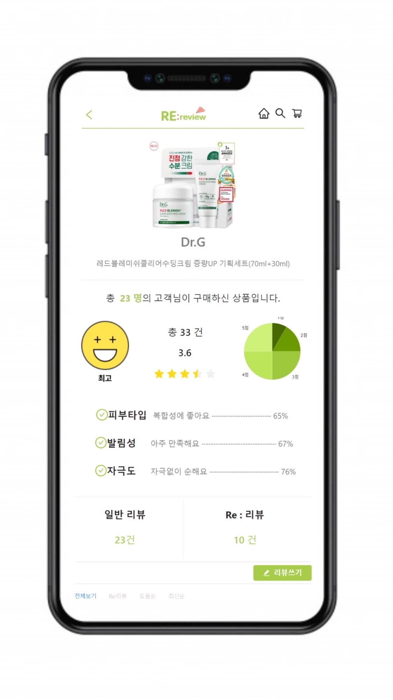
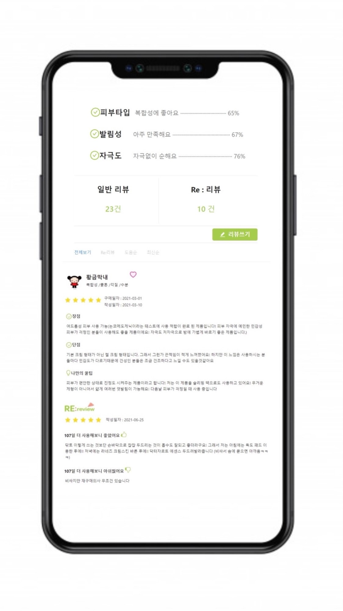
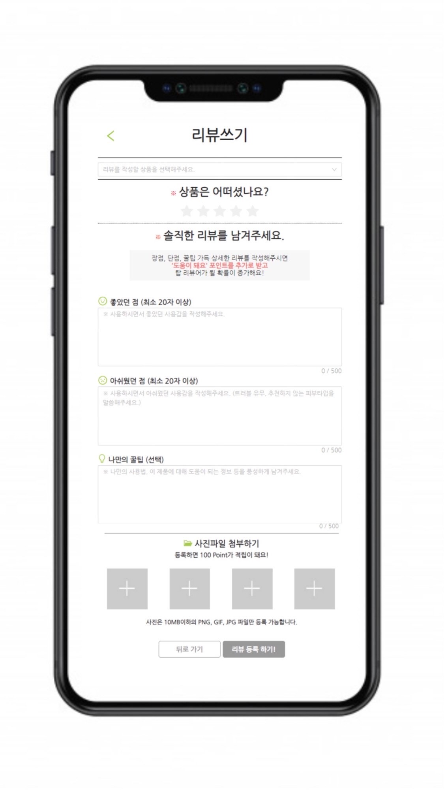
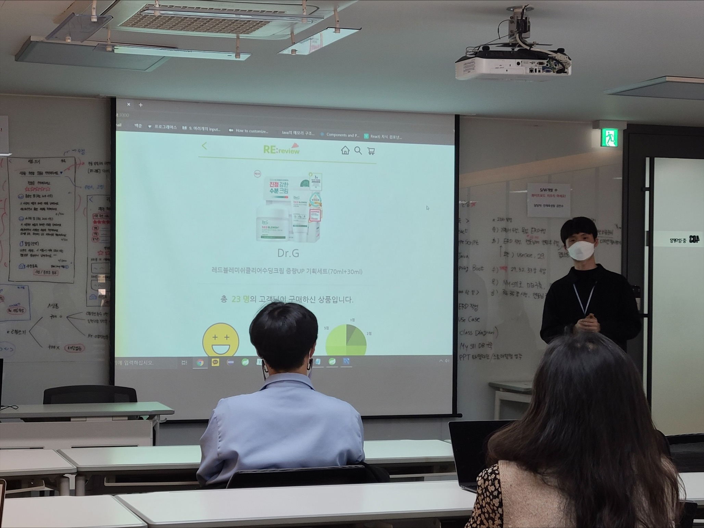

> 올-하! 💚 안녕하세요. 여러분! 올리브영 서비스개발팀 신입사원 홍시홍입니다.  
올리브영에 입사했을 때만 해도 아직 추운 겨울이였는데 벌써 봄이 지나고 여름이 다가오고 있네요 🌱    
취준생 시절 올리브영 기술블로그를 염탐하며 꿈을 키우던 제가 이렇게 게시글을 올리게 되다니 너무 감격스럽습니다 🙊🙊  
그럼 앞서 의지수님이 작성하신 글에 이어 *S/W 개발 직무 후속 교육 프로젝트 경험* 2탄을 공유해보도록 하겠습니다!   
부족한 글 실력이지만 열심히 써내려가 볼께요 :)

## 다시 쓰는 리뷰, Rereview ✍🏻
먼저 저희가 한달동안 열심히 만든 웹 앱 리리뷰를 소개해드리겠습니다.

    
    
    

리리뷰 앱은 다음과 같이 총 3개의 페이지로 구성되어 있습니다.

#### 1. 리뷰 상세페이지
상품을 구매한 고객 수, 리뷰를 작성한 고객 수, 리뷰 총 평점, 고객 선호타입 별 비율 등 리뷰정보를 한눈에 알아볼 수 있도록 별점과 도표 등을 활용하여 레이아웃을 구성했습니다.

#### 2. 리뷰 리스트
고객 닉네임, 선호 타입, 평점 뿐 만 아니라 리뷰 항목을 장점, 단점, 나만의 꿀팁 란으로 나누어 읽기 쉬운 리뷰를 만들었습니다.  
그리고 리리뷰를 작성했을 경우 바로 하단에 보일 수 있게 구성했습니다.

#### 3. 리뷰 작성
리뷰 작성 시 작성가능한 리뷰목록을 셀렉트 바를 통해 쉽게 접근할 수 있도록 했습니다.  
또한, 리리뷰를 작성할 시 상단에 이전 작성 항목을 불러옴으로써 리뷰작성에 편의성을 높였습니다.
  
 

> 아무래도 한달이라는 시간동안 기획부터 앱 제작까지 진행하다 보니 회원가입, 로그인, 마이페이지 등 여러 페이지부분이 빠져서  
완성도 높은 앱을 만들지 못했다는 점이 많이 아쉬웠습니다 😢

 

## 프로젝트 발표 🙋🏻‍♂️
드디어 아기다리고기다리던 발표회 당일!! 여기저기서 저희를 보러오신다는 생각에 긴장반 설렘반,, 😳

하지만 언제그랬냐는듯 프로페셔널한 모습으로 복스뮤직님이 멋지게 발표를 해주셨답니다 👏 👏  

  

발표회 후에 서비스개발팀 팀원분들과 코드리뷰 시간을 보냈었는데요,
저희 네명이 작성한 코드에 대해 다양한 피드백을 제공해주셨습니다.   
아직 다듬어지지 못한 저희의 개발새발 코드임에도 불구하고 적극적으로 리뷰해주셔서 부족한 부분을 채워나갈 수 있었답니다. 👩🏻‍💻🧑🏻‍💻‍👩🏻‍💻🧑🏻‍💻

 
## 프로젝트를 마치며...

>이번 리리뷰 앱 프로젝트를 하면서 가장 크게 와닿았던 부분은 'React 의 편리성' 이였습니다.  
학부시절 프론트엔드 작업을 주로 Java로 많이 했었는데요, 각 페이지 레이아웃을 구성할 때 마다 긴 코드를 작성해야 된다는 점이 저에게는 조금 번거롭게 느껴졌었습니다.
> 하지만 이번 프로젝트를 통해 리액트라는 언어를 처음으로 접하게 됐고, 제가 필요한 부분의 컴포넌트만 골라 import해서 사용하면 된다는 점이 너무 신세계였습니다. 🌈    

>사실 처음에 어느정도 단위로 컴포넌트를 나눠야 할지 감이 잘 오지 않았습니다. 그래서 하나의 파일에 제가 맡은 부분의 페이지의 모든 코드들을 작성한 뒤 반복해서 사용되는 부분이 어디일까 고민하며 영역을 나눠봤어요. 그렇게 하나하나 컴포넌트로 빼다보니 나중에는 어느정도 감이 오더라구요 ! 혹시 리액트를 처음 접하는 분들이라면 저처럼 *bottom-up(상향식) 개발을 진행해보는 것도 컴포넌트에 익숙해 지는데 도움이 될거라고 생각합니다 ;)
  *bottom-up : 계층 구조의 상층부에 있는 컴포넌트 부터 만드는 것

>그리고 제가 와닿았던 리액트의 특징중 하나는 바로 단방향 데이터 바인딩 이였습니다. 부모 -> 자식으로서의 데이터 흐름인데요, 저는 이부분이 오히려 코드를 작성할 때 tree를 그리는 것처럼 머리속으로 정리할 수 있어서 좋았습니다! (데이터 조작이 불편하다고 단점으로 느끼는 분들도 있어요 ㅠ.ㅠ)
이러한 특징들 외에도 virtual DOM을 활용해서 렌더링을 빠르게 할 수 있다는 점, 다양한 라이브러리 활용이 가능하다는 점 등등 리액트의 매력은 무궁무진하답니다 ✨

>TMI 하나 알려드리자면, 저는 과거 프로젝트를 진행할때면 백엔드 극극 찬양론자였다는 사실,,  🙄 하지만 리리뷰 프로젝트를 통해 리액트의 매력에 푹 빠져 지금은 프론트엔드 개발자가 되기위해 하루하루 열심히 배우고 있답니다. (찡긋) 😉  
블로그를 작성하는 게 처음이라 너무 주저리주저리 떠들었던것같네요.. 다음에는 조금 더 글실력을 높여서 돌아오도록 하겠습니다!   
> 긴 글 읽어주셔서 감사합니다 :) 그럼 다음에 또 만나요 여러분 !!  👋 올-바~~! 💚 

  

