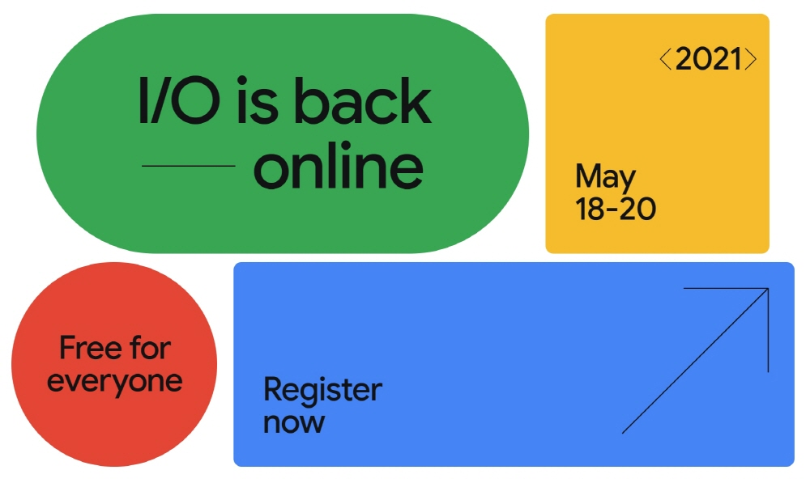
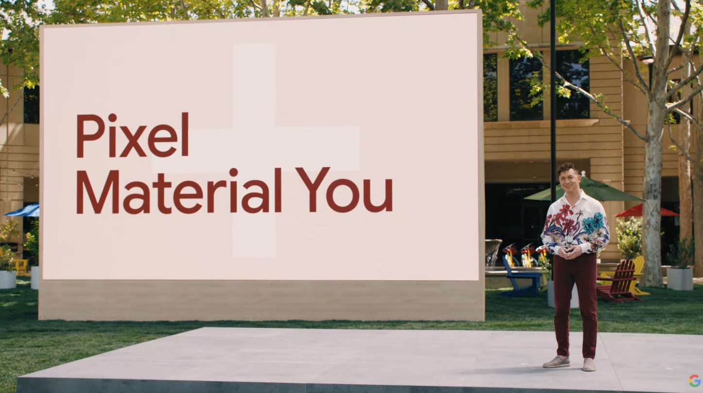
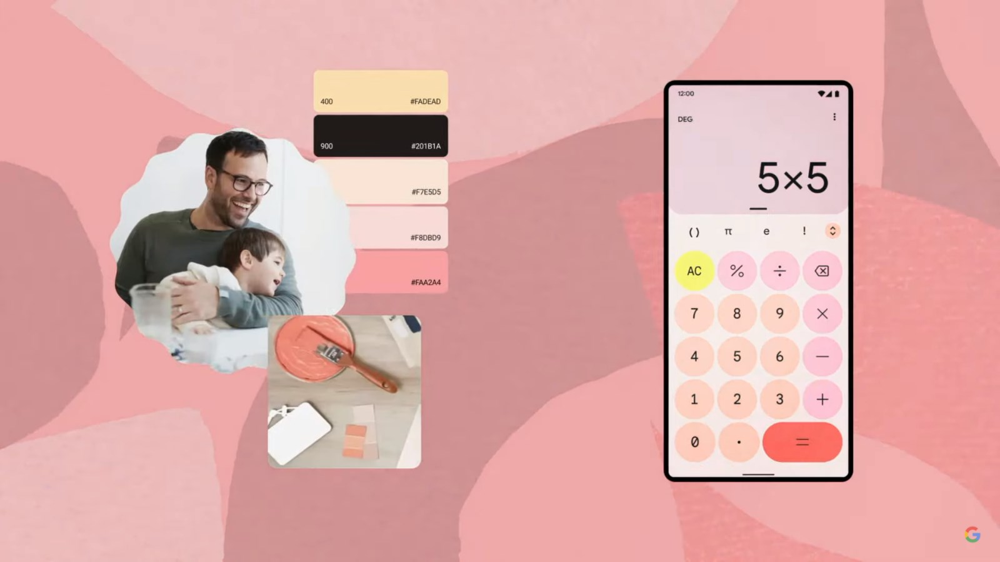
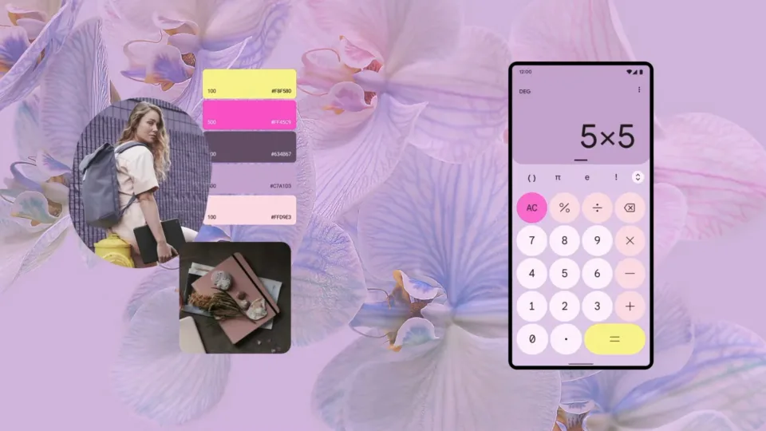
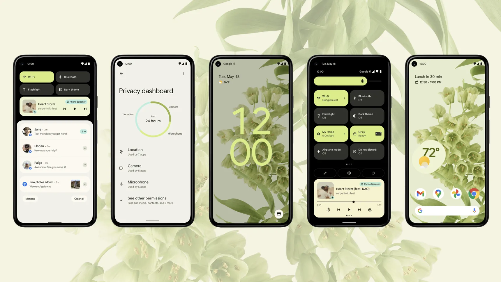
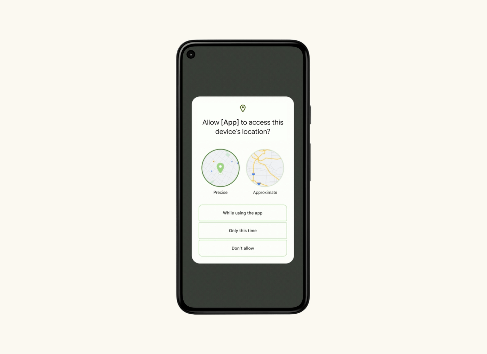
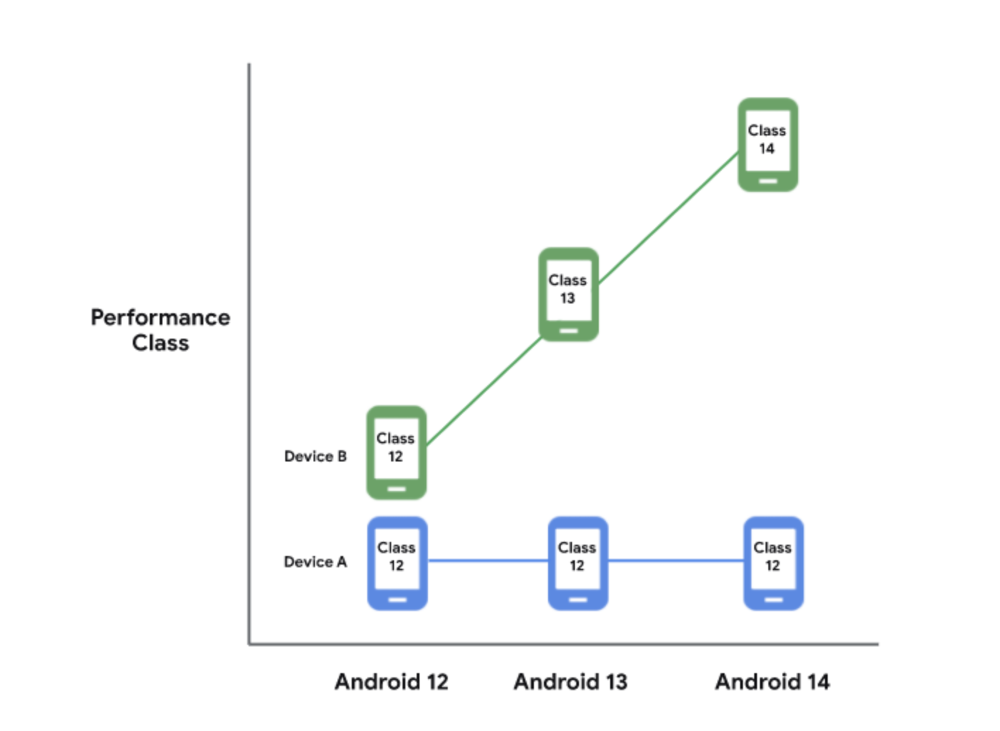
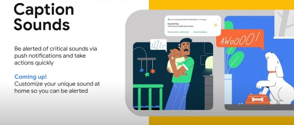

여러분 안녕하세요💚 올리브영 모바일 앱에서 안드로이드 개발을 담당하고 있는 의지수입니다. 오늘은 5월달에 열렸던 Google I/O 2021에서 소개된 안드로이드12에 관한 이야기를 해보려 합니다.

## Google I/O 2021

 
Google I/O는 일년에 한 번 개최되는 개발자 지향 컨퍼런스로 2008년부터 시작된 구글의 연례행사입니다. 작년에는 코로나 바이러스 확산으로 인해 취소되었는데요. 올해 몇 가지 새로운 발표와 함께 멋지게 돌아왔습니다!
그 중에서도 가장 기대를 모았던 것이 바로 안드로이드 12였습니다. 사실 안드로이드 12는 지난 2월 첫 번째 개발자 프리뷰가 발표되고 별다른 오피셜이 없었기에 모두들 Google I/O 2021에서 안드로이드12의 공식적인 발표가 있을 것으로 예상했기 때문이죠.
그래서인지 구글은 안드로이드 12에 대한 이번 업데이트를 **안드로이드 역사상 가장 큰 디자인 변화**라고 설명했습니다.
 

## Android 12

역사상 가장 큰 디자인의 변화! 몇 년 만에 안드로이드 12는 전체 시스템 인터페이스가 대대적으로 바뀌었습니다. 새로운 디자인 언어와 더불어 추가된 기능들까지, 어떠한 점이 달라졌을까요?

### 1. Material You

   구글은 안드로이드 5.0부터 적용되었던 Material Design의 업데이트 버전인 Material You를 발표했습니다.

 
**Design**에서 **You**로의 변화, 느껴지시나요?  
이번 I/O 영상에서 유독 Personal이라는 단어를 많이 확인할 수 있는데요. 바로 디자인 변화의 핵심도 사용자 개개인의 자유로운 커스텀이 키워드였기 때문입니다.
Material You는 사용자의 전체 UI에서 일정하게 유지되는 사용자 지정 색상 팔레트를 자동 생성한 후 색상과 보색을 결정하여 정해진 컬러 테마들이 배경 화면과 모든 앱에 반영되게 도와줍니다.
예를 들어 핑크색이 많이 들어간 배경을 설정하면 핑크 색을 기본 컬러로 인식하여 이에 상응하는 색상들로 다른 여러 앱들이 아주 예쁘게 표현됩니다.  
 

   
자동 생성된 색상 팔레트는 라이트 모드와 다크 모드 모두 지원하며 사용자들에게 디자인적 개인화를 주는 대신 몇 가지 매개변수를 시스템에서 제어하여 텍스트가 안보이거나 색상이 잘 보이지 않는 사태를 방지하는 조치를 취했습니다.

 

### 2. 위젯 디자인

안드로이드 12에서 새롭게 추가된 기능 중 iOS와 가장 유사한 디자인은 **새로운 위젯**입니다. 일반 위젯은 모서리가 둥근 iOS와 비슷한 사각형으로 바뀌었고 알림창 역시 기존의 원형 아이콘을 대신해 둥근 사각형에 텍스트와 함께 배치하여 정보성을 높였습니다. 여기에 알림 음영 또한 Material You의 색상 테마에 따라 색상이 달라지게끔 설정되었습니다.  
    

### 3. 개인 정보 보호 강화

구글은 안드로이드 12에 더 많은 **개인정보 보호** 기능들을 추가했습니다. 이 기능들은 새롭게 '개인정보 대시보드'와 함께 제공되어 어떤 앱이 어떤 것에 엑세스할 수 있는지 빠르게 확인할 수 있고 빠르게 취소할 수도 있게 되었습니다. 구글 개발자들이 강조한 개선사항은 마이크와 카메라 정보입니다. 이것은 iOS 14와 비슷한 기능인데요. 앱이 마이크와 카메라에 엑세스할 때마다 실시간으로 파악 가능한 표시가 나타나고 사용자들이 수상하다고 판단될 경우 이를 차단할 수 있도록 도와줍니다.  
     또한 위치 정보 보호가 강화되었습니다. **대략적인 위치 제공 기능**을 제공하여 어플리케이션 제작사가 사용자의 상세 주소에 접근하지 못하도록 차단하는 기능을 추가했습니다. 이에 대해 구글은 사용자들이 정보 주권을 행사할 수 있도록 도와주는 것이라 설명했습니다.

 

### 4. 성능 향상

안드로이드 12에서는 사용자와 스마트폰 간 상호작용이 보다 간소화됩니다. 즉 사용자가 화면에 탭을 하고, 문지르고, 스크롤하는 작업을 더 부드럽게 느낄 수 있도록 기본 시스템을 전면 설계하여 배터리 효율을 높였습니다. 안드로이드 11 대비 코어 시스템 서비스에 필요한 **CPU 작업시간을 최대 22% 단축**시켰고 처리 속도와 응답성을 향상했습니다. **빅 코어 사용을 15.4%나 절감**하여 배터리 사용 시간을 늘렸습니다.   
안드로이드 장치의 표준화도 제공하여 내 스마트폰 성능에 맞는 앱을 사용할 수 있을 전망입니다. 예를 들어, 안드로이드 12를 사용하는 스마트폰이 안드로이드 14로 운영체제를 업그레이드했지만 스마트폰의 성능이 뛰어나지 못하다면 클래스 12 수준의 앱을 그대로 사용할 수 있습니다.

 

### 5. 장애인들을 위한 기능

구글은 IT기업으로서 **장애인들이 일반인들과 다름없이 생활할 수 있도록 하는 기술**들을 개발 중이라 합니다. 그의 일환으로 안드로이드 12 업데이트를 통해 장애인들의 삶의 질 개선에도 도움이 되는 기능들이 추가될 예정입니다.
시각장애인들을 위한 TTS (텍스트를 소리로 변환해주는 기술) 서비스인 '톡백' 기능을 강화하고 청각장애인들이 주변 소리에 쉽게 대처할 수 있도록 스마트폰 깜빡임이나 진동으로 알리는 접근성 기능이 도입됩니다.  

 

## 마치며 

> 2년만에 유튜브 생중계로 다시 돌아온 Google I/O 2021.  
> 역시 구글은 올해도 자신들의 신기술을 멋지게 뽐냈습니다. 구글은 워낙 크고 다양한 프로젝트를 진행하기에 컨퍼런스를 조금만 시청해도 흥미롭고 다양한 프로젝트들을 볼 수 있었습니다. 그 중 이제 막 안드로이드 길에 입문하게 된 저에게 안드로이드 12에 관한 소식은 너무나도 재밌고 흥분되는 소식이었습니다.
> 무엇보다 새로운 UI와 위젯 디자인들의 변화가 설레임을 안겨주었습니다..💗 또한 업데이트를 통해 새롭게 추가되는 기능들을 보며 요즘 이슈가 되고 있는 부분들과 더불어 iOS와 비교하여 경쟁력을 갖추기 위한 변화들도 기꺼이 빠르게 해내겠다는 구글의 의지가 느껴졌습니다.
> 안드로이드 12는 올해 가을 구글의 스마트폰인 Pixel에 먼저 적용되며 점차 모든 안드로이드 폰에 업데이트될 것으로 발표되어 저도 계속해서 팔로우업하며 기대해보려 합니다! 함께해요!

 
*이 외에도 Google I/O 2021은 유튜브, 구글 맵, 포토, AI, 퀀텀 컴퓨터 등 다양하게 재밌는 프로젝트가 많이 소개되었습니다. 유튜브를 통해 한 번 시청해보세요 :)*
