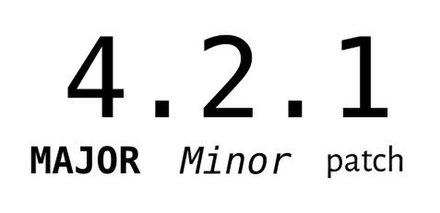
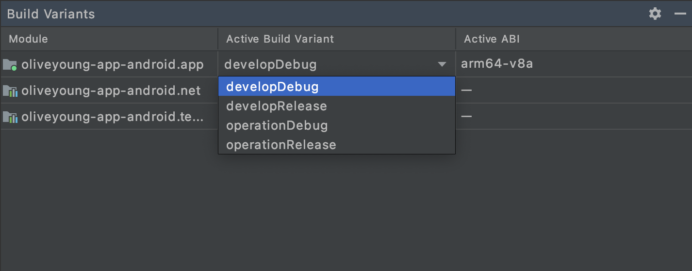

---
layout: post
type: tech
date: 2021-07-01 10:10
category: App
title: 앱 버전 관리하기
subtitle: 올리브영 안드로이드 앱 버전의 숨겨진 비밀..은 없다!
writer: 834840
post-header: true
header-img: img/android.png
hash-tag: [Android, App, Versioning]
--- 
<hr />
여러분 안녕하세요💚 올리브영 모바일 앱에서 안드로이드 개발을 담당하고 있는 의지수입니다. 생각보다 블로그로 자주 인사드리게 되네요 :)  오늘은 앱개발 파트에서 안드로이드 앱 버전 관리를 어떻게 하고 있는지 소개하는 글을 써볼까 합니다. 
사실 버전 관리를 주제로 정한 이유가 있는데요.. 몇 주 전에 버전 이름을 자동으로 설정되게 적용했다가 나비효과처럼 아주 예상치 못한 곳에 영향을 미쳐 문제가 생긴 적이 있었어요.. 🦋.. 그 후에 찾아보다보니 앱 버전 관리는 생각보다 더 중요했고 그렇게 알게 된 것들을 공유해보고자 이 글을 쓰게 되었습니다 🤔
<hr />

## 버저닝

모두들 개발을 하다보면 버저닝에 대한 생각이 점점 생겨나는 것 같아요. 저는 개발에 입문한지 그리 오래되진 않았지만 옆에서 **개발요정🧚‍️**님만 봐도 개발을 하다보면 버저닝에 대한 생각이 자연스레 깊어지는 것 같습니다. v1.2.3에서 1, 2, 3이 가지는 의미들이 무엇인지, 개발자가 아니더라도 한 번은 궁금해하셨을 것 같기도 해요.
버전 관리가 참으로 중요하기에 여러 좋은 전략들이 있지만 올리브영 앱개발 파트에서는 **시맨틱 버저닝 전략**을 따르고 있습니다. 이에 대해서는 간단히 설명하고 넘어가지만 개발요정님이 작성해주셨던 [앱 개발파트 업무프로세스 수립기](http://tech.oliveyoung.co.kr/tech/2101231252/#%EC%B0%BD%EC%84%B8%EA%B8%B0-3%EC%9E%A5-%EB%B2%84%EC%A0%80%EB%8B%9D%EC%A0%84%EB%9E%B5-%EC%88%98%EB%A6%BD)에도
설명되어 있으니 참고해보세요!

#### 시맨틱 버저닝 (Semantic Versioning)



버전은 MAJOR.MINOR.PATCH 숫자로 표기합니다.  
1. 기존 버전과 호환되지 않게 API가 바뀌면 "MAJOR" (주) 버전을 올리고
2. 기존 버전과 호환되면서 새로운 기능을 추가할 때는 "MINOR" (부) 버전을 올리고
3. 기존 버전과 호환되면서 버그를 수정한 것이라면 "PATCH" (수) 버전을 올린다.   

<br />
이와 같은 시맨틱 버저닝 전략에 따라 올리브영 앱도 배포에 포함되는 기능들의 중요도에 맞춰 기획 단에서부터 함께 버전 관리를 하고 있습니다.  

## versionCode와 versionName

안드로이드에서는 versionCode와 versionName이라는 2가지의 버전 관리 체계가 존재합니다. 이 값들은 안드로이드 스튜디오 기준으로 프로젝트 레벨의 build.gradle 파일에서 설정할 수 있어요. build.gradle 파일을 통해 apk가 빌드될 때  Build Configuration Code에 자동으로 포함되어 빌드됩니다.      

``` 
android {
    ...
    defaultConfig {
       ...
        versionCode 306
        versionName "2.3.9" 
        ...
    }
    
    buildTypes {
        ...
    }
    ...
}
```

**versionCode**는 앱의 버전 코드를 나타내는 정수로 앱 업데이트를 검사할 수 있는 용도로 쓰입니다. 1부터 시작하여 1씩 증가하는 값으로서 Google Play Store에서 apk의 버전이 변경 되었다는 것을 추적하기 위해 쓰이고 사용자에게는 공개되지 않습니다.
**versionName**은 앱의 배포 버전을 나타내는 문자열입니다. 사용자들에게 공개되지만 앱의 갱신에 영향을 주지 않아 상황에 맞게 앱을 개발하는 개발자들이 이해하기 쉽도록 기재하면 되는데요. 이 때 저희는 시맨틱 버저닝 전략에 맞춰 버전을 정하고 있습니다!   


#### 영향도와 주의할 점
- **versionCode**는 안드로이드 시스템 내에서 판단하는 버전 정보로서 번호가 높을 수록 최신 버전입니다. 한 번 apk versionCode를 올리면 사용했던 versionCode는 재사용할 수 없게 되는데요. Google에서 DevOps 차원의 
관리상 어려움을 이유로 과거 apk로 Rollback을 허용하고 있지 않기 때문입니다. 그래서 versionCode로 최신 버전을 판단하고 안드로이드 시스템에서 versionCode가 현재 기기에 설치되어 있는 버전보다 낮은 apk를 사용자가 설치하지 못하게 함으로써 다운그레이드를
방지시킵니다. 참고로 versionCode는 versionName과 유사할 필요는 전혀 없으며 Google Play에서 versionCode로 허용하는 가장 큰 값은 2100000000입니다.    

- **versionName**은 어떤 영향이 있을까요? 이 값은 사용자들에게 표시되는 버전 정보이지만 개발자 편의에 맞게 설정할 수 있습니다. 이렇게 설정할 수 있도록 의도된 것은 각 회사의 개발팀마다 버전 관리 체계가 다르기 때문입니다. 
좀 더 편하게 버전을 관리할 수 있도록 개발자들을 존중했지만 사실 versionName은 사용자에게 표시하는 것 이외에 다른 용도는 없습니다.


## flavor
안드로이드는 build type과 flavor를 조합하여 다양한 버전의 앱을 만들 수 있습니다. 예를 들어, 무료 버전과 유료 버전을 구분할 때 혹은 개발 앱이나 운영 앱을 구분할 때 등 하나의 소스 파일을 동일하게 사용하지만 그 안의 값들을 바꿔서 다른 버전들을 만들어 내는 것이죠.
사용할 때 좋은 점은 같은 파일 내에서 값을 바꿀 때 주석 처리를 하거나 지우거나 다른 값을 넣어서 다시 컴파일하는 게 없어졌다는 것이에요! 수동으로 변경해야하는 수고로움을 줄였다는 게 큰 행복이었습니다. 하지만 flavor 적용이 앱에 영향을 미칠 수 있으니 
그 전에 영향도 한번 검토하시고 적용하면 좋을 것 같습니다! (나비 효과 조심.. 🦋)

#### 사용법
마찬가지로 프로젝트 레벨의 build.gradle 파일에서 prodcutFlavors을 블록을 추가하여 원하는 설정을 추가하면 됩니다.
```
android {
    ...
    defaultConfig {...}
    buildTypes {
        debug{...}
        release{...}
    }
    
    flavorDimensions "test"
    productFlavors {
        demo {
            dimension "test"
            applicationIdSuffix ".demo"
            versionNameSuffix "-demo"
        }
        full {
            dimension "test"
            applicationIdSuffix ".full"
            versionNameSuffix "-full"
        }
    }
}
```
먼저 차원 정의를 해야하는데요. 위의 예시를 보자면 "test"라는 버전 차원을 만들고 "demo"와 "full"이라는 두 가지 제품 버전을 추가했습니다. test별로 demo와 full을 나눈 것이죠. dimension을 배열의 차원이라고 생각하시면 이해하기 편할 것 같습니다.
applicationIdSuffix 옵션으로 applicationId를 다르게 설정할 수 있고 versionNameSuffix 옵션으로 versionName을 다르게 설정할 수도 있습니다. 그 외 많은 다른 옵션들은 안드로이드 공식 개발자 페이지에서 확인해주세요 ㅎㅎ 이렇게 아주 간단한 1차원의 test dimension을 정의할 수 있습니다.
정의가 완료되면 바로 Build Variants 메뉴에서 확인 할 수 있습니다. 이름은 productFlavors에서 정의된 순서 + buildTypes으로 나열됩니다. 


#### 영향도와 주의할 점
- versionNameSuffix 옵션으로 versionName에 접미사를 추가하게 되면 버전 이름이 Google Play Console과 Store에서도 접미사가 추가된 이름으로 보여지게 됩니다.
- buildType의 이름과 productFlavor의 이름은 서로 동일하게 사용할 수 없습니다.
- 두 개 이상의 dimension이 정의되면 순서에 유의해야합니다. Build Variant가 productFlavors 이름 순으로 정의되고 그 순서가 중요한 이유는 각 설정의 조합에 따라 다르게 읽어들이게 될 폴더들의 경로를 변경해야할 수도 있기 때문입니다.   
  `예를 들어, dimension이 store, city 순서로 정의되었다면 Build Variant는 playStoreKorea, playStoreAmerica...이고 반대 순서라면 KoreaplayStore, AmericaplayStore...로 Build Variant가 만들어집니다.`
- 여러개의 dimension을 사용할 경우, 조합의 수는 기하급수 적으로 늘어나게 됩니다. 그렇게 되면 사용하지 않는 무의미한 Build Variant가 생기게 될 수도 있습니다.   

<br/>
## 올리브영 안드로이드 앱
저희 올리브영 앱도 build type과 flavor를 조합하여 아래와 같이 4가지의 버전을 만들어 관리하고 있습니다.  

   
"version"이라는 dimension을 정의하여 develop과 operation이라는 선택지를 만들었고 거기에 build Type인 debug와 release를 조합하여 4가지 버전으로 상황에 맞게 사용하고 있습니다!  


## 마치며
오늘은 안드로이드 앱 버전 관리에 나름 도움이 될만한 정보들을 (아주 간략하고 소소하게) 정리해봤습니다. 여러분께 공유한다는 것을 핑계로 제 머릿속에 한 번 더 정리했네요🤣 이 글이 아! 안드로이드는 이런 식으로 버전 관리를 하는구나~ 하고 조금이라도 도움이 됐다면 행복할 것 같습니다.
저도 앞으로 어떤 버전 관리가 좋고 더 편리한 관리 방법은 무엇일지 그게 또 올리브영 앱에 어떻게 적용되면 좋을지 생각해보며 개발해나가겠습니다. 다음에 또 만나요! 💚💚