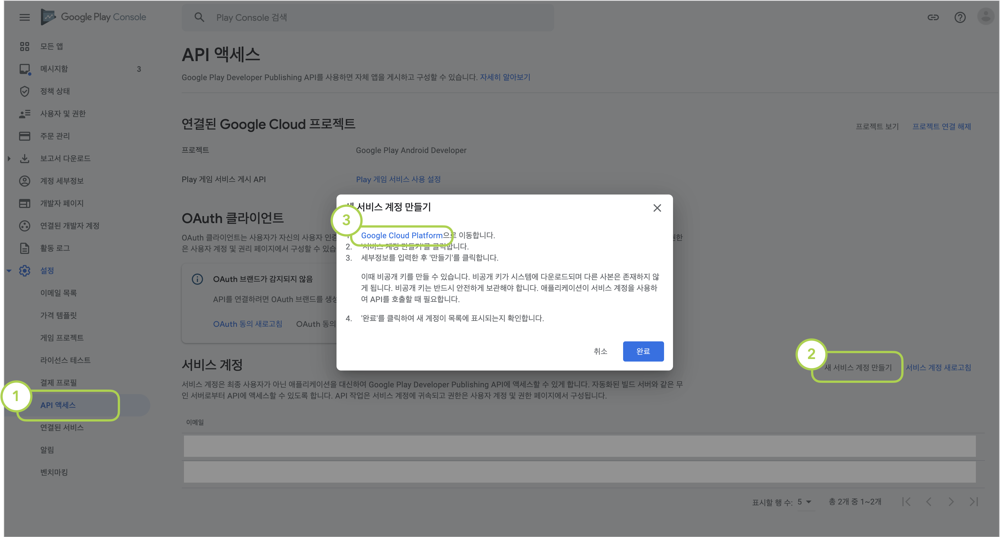
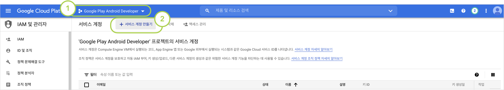
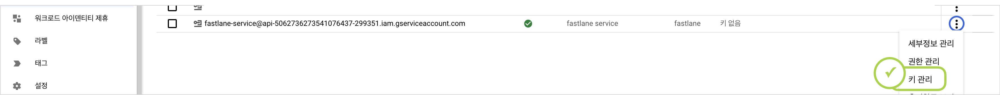
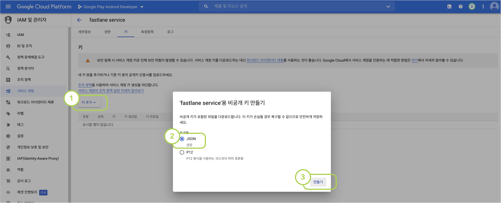
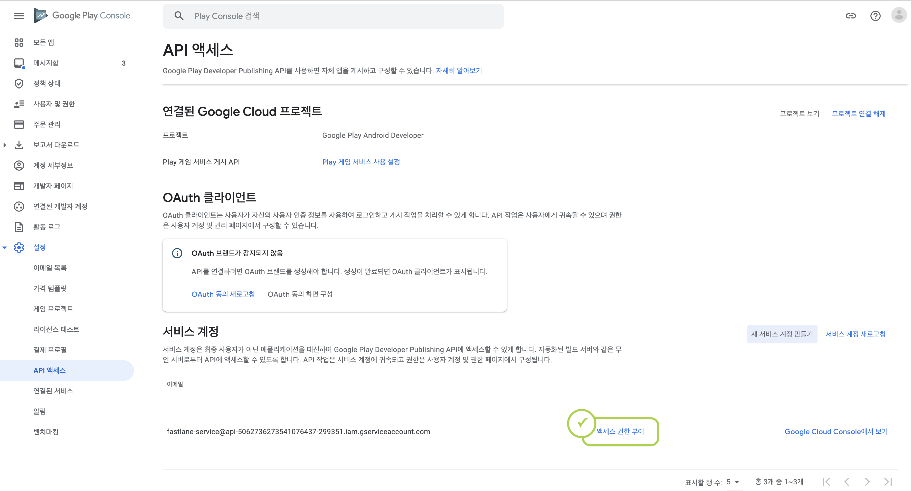
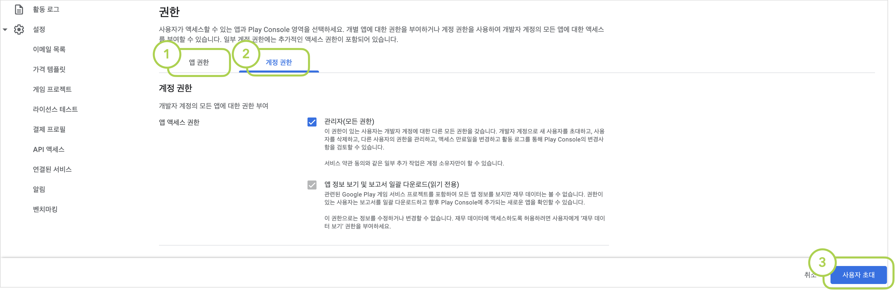
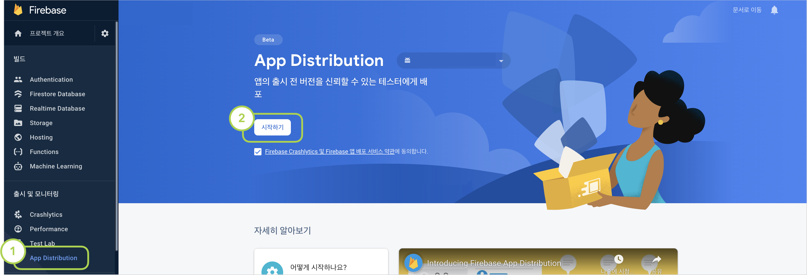
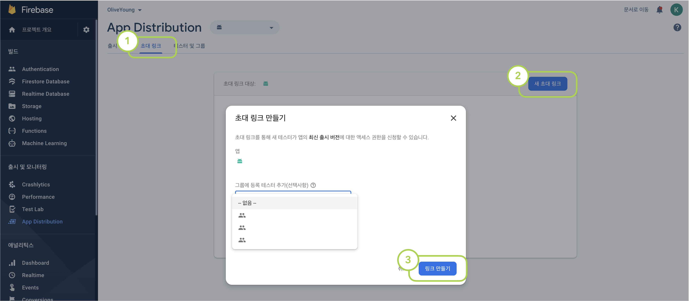
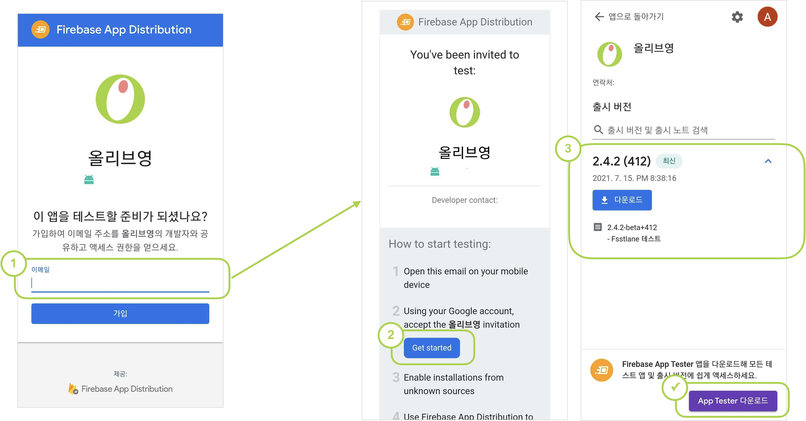
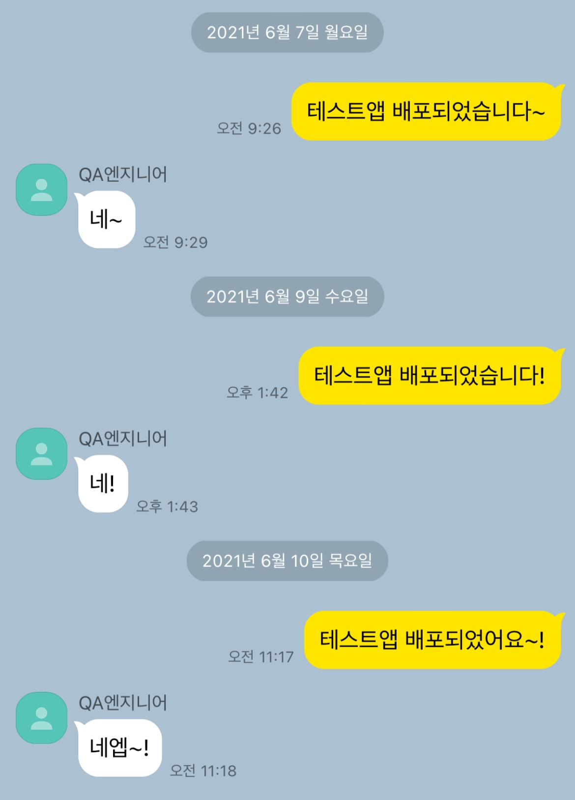

올-하! 💚 안녕하세요. 여러분! 올리브영에서 모바일 앱 개발을 담당하고있는 개발요정🧚‍♀️ 입니다.
오늘은 올리브영 안드로이드 Android 테스트앱에 자동배포 프로세스를 적용한 이야기를 해보려고합니다.

## 👉 세줄요약부터.
본론부터 말하는거 좋아하는 성격급한 저같은 분이 계실것같아서, 3줄요약 먼저 준비해봤습니다. ^^
1. 올리브영앱 자동배포 적용 성공했고 ✨
2. [Firebase App Distribution](https://firebase.google.com/docs/app-distribution) + [fastlane](https://fastlane.tools/) 조합으로 했습니다. ♻️
3. 적용법 핵 쉬우니 아직도 수동배포하는 곳이 있다면 이 글을 꼭 읽어주셨으면 좋겠습니다! 🏃‍

<br/><br/>
👇👇👇 왜 적용하게 되었는지, 어떻게 적용했는지 궁금하시다면 고고! 👇👇👇

## 📢 테스트앱 올라갔어요!
올리브영 Android 앱은 PlayStore Beta로 테스트앱 관리를 하고 있어요.
feature 단위 건의 개발이 완료되면 버전별로 테스트 앱을 배포하고 QC를 진행하는 방식입니다.
사실 가장 기본적인 방법일 수도 있는데요, 이 방법에는 몇가지 비효율적인 부분들이 있었습니다.

#### 1. 테스트앱을 제공하는데 너무 많은 시간이 걸린다.
개발이 완료되면 앱을 빌드한뒤 업로드해야합니다.
우선 PlayStore에 2차 인증을 거친 로그인을 해야하고 ~~(제일 귀찮아요)~~, 적당한 릴리즈노트와 함께 앱을 업로드하면, 앱파일을 첨부하는데 일정 시간을 소요한뒤에 앱을 제출할 수 있습니다. 
업로드가 완료되면 바로 제공되는 것도 아닙니다.
약 30분의 '출시준비중' 단계를 대기한 후에 테스터들에게 앱이 제공됩니다.

#### 2. 앱이 제공되고나면 QA엔지니어에게 직접 알려야한다.
앱이 제공되고나면 QA엔지니어에겐 누가 알려줄까요? That's Me..^^.. 🧚‍♀️
앱 업로드 후 30분동안 '출시준비중' 상태를 뺑글뺑글 도는 것을 지켜보다가, 출시가 완료되면 QA엔지니어에게 호다닥 달려가서 알립니다. (호외요 호외~)

#### 3. 테스터가 추가될때마다 일일이 추가해야하고, 오랫동안 기다려야한다.
신규 테스터를 추가하기 위해서는, (1) 플레이스토어 계정을 전달받아야하고 (2) 전달받은 계정에 수기로 권한을 등록해야합니다. (3) 권한을 획득한 테스터는 플레이스토어에서 '베타 참여하기' 버튼을 누른 뒤 (4) 약 4시간을 기다려야 테스트앱을 다운받을 수 있습니다.

#### 4. 이전 버전을 테스트할 수 없다. 한번에 1개의 버전만 테스트가 가능하다.
그나마 TestFlight는 '이전 빌드 보기'통해 과거 버전의 앱도 설치할 수 있어서, iOS는 이 방법으로 기능별 버전을 분리해서 QC를 진행하고 있습니다.
그러나 플레이스토어는 가장 최신 버전의 앱만 제공할 수 있어 동시다발적으로 여러개의 QC를 태울땐 항상 난감합니다.
또 프로덕트에 앱이 출시되고나면, 자연스레 Beta에 등록된 앱이 이전 버전이 되면서 무효화 되기 때문에 Beta앱을 또 다시 빌드해서 등록해주어야합니다.
안 그래도 챙겨야할게 한두개가 아니라 바쁜 배포날.. 또 하나의 배포 태스크인셈이죠..


## 🤷 왜 fastlane일까?
이러한 이유들로, 배포툴 변경과 배포 자동화에 대해서는 사실 꽤 오래전부터 계획되어 왔었습니다.
자동화를 위한 툴은 꽤 여러가지가 있는데요, 보통 Bitrise나 fastlane을 가장 많이 사용하는 것 같습니다.
올디브는 왜 그 많은 툴중에 fastlane으로 선택했을까요?

#### 사실 Bitrise를 쓰고싶었어요.
돈, 사랑, 명예.. 그것보다 중요한 보안..! 
네 그렇습니다. 올디브는 사내 보안을 위해 내부망에서만 접근가능한 self-hosted 환경의 Git을 사용중입니다.
처음에는 올디브 Git이 내부망에서만 가능하다는 사실을 잊은채, Bitrise가 self-hosted 환경까지 지원하니 당연히 될거라고 생각했습니다.
열심히 셋팅하는데 자꾸 프로젝트를 못 찾아오길래 '왜이러지(ㅠㅠ)'하며 삽질하고 있었는데.. 예.. 내부망.. 네..
Bitrise는 이렇게 처참히 실패했습니다.

🧚‍♀️: 마젤토브 힘내봐.. 마젤토브 빌드해봐..

🤖: (뭐래..)

#### Android도 iOS만큼 fastlane과 궁합이 괜찮을까?
iOS 개발자라면 너무나 익숙한 fastlane...
올리브영 iOS앱은 Android보다 한걸음 빠르게 fastlane 적용을 검토중에 있었는데요, Android + fastlane 조합도 괜찮을까 반신반의하며 서치해봤습니다.
사실 QA엔지니어들의 접근성을 위해 Firebase Distribution으로 테스트앱을 제공하자는 목표가 1차적으로 설정되어 있었고,
그 과정에서 [Firebase의 공식 document](https://firebase.google.com/docs/app-distribution/android/distribute-fastlane?hl=ko)에서조차 fastlane + Firebase Distribution 조합을 추천하는 것을 보며 시험삼아 적용했다가 만족하게 되어 최종적으로 채택하게 되었습니다.
특히 지난 프로젝트인 '인마이백'에서 [코드푸시로 앱을 배포했던 경험](http://tech.oliveyoung.co.kr/tech/2101052132/#%EC%BD%94%EB%93%9C%ED%91%B8%EC%8B%9C)이 있었던지라 코드푸시와 유사한 구동방식이 마음에 들었습니다.
익숙함 + 편리함 + 적용하기쉬움 등등이 한몫 했던 것 같아요. ~~구관이 명관~~

# 🎬 본격적인 적용기!
## 🏃‍ 이제 적용해보자!
자 이제 플랫폼 검토가 끝났으니 적용을 할 차례입니다.
Firebase 공식문서인 [Distribute Android apps to testers using fastlane](https://firebase.google.com/docs/app-distribution/android/distribute-fastlane)을 많이 참고해서 쉽게 적용할 수 있었습니다.

### 1. Google 자격증명 획득
서비스 연동을 위해 API키를 생성하고 Google PlayStore에 등록해줘야합니다.


<figcaption>1. Google Play Console > 설정 > API 액세스 > 새 서비스 계정 만들기 > Google Cloud Platform 링크 클릭</figcaption>


<figcaption>2. 'Google Play Android Developer' 프로젝트 선택 > 서비스 계정 만들기 클릭</figcaption>


<figcaption>3. 서비스 계정 정보 입력. 이 때 역할을 필수로 '서비스 계정 사용자'로 설정해주어야 합니다.</figcaption>


<figcaption>4. 서비스 계정이 생성되었으면, '키 관리' 메뉴로 이동</figcaption>


<figcaption>5. 키 추가 > 새 키 만들기 > JSON > 만들기 클릭 후 생성된 키를 기기에 저장합니다.</figcaption>


<figcaption>6. 다시 1번의 Google Play Console로 돌아오면 신규 서비스계정이 생성된것을 확인할 수 있습니다. 여기서 '액세스 권한 부여' 버튼을 클릭</figcaption>


<figcaption>7. '앱 권한' 메뉴에서 타겟 앱을 설정하고, '계정 권한' 메뉴에서 '관리자 권한'을 부여한 후 '사용자 초대' 버튼을 클릭하여 완료</figcaption>

### 2. Firebase App Distribution 활성화


<figcaption>Firebase console에서 App Distribution 메뉴에 진입하여 기능을 활성화해줍니다.</figcaption>

### 3. fastlane 설치

macOS 기준으로 fastlane 설치하는 방법을 설명합니다.
터미널에서 하기 명령어를 실행하여 fastlane을 설치합니다.

```shell
$ brew install fastlane
```

프로젝트 경로로 이동하여, fastlane을 초기화해줍니다. 해당 과정에서 패키지명과 위 [사전작업](#사전작업) 단계에서 설정한 JSON 파일 경로를 입력하게 됩니다.

```shell
~/workspace$ fastlane init
```

(옵션) fastlane이 정상 설치 되었는지 확인하려면 아래 명령어를 입력해줍니다.

```shell
~/workspace$ bundle exec fastlane test
```


### 4. fastlane과 Firebase App Distribution 연결

fastlane을 Firebase App Distribution과 연결해줍니다.

```shell
~/workspace$ fastlane add_plugin firebase_app_distribution
```

하기 명령어를 입력하여 인증을 위한 Google Auth URL을 받아옵니다.

```shell
~/workspace$ bundle exec fastlane run firebase_app_distribution_login
> Open the following address in your browser and sign in with your Google account:
> https://accounts.google.com/o/oauth2/auth....
```

터미널에서 출력된 페이지 URL을 브라우저로 실행하여 인증한 뒤, 반환되는 인증코드를 콘솔에 입력하면 Refresh Token이 발급됩니다. 해당 토큰을 환경변수로 설정해줍니다.
```shell
$ export FIREBASE_TOKEN={token}
```

### 5. 배포 lane 설정
마지막으로 배포를 위한 lane 명령어를 생성합니다.
workspace의 `./fastlane/Fastfile` 파일을 열어 하기 블록을 추가해줍니다.
```
...
  desc "Lane for distribution"
  lane :distribute do
      gradle(
          task: "assembleDevelop",
          build_type: "Release"
      )

      firebase_app_distribution(
          app: "(Firbase App ID)",
          groups_file: "fastlane/testers-groups.txt",
          release_notes_file: "fastlane/release-notes.txt",
          debug: true
      )
  end
```
각 설정값 별 상세 옵션은 [Firebase App Distribution - 3단계: Fastfile 설정 및 앱 배포](https://firebase.google.com/docs/app-distribution/android/distribute-fastlane#step_3_set_up_your_fastfile_and_distribute_your_app) 문서에서 확인하실 수 있습니다.
올리브영앱은 각 테스터들 그룹을 만들고, 해당 그룹의 정보가 위치한 txt 파일을 바라보도록 설정했습니다.
릴리즈노트도 이런식으로 작성하면 관리에 더 용이합니다.

위 옵션 중 `task` 값이 일반적으로 사용하는 'assemble'이 아닌 'assembleDevelop'인 점을 추가적으로 설명드리자면, 저희는 'develop'이라는 테스트앱용 flavor를 가지고 있습니다. 
그리고 사이닝과 난독화등의 처리를 위해 'release' build type으로 앱을 빌드합니다!
따라서 올리브영 테스트앱을 배포하기위해는 'assembleDebug' `task`를 수행하여 'develop' flavor를 바라본 뒤, 'release' `build_type`으로 앱을 빌드하여 배포합니다.
해당 부분은 각 프로젝트 상황에 맞게 설정하시면 됩니다!

# 🚀 배포 시작
## 실행
이제 번거로운 빌드-업로드-배포-확인요청 4단계를, 단 한줄만으로 완료할 수 있습니다!
```shell
$ fastlane distribute

# 만약 gradle permission dined 오류가 발생한다면 하기 명령어로 권한 부여 후 재시도 해줍니다.
~/workspace$ chmod +x gradlew 
```

## 👾 테스터 추가
이제 마지막으로 테스터들을 추가할 차례입니다!
일일이 메일계정을 취합받아서 등록하는 방법과, URL을 통해 직접 참여할 수 있도록 유도하는 방법이 있습니다.
수동업무를 줄이기 위해 적용하고 있는만큼, 당연히 후자 방법인 URL을 통해 직접 참여할 수 있도록 진행해보겠습니다. (다 끝나갑니다! 💦)


<figcaption>Firebase console에서 초대 링크 > 새 초대 링크 > 그룹 선택 > 링크 만들기 클릭</figcaption>

### 💁 QA 엔지니어 초대
위에서 만든 링크를 이제 QA 엔지니어들에게 전달하기만하면됩니다.
QA 엔지니어는 링크를 통해 테스트앱을 설치할 수 있어요.
이때, 'App Tester'라는 앱을 설치하면 향후에도 계속 편하게 테스트앱을 받아볼 수 있습니다.

<figcaption>테스터들은 링크를 클릭한 후 이메일 주소를 입력하면, 메일에서 Firebase의 친절한 안내를 따라 앱을 설치할 수 있습니다.</figcaption>


## 💚 적용이후 달라진 점

일단 개발자도, QA엔지니어도 모두 편해졌습니다. 🤝
~~자동응답기마냥 주고받던 대화를 나눌일이 없어져서, 대화할일이 사라졌어요.~~

<figcaption>(구) 자동응답기 시절..</figcaption>

다음에는 CI까지 적용해서 완벽한 CI/CD 적용기로 찾아뵙겠습니다!
점점 더 발전해나가는 올리브영앱을 많이 찾아주세요!
(구매는 올리브영앱에서! 💚)
