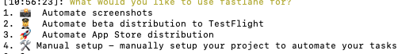
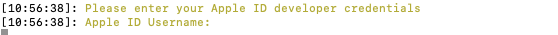
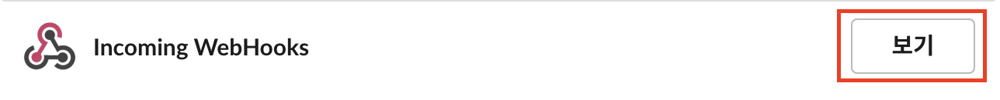
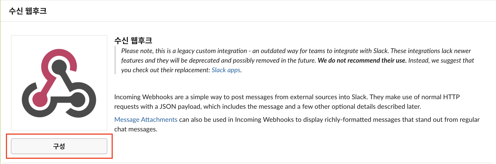
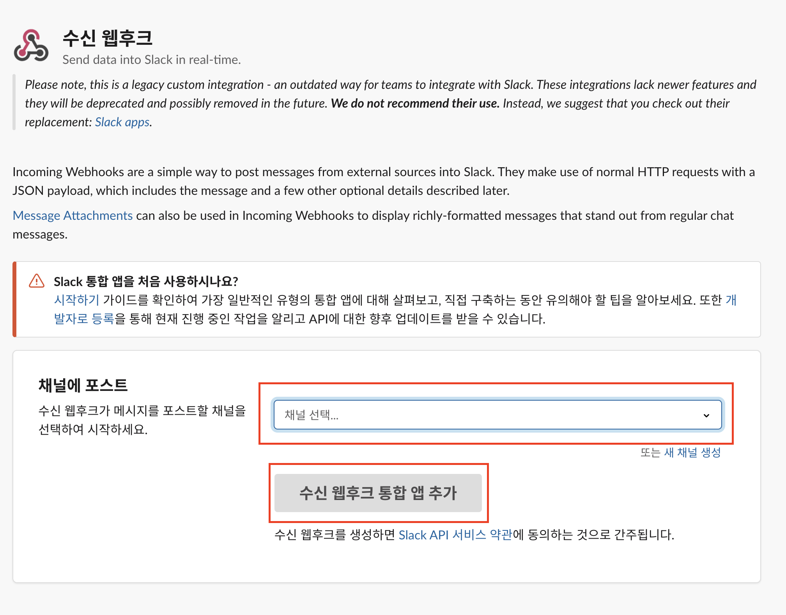
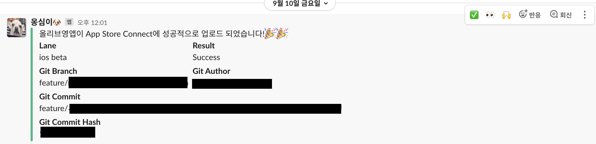

올-하! 💚 안녕하세요. 여러분! 올리브영에서 iOS 앱 개발을 담당하고있는 럭셔리💍 입니다.
오늘은 올리브영 iOS 테스트앱에 자동배포 프로세스를 적용한 이야기를 해보겠습니다~~!

## 😮 자동 배포 환경을 하루도 안걸려서 구축했다고?

사실 뻥... 이 아니라 진짜에요 ㅎㅎ 그만큼 쉽고 간단하다는 소리겠죠?? 수동 배포를 한다고 가정(🏠)해봅시다! 버전 번호 올리고 ~\~,  빌드번호 올리고~\~, 아카이브 하고~~, 앱스토어에 올리고 ~~, 배포 완료 공유하고 ~~... 생각만해도 머리가 터질것만 같네요.. 🚀

이러한 이유로, 자동 배포 환경을 구축하고자 마음을 먹게 되었고, 생각 보다 간단하여 짧은 시간내에 구현해낼 수 있었답니다!🤗 

어떻게 구현하였을까요?? 자~~ 따라오시죠!!🏃🏃 

## ⛏️ 구축 과정을 한번 살펴볼까요??

iOS 앱 자동 배포인 만큼 당연히 맥()을 사용하시겠죠? 터미널로 설치해봅니다.

* `xcode-select --install` 
  * fastlane은 xcode의 Command Tool을 사용하므로 설치 해주셔야 합니다.
* `brew install fastlane`
  * homebrew를 사용해서 fastlane을 설치해주도록 합니다.


fastlane설치가 끝나셨나요? 아주 간단한 과정이었죠? ㅎㅎ 😗 그럼 본격적으로 fastlane을 사용해봅시다.

* fastlane을 적용하고자 하는 프로젝트 폴더로 이동합니다.
  * `cd ~` 명령어로 이동하세요~~!(➡️)
* Fastlane 환경을 초기화 해봅시다.
  * `fastlane init` 명령어를 입력해봅시다!
  
  * 다음과 같은 화면이 나오셨나요? 저희는 앱을 테스트플라이트에 업로드 하는 것이 목적이기 때문에, 2번을 선택합니다.
  * 2번을 선택하시면 다음과 같은 화면이 나타날 것입니다.
    
    * Apple ID (email 형식)를 입력해주시면 됩니다!!
  * <b>비밀번호 같은 경우는, 해당 ID의 비밀번호가 아닌 appleID페이지에서 앱 암호를 발급받아서 사용하셔야합니다!!</b>
    * [AppleID 페이지로 이동](https://appleid.apple.com/)
    * 로그인 진행
    * 보안 탭에 앱 암호를 선택하여 앱 암호를 발급 받습니다~~!
    
    * 발급된 앱 암호를 입력해주시면 됩니다!
  * 다음과 같은 화면이 나타나면 계속 return키로 넘어가시면 됩니다.
  
  
  * 완료되면 프로젝트 폴더안에 다양한 파일들이 생성될 것이에요~~!
    * fastlane
      * Appfile
      * Fastfile
      * README.md
      * Report.xml
    * Gemfile
    * Gemfile.lock


fastlane 초기화 작업이 끝나셨나요? 설치보다 더 간단하지 않나요? ㅎㅎ 그럼 fastlane을 잘 활용할 수 있도록 설정해봅시다!

자 ~ 그럼 fastlane 폴더안에 있는, Fastfile을 수정해봅시다. 

* xcode 버전 선택하기
  * 저 같은 경우는, 맥에 두가지 버전의 xcode가 설치되어있습니다.
  * 이 중 어떤 버전의 xcode를 활용하여 빌드할지 결정해주어야합니다.
  * 한 개의 xcode만 설치되어있다면 이 과정은 무시하셔도 됩니다~~!
  * 저 같은 경우는 12.4버전의 xcode를 선택해주었답니다~!
    * `xcode_select("/Applications/Xcode_12.4.app")`

* build_number 자동으로 올리기

  * 매번 릴리즈버전을 배포할때마다 버전은 수동으로 올려주는게 편하지만, 지속적으로 업로드 해야하는 테스트 앱 같은 경우는, 빌드번호를 수동으로 올리는게 상당히 귀찮은 일입니다 ㅠㅠ

  * 따라서, 테스트플라이트에 올라가있는 가장 최신버전의 빌드번호를 가져와서 +1 해주는 코드를 작성해 봅시다.

    ```
    build_number: latest_testflight_build_number + 1,
    xcodeproj: "{ProjectName}.xcodeproj")
    build_app(workspace: "{ProjectName}.xcworkspace", scheme: "{ProjectName}")
    ```

* testflight에 앱 업로드하기

  * ` upload_to_testflight`

* slack으로 알람주기

  * 업로드가 완료되었으면, 알림을 통해 알려주어야겠죠?  저희는 슬랙채널을 통해 알림을 받아보고 있답니다.

    ```
    slack(
      username: "{알림봇 이름}",
      icon_url: "{알림봇 이미지 주소}",
      message: "{알림봇 메시지}",
      channel: "{채널명}",
      slack_url: "{webhook_api url}"
    )
    ```

  * Webhook API 주소 생성하는법

    * slack에서 알림을 받기 원하는 채널에 들어간다.
    * 제일 위로 올려서 채널명을 클릭한다.
    

    * "통합"을 클릭하고 "앱 추가"를 클릭한다.

    

    * Incoming WebHooks에서 해당 버튼을 클릭한다. (기존에 있으면 보기, 없으면 추가가 노출됨)
    
    * "구성" 버튼을 클릭한다.
      
    * 수신 받고자하는 채널을 선택하고, "수신 웹후크 통합 앱 추가"를 클릭하면 Webhook API 주소를 얻을 수 있다!!
    

* 결과

  * 저희같은 경우는 리멍님의 친구 '옹심이'가 테스트플라이드 업로드 여부를 알려줘요!! 🐕🐕
  * 어떤 브랜치가 업로드 되었는지, 커밋이력은 어떻게 되는지 알 수 있어요.
  * 엄청 귀엽지 않나요?? ㅠㅡㅠ 😭😭 

  

## ⚙️ 구축을 했으면 활용을 해야지~~!

지긋지긋했던 빌드번호 체크, 아카이브, 수 십분의 대기시간... 이제 안녕..!👋👋

이제 나도... 단 한번의 입력으로 앱 배포할꺼야... 그럴꺼야.. 🔥🔥

* 프로젝트 폴더 내에서 다음 명령어를 입력합니다.
  * `fastlane beta`

* 저희는 fastlane을 활용한 자동배포를 적용함으로써, 다음과 같은 이점을 얻게 되었습니다.
  * 테스트 앱을 업로드하는 시간이 대폭 줄었다!! (기존 대비 99%!!)
  * 빌드번호를 올리지 않고 업로드하는 불상사가 일어나지 않는다.
  * 브랜치 명과 커밋명을 통해, 어떤 코드가 빌드되었는지 <b>명확</b>하게 알 수 있다.


이렇게 구축하기 쉬운데, 구축해놓으면 이렇게 편하고 정확한데.. 이걸 안하시렵니까..? 

니들은.. 수동배포 같은거 하지마라..😎

