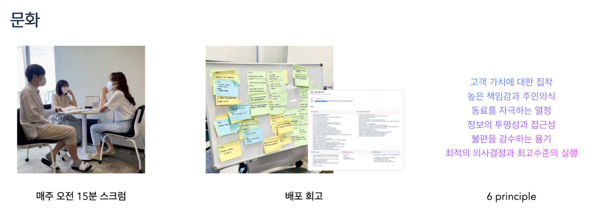
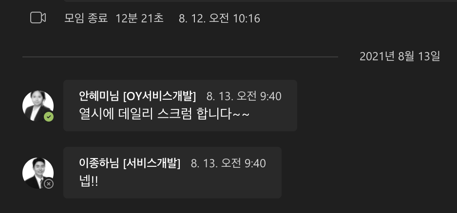
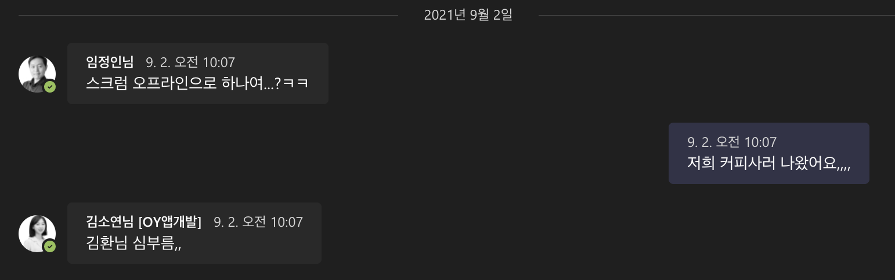
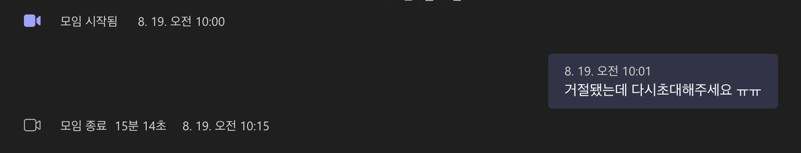
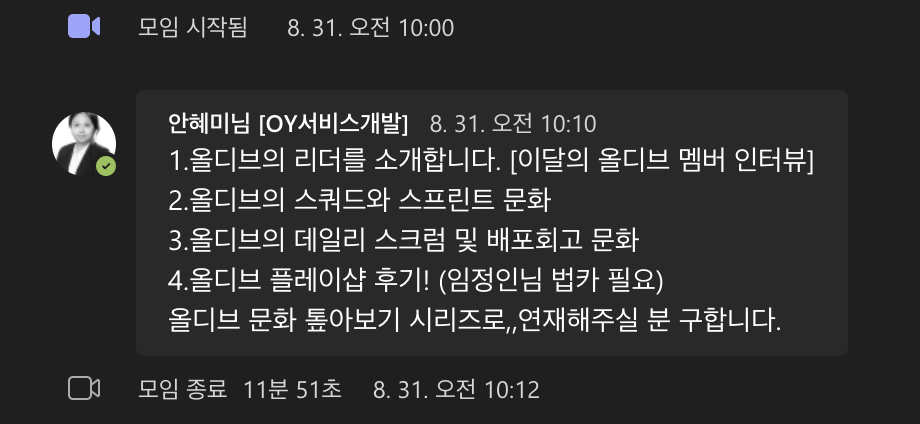
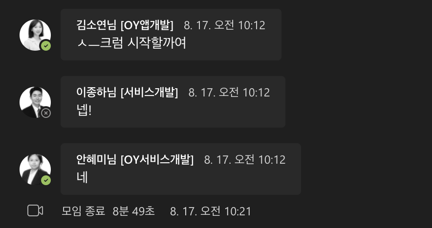
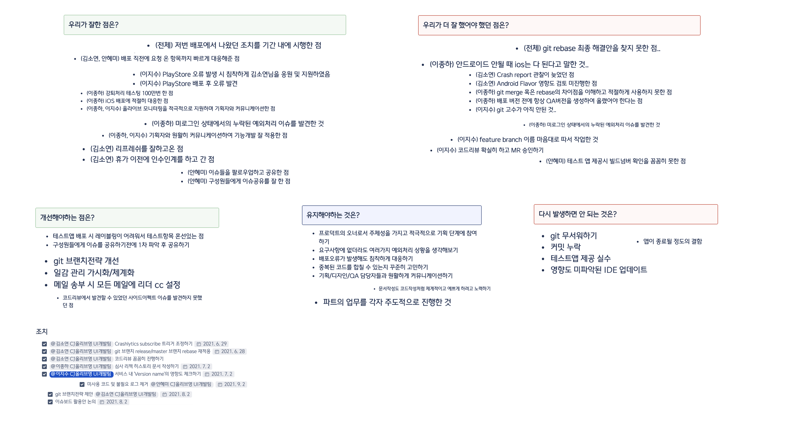
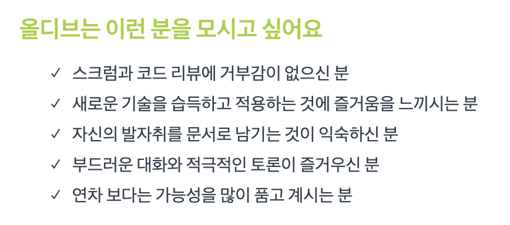

>안녕하세요! 올리브영에서 안드로이드 개발을 하고 있는 의지수입니다 :) 오늘은 앱개발파트가 올디브의 스크럼 및 회고 문화를 어떻게 실천하고 있는지 보여드리려 합니다 그럼 바로 본론으로 가볼까요-!   

---

---

## 매일 오전 15분 스크럼💡
저희 파트는 매일 오전 10시에 스크럼을 진행하며 데일리 업무를 시작합니다. 팀 내 매주 진행하는 주간회의와는 별개로 파트별로 더욱 더 효율적 그리고 효과적으로 일하기 위해 데일리 스크럼을 하고 있습니다. 
현재 서로 어떤일을 하고 있고 업무 진행 상황 및 여러 이슈를 짧게 공유하는 자리인데요. 사실은 개인 tmi부터 아주 사소한 일정도 공유합니다.ㅎㅎ 그래도 15-20분을 넘기지 않도록 항상 노력하고 있는 것 같아요.
스크럼을 꾸준히 하다보니 깨달은 좋은 점들이 있습니다.

1. 누군가의 갑작스러운 부재에도 우리는 차질없이 대응할 수 있다!!!
2. 이슈를 빨리 함께 해결할 수 있다!!
3. 각자 업무량을 조절할 수 있다!!  

데일리로 진행하다보니 작은 의견도 맘놓고 터놓는 자리가 되어 서로서로 많은 도움이 되는 것 같습니다. 또한 하다보니 업무 공유의 중요성을 느끼게 되었달까요,, 함께 의논하고 고민하기에 더욱 더 함께 일하는 기분이 들어 좋은 것 같습니다.   

### 👥👤👥재미난 스크럼 시간 👤👥👥웅성웅성👥👤👥

    
    
    
    
    

 

## 배포 회고📝
앱개발 파트는 앱 업데이트를 제공할 때마다 회고를 하고 있습니다. 첫 회고는 보드에다 포스트잇을 붙여가며 진행했었는데요, 그 후부터는 어찌저찌 위키에 정리하고 있습니다.. 
(왜 어찌저찌인지 생각해봤는데 이유가 생각나지 않는 걸 보니 다시 포스트잇이나 더 신나는 방법으로 해보자고 제안해봐야겠습니다..)
다음 배포까지의 주기가 너무 짧은 경우 두개의 배포를 한번에 회고하는 경우도 있지만, 일반적으로는 매 배포시마다 꼭 회고를 진행합니다. 보통 배포 다음날 배포 회고록을 작성하는데요.
아주 아주 간단한 순서를 가지고 있습니다.
   1. 각자 회고록을 작성한다.   
      1-1. 회고록을 작성할 땐, 본인이 아닌 다른 팀원에 대한 회고도 포함하여 작성할 수 있다.
   2. 다같이 모여 회고한다.    
      2-1. 저번 회고에서 나왔던 액션 아이템을 리뷰한다.   
      2-2. 이번 배포에 관한 회고를 진행한다.   
      2-3. KPT(Keep, Problem, Try)의 관점에 따라 나눠 함께 작성한다.   
      2-4. 2-2에 따른 액션 아이템을 도출한다.   
      

   
위키에 당당하게 양식으로 등록해놓은 앱개발파트 회고 양식입니다.v_v 지금까지했던 회고들 중 간단하게 모아보자면 아래와 같습니다.   
 
   

몇 달전에 저희 파트에 여러 이유로 갑자기 git 공포증이 전염병처럼 스멀스멀 퍼져 럭셔리님께서 저보고 git 고수가 되라고 덕담해주고 난리가 났던 때가 있었는데,, 그 때 회고에 git에 관한 이야기가 유독 많았던 걸 다시 보니
너무 웃기네요. 회고를 작성하다보면 그 때 배포뿐만 아니라 그 당시에 있었던 일들까지 돌아볼 수 있어서 참 좋은 것 같습니다. 또한 생각보다 각자 작성하다보면 비슷한 내용이 꽤 많이 나오기 때문에 함께 이야기하면서 큰 주제를 만들고 그 안에서 몇 개의 내용을 
정리하여 개선해야하는 점, 유지해야할 점 등을 정리하고 있습니다. 그렇게 정리된 KPT를 바탕으로 최종 액션 아이템을 도출하고 있습니다. 액션 아이템으로 다시 일감관리를 할 수 있구요!
 

### 우리는🫒
올디브는 이렇게 데일리 스크럼과 회고를 통해 함께 공유하고 일하는 협업문화를 만들어가고 있습니다. 각 파트, 팀뿐만 아니라 스쿼드에서도 기획자, 디자이너 분들과도 항상 소통하고 있습니다! 이렇게 항상 이야기하고 공유하는게 서로의 업무 이해도를 높여주고
존중해주며 시너지를 만들어 좋은 문화를 자리잡게 해주는 원동력이 되는 것 같아요. 함께 만들어나가는 문화를 바탕으로 더욱 더 성장하는 올디브가 되려고 항상 노력중입니다

### 당신은 우리와 함께..
   
올디브가 지켜가려는 문화와 함께 하고싶은 분들은 혹은 더 재밌는 문화를 함께 만들어 가고 싶으신 분들은 언제든지 *[채용정보](http://tech.oliveyoung.co.kr/recruit/)*를 확인해주세요!!!   

  

