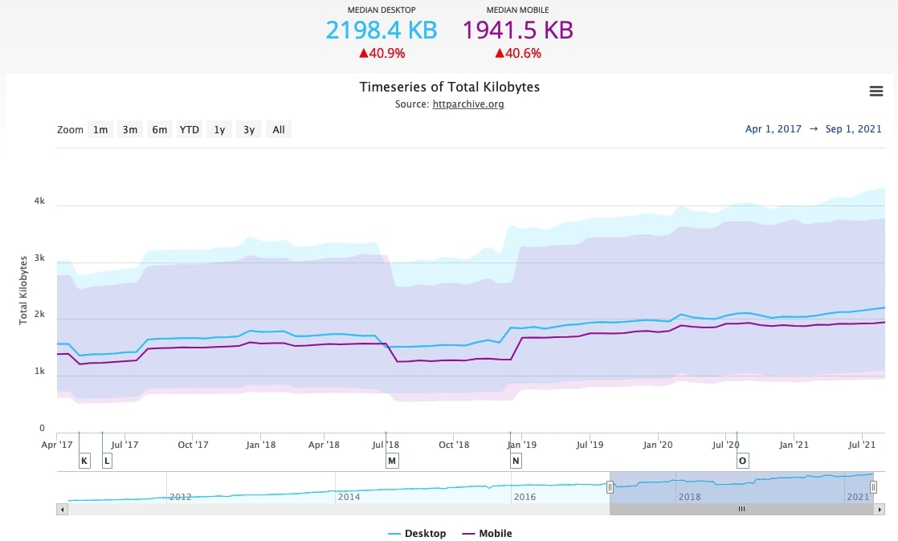
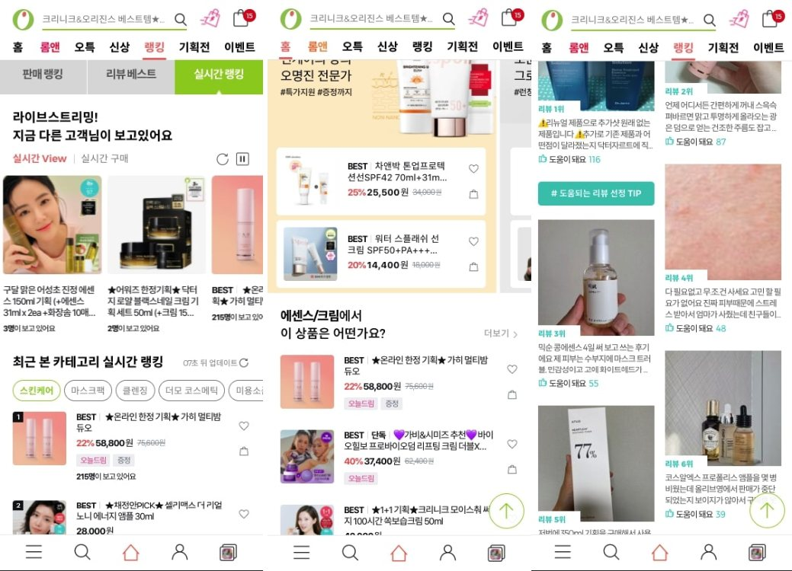
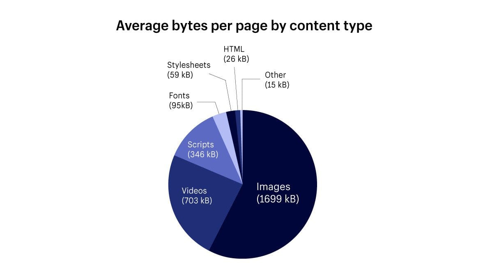
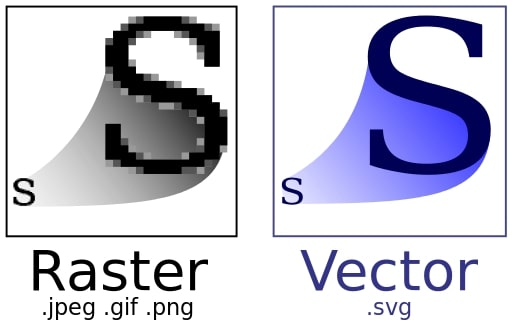
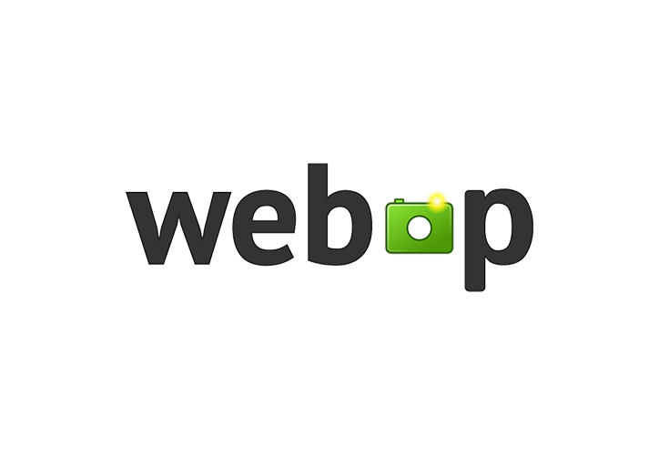
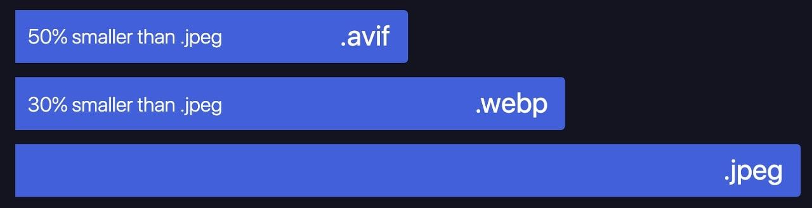
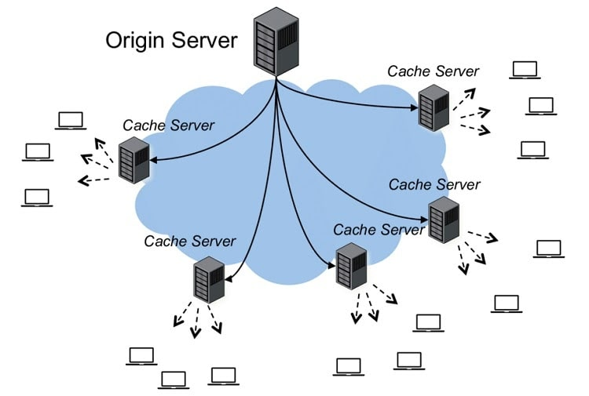

> 안녕하세요~ 올리브영에서 웹 프론트엔드 개발을 맡고 있는 개발새발자입니다 만반잘부~👋! <br/>
> 오늘은 웹 최적화 그 첫번째(라고 쓰고 마지막이 될수도 있는....) 이미지 최적화에 대해서 포스팅 해보려고 합니다. 그럼 시작해 볼까요?

---

## 이미지의 중요성



최근 들어, 초고속망 인터넷과, 그에 따른 사용자의 니즈로 인하여 웹페이지는 무게는 점점 더 무거워졌습니다. 
위 사진을 보면, 2017년엔 1233.7kb이던 웹사이트의 무게가 2021년 현재는 1941.5kb로 무려 40퍼센트나 무거워졌기 때문입니다. 
특히 E-Commerce는 사이트 특성상 사진이 많이 들어가고 상품을 팔기 위해 사진은 빠지지 않는 가장 중요한 요소이기 때문입니다. 
또한 이 이미지의 사이즈는 판매와도 직결되는 부분입니다.
[KissMetrics의 연구 결과](https://neilpatel.com/blog/loading-time/)에 따르면 페이지 로딩이 약 1초씩 느려질 때마다 상품을 구매하는 사용자의 비율은 약 7%씩 감소할 수 있다고 합니다. 
그러므로 이미지 최적화는 E-Commerce 개발자의 숙명이라고 할 수 있습니다. 
특히 올리브영은 올리브영 온라인몰 앱이 웹 뷰로 이루어져 있고 타 E-Commerce 사이트에 비해 이미지를 많이 사용하기 때문에 더욱 더 중요합니다.


<div style="width: 100%; text-align: center;">
    <span style="color: #afafaf">&lt;올리브영 모바일 웹사이트&gt;</span>
</div>

## 웹사이트 이미지 체크



HTTP 아카이브 연구에 따르면 평균 웹사이트의 반 이상이 이미지로 이루어져 있으며, 이미지의 용량도 다른 콘텐츠에 비해 월등히 높습니다. 
따라서 이미지의 사이즈를 적절히 줄이고, 렌더링 속도를 빠르게 하면, 웹사이트의 렌더링 성능은 더욱더 빨라질 것입니다. 
하지만 먼저 이미지를 최적화하기 전에, 이미지를 최적화할 필요가 있는지부터 확인해 보아야 합니다. 
왜냐하면 이미지가 중요한 사이트가 아니라면 굳이 이미지를 최적화하는데 드는 리소스와 비용을 투자할 이유가 크게 없기 때문입니다. 
(이미지 지연 로딩 등을 이용해 이미지의 우선순위를 낮추고 다른 중요한 콘텐츠부터 불러오는 게 좋습니다) 
하지만 올리브영은 이미지가 중점인 사이트이기 때문에 이미지 최적화가 필요합니다. 
그렇다면 올리브영 사이트를 한번 확인해 볼까요? 현재 올리브영 모바일 메인페이지에서는 414개 이미지 요청과 Fast 3G 기준 62초에 로드 타임을 가지고 있습니다. 
타 E-Commerce 사이트인 11번가(372개 이미지 요청, Fast 3G 기준 로드 타임 48초), G마켓(185개 이미지 요청, Fast 3G 기준 로드 타임 40.74초) 등을 봤을 때, 
올리브영의 이미지 요청이 상당히 많은 것으로 보입니다. (해당 결과는 크롬 개발자 도구의 네트워크 탭을 이용하여 확인했습니다) 
그렇다면 이러한 웹사이트는 어떻게 이미지를 최적화해야 할까요?

## 이미지의 종류 및 특성

이미지 최적화는 적절한 디지털 이미지 타입의 선택이 60%라고 해도 과언이 아닙니다. 
따라서 브라우저에 뿌려지는 디지털 이미지에 대해서 알아볼 필요가 있습니다. 
디지털 이미지는 일반적으로 브라우저에서 어떻게 렌더링 되느냐에 따라 레스터 이미지 타입과 벡터 이미지 타입, 그리고 이미지의 손실을 어느 정도 허용하는지에 따라, 
무손실 이미지 타입과 손실 이미지로 구분이 됩니다. 
그러면 먼저 레스터 이미지와 벡터 이미지에 대해서 알아보도록 하겠습니다.

### 레스터 이미지와 백터 이미지



먼저 래스터 이미지는, 여러분들이 잘 아는 픽셀에 표현하고자 하는 색상을 그려서 이미지 형태로 표현하는 방식입니다. 
개발자들이 주로 사용하는 JPEG, PNG, GIF 등이 대표적인 레스터 이미지입니다. 
이 레스터 이미지는 여러 픽셀이 모여서 하나의 이미지를 만들기 때문에, 
사이즈가 크거나 품질이 더 좋은 이미지를 만들기 위해서는 그만큼의 정보를 담은 픽셀들을 추가해야만 컴퓨터가 이를 정상적으로 표현할 수 있습니다. 
사이즈가 커지면 커질수록 이미지의 용량도 늘어나고 렌더링 속도도 현저히 떨어지게 됩니다.

반면, 벡터 이미지는 픽셀값으로 그림을 그리는 게 아닌 이미지 안에 수많은 수학 방정식을 포함하고 있는 방식의 이미지 형태입니다. 
그렇기 때문에 컴퓨터는 선의 표현, 크기, 색상 등의 정보를 이미지안에 있는 계산식으로 연산하여 이미지를 제공합니다. 
이러한 연산을 사용하는 이미지 렌더링 방식 덕분에,
벡터 이미지는 사이즈가 커지거나, 작아져도 이미지가 깨지거나 정보가 달라지지 않습니다. 
그 말은 즉, 항상 같은 이미지 품질을 유지할 수 있죠. 
이 벡터 이미지는 보통 아이콘, 폰트 등에 주로 사용되며, 대표적인 W3C 포맷인 SVG가 많이 사용됩니다. 
다만, 이미지가 복잡하면 복잡할수록 이미지 안에 수학적인 정보는 계속해서 늘어나게 되고, 이미지 용량 또한 같이 늘어나게 됩니다.

### 무손실 이미지와 손실 이미지

위에 레스터 이미지와 벡터 이미지와 더불어 이미지를 구분하는 또 다른 기준은 이미지의 정보 손실을 허용하는지의 안 하는지의 여부입니다. 
용어만 봐서는 무손실 이미지가 원본 이미지라고 이해할 수 있는데, 사실 무손실 이미지가 원본 이미지라는 뜻은 아닙니다. 
원본 이미지는 말 그대로 이미지의 모든 정보를 가지고 있는 이미지를 말하고, 
무손실 이미지는 원본 이미지에서 이미지를 렌더링하는데 필요하지 않은 정보들을 제거한 이미지를 무손실 이미지라고 합니다. 
따라서 무손실 이미지는 원본 이미지보다 용량이 줄어들 수 있습니다. GIF, PNG가 대표적인 무손실 이미지입니다.

손실 이미지는 무손실 이미지의 화질 감소를 감수하면서도 사이즈를 줄여 빠른 렌더링을 할 수 있는 이미지입니다. 
일반적으로 사람이 품질 저하를 거의 눈치채지 못하면서 품질을 낮출 수 있는 퍼센트는 100% ~ 75% 사이라고 합니다. 
대표적으로 구글 이미지의 썸네일은 74%~76% 정도의 손실 이미지를 사용하고, 페이스북 이미지는 85%의 손실 이미지를 사용합니다. 
손실 이미지의 사용은 무손실 이미지보다 상대적으로 빠른 렌더링이 가능하므로 사용자에게 꼭 필요한 정보를 주는 이미지가 아닌 경우 사용되는 이미지입니다. 
JPEG가 가장 대표적인 손실 이미지이며, 그 외로 JPEG 2000등이 존재합니다.

### 이미지 선택

그렇다면 이미지 개선을 위해 어떠한 이미지를 사용해야 할까요? 
사실 틀에 박힌 이야기긴 하지만 상황에 맞는 이미지 타입을 선택해서 사용해야 합니다. 
지금까지 이야기만 들어보았을 때는 압축률이 높고 정보 손실이 적은 이미지를 선택하는 게 가장 좋아 보이지만, 용량, 지원 브라우저 등 적당한 타협이 필요합니다. 
당연한 이야기지만, 이미지 렌더링 속도는 이미지 용량에 비례합니다. 
따라서 화질이 중요한 배너 이미지나 메인 이미지는 좀 더 손실이 적은 이미지로, 화질과 상관없는 이미지는 손실률이 높지만, 용량이 작은 이미지로 선택을 고려해야 합니다. 
이 포스팅에서는 현재 상용에서 많이 쓰이는 포맷인 WebP와 최근 각광을 받고 있는 AVIF대해서 자세히 알아보도록 하겠습니다.
그외의 이미지 포멧의 대해서는 아래 표를 참고해 보시길 바랍니다.

<style type="text/css">
.tg  {border-collapse:collapse;border-spacing:0; width: 100%;}
.tg td{border-color:black;border-style:solid;border-width:1px;font-family:Arial, sans-serif;font-size:14px;
  overflow:hidden;padding:10px 5px;word-break:normal;}
.tg th{border-color:black;border-style:solid;border-width:1px;font-family:Arial, sans-serif;font-size:14px;
  font-weight:normal;overflow:hidden;padding:10px 5px;word-break:normal; font-weight: bold}
.tg .tg-0pky{border-color:inherit;text-align:left;vertical-align:top}
.tg .tg-0pky:first-child {font-weight: bold}
</style>
<table class="tg">
<thead>
  <tr>
    <th class="tg-0pky"></th>
    <th class="tg-0pky">GIF</th>
    <th class="tg-0pky">PNG</th>
    <th class="tg-0pky">JPEG</th>
    <th class="tg-0pky">JPEG 2000</th>
    <th class="tg-0pky">JPEG XR</th>
  </tr>
</thead>
<tbody>
  <tr>
    <td class="tg-0pky">압축률</td>
    <td class="tg-0pky">보통</td>
    <td class="tg-0pky">보통</td>
    <td class="tg-0pky">높음</td>
    <td class="tg-0pky">매우 높음</td>
    <td class="tg-0pky">매우 높음</td>
  </tr>
  <tr>
    <td class="tg-0pky">압축방식</td>
    <td class="tg-0pky">무손실</td>
    <td class="tg-0pky">무손실</td>
    <td class="tg-0pky">손실</td>
    <td class="tg-0pky">손실/무손실</td>
    <td class="tg-0pky">손실/무손실</td>
  </tr>
  <tr>
    <td class="tg-0pky">애니메이션</td>
    <td class="tg-0pky">지원</td>
    <td class="tg-0pky">미지원</td>
    <td class="tg-0pky">미지원</td>
    <td class="tg-0pky">지원</td>
    <td class="tg-0pky">지원</td>
  </tr>
  <tr>
    <td class="tg-0pky">투명</td>
    <td class="tg-0pky">미지원</td>
    <td class="tg-0pky">지원</td>
    <td class="tg-0pky">미지원</td>
    <td class="tg-0pky">지원</td>
    <td class="tg-0pky">지원</td>
  </tr>
  <tr>
    <td class="tg-0pky">Progressive Image</td>
    <td class="tg-0pky">지원</td>
    <td class="tg-0pky">지원</td>
    <td class="tg-0pky">지원</td>
    <td class="tg-0pky">지원</td>
    <td class="tg-0pky">지원</td>
  </tr>
  <tr>
    <td class="tg-0pky">지원브라우저</td>
    <td class="tg-0pky">모든 브라우저</td>
    <td class="tg-0pky">모든 브라우저</td>
    <td class="tg-0pky">모든 브라우저</td>
    <td class="tg-0pky">사파리</td>
    <td class="tg-0pky">인터넷 익스플로러, <br>엣지</td>
  </tr>
</tbody>
</table>

### WebP 포멧

WebP는 2010년 구글에서 개발한 이미지 포맷으로 손실 압축과 비손실 압축을 전부 지원하는 특징을 가지고 있습니다.
VP8이라는 비디오 코덱 기술을 기반으로 한 영상압축 방식을 사용하며 파일크기를 25%~35%정도로 압축을 할 수 있는 이미지 포멧입니다.
또한, 투명, 애니메이션 기능도 지원하므로 GIF, PNG, JPEG 등의 상용 이미지 포맷을 대체할 수 있습니다.
하지만 디바이스에 사양에 따라서, 상용 이미지 포맷보다 더 높은 리소스를 필요해 하거나, 
IE를 지원하지 않는 점 ~~(IE좀 이제 놓아줘라....)~~,
Progressive Image 기능을 지원하지 않는다는 것이 단점입니다.
그럼에도 불구하고, 현재 많은 곳에서 사용하고 있는 이미지 포멧입니다.

### AVIF 포멧



AVIF는 2017년 AOMedia에서 개발한 이미지 포맷으로 손실 압축과 비 손실 압축을 전부 지원하기 때문에 WebP와 마찬가지로 GIF, PNG, JPEG 등의 상용 이미지 포맷을 대체할 수 있습니다.
또한 애니메이션 기능이 있어 움직이는 이미지로 쓸 수 있고, 압축 효율이 WebP보다 뛰어나, 많은 관심을 받고있는 이미지 포멧입니다.
하지만, 최신 포맷인 만큼 낮은 범용성으로 인하여, AVIF를 지원하는 뷰어가 적고, 브라우저 지원율이 아직은 많이 낮습니다.
또한, 단순한 패턴의 이미지를 압축하는 경우 PNG보다 낮은 압축률을 보여질 때도 있습니다.
그럼에도 불구하고 [넷플릭스에서는 AVIF도입을 검토 중](https://netflixtechblog.com/avif-for-next-generation-image-coding-b1d75675fe4)에 있으며,
[Next.js에서는 AVIF를 지원](https://nextjs.org/blog/next-12#smaller-images-using-avif)하고 있습니다.

## 이미지 최적화 방법

자 이제 이미지에 대해서 어느 정도 알게 되었고, 각각의 목적에 맞는 이미지가 무엇인지 알 수 있었습니다. 
그렇다면 이걸 가지고 어떻게 이미지를 최적화할까요? 알아보도록 하죠

### 브라우저 사이즈에 맞춰 적절한 이미지 제공

이미지를 다양한 사이즈에 대응할 수 있도록 적절한 브레이크 포인트를 설정하여 사이즈를 조절해줍니다. 
이렇게 하는 이유는 데스크톱의 이미지는 모바일의 이미지보다 상대적으로 용량이 클 수밖에 없습니다. 
그렇게 되면 사용자는 필요 이상의 이미지를 다운받게 되어 리소스가 낭비될 수 있습니다. 
그러므로 브라우저 사이즈에 맞게 브레이크 포인트를 걸어 과도한 리소스를 사용하지 못하게 해주어 보다 빠른 렌더링이 가능하도록 해줍니다. 
이러한 방식의 해결로  미디어쿼리 및 ``태그의 srcset 속성, `<picture>`태그 등의 방법이 있습니다.


#### 미디어 쿼리를 활용하는 방법

미디어 쿼리는 단말기의 유형과 어떤 특성이나 수치에 따라 스타일을 조절할 수 있는 CSS 문법입니다. 
이 미디어 쿼리를 이용하면, 브라우저의 사이즈, 호버 상태, 사용자 OS의 다크 모드 적용 여부 등 다양한 조건에 따라 다른 스타일 시트를 적용할 수 있습니다. 
사용법은 아래와 같습니다.

```html
<div class="image-box"></div>
```

```css
.image-box {
  max-width: 100%;
  width: 400px;
  height: 400px;
  background-image: url(./small.png);
  background-repeat: no-repeat;
  background-size: contain;
  padding: 10px
}

@media (min-width: 401px) {
	.image-box {
  	width: 700px;
  	height: 700px;
  	background-image: url(./midium.png);
  }
}

@media (min-width: 701px) {
	.image-box {
    width: 1000px;
    height: 1000px;
    background-image: url(./large.png);
  }
}
```

#### ``태그의 srcset 속성 사용하는 방법

``태그의 `srcset` 속성은 이미지 소스의 세트라는 의미로, 같은 비율의 다양한 크기를 가지는 동일 이미지들을 명시하는 속성입니다. 
(단, 주의사항은 이미지의 크기로 `px`단위가 아닌 `w`디스크립터 혹은 `x`디스크립터를 입력해야 하며, 작은 크기 이미지부터 순서대로 입력해야 합니다), 
또한 `sizes`는 미디어 조건과 그 조건에 해당하는 이미지의 최적화 출력 크기를 지정합니다. 사용법은 아래와 같습니다. 
(단, IE는 지원하지 않습니다.)

```html

```

#### `<picture>`태그를 사용하는 방법

사실 위의 `` 태그는 완벽하지 않습니다. 
브라우저가 사용하는 연산 방식이나 메모리, 혹은 파워가 충분한지에 따라 낮은 해상도가 선택될 수도 있고, 
해상도별로 다른 비율의 이미지를 사용하거나 부분만 확대한 이미지를 사용할 때 이미지가 비정상적으로 보이는 이슈가 존재합니다. 
하지만 `<picture>`태그는 `` 태그의 단점을 보완하는 방법입니다. 
picture는 특정 브라우저에서 특정 이미지를 사용할 수 있도록 강제할 수 있으며, 조건에 맞지 않는 이미지는 다운로드 하지 않습니다. 
또한 `<picture>`태그는 이미지를 숨겨도 이미지를 다운로드하고 이미지를 줄여도 다른 이미지가 보여지지 않는 `` 태그와는 다르게 해당 문제를 모두 해결할 수 있는 가장 효과적인 방법입니다. 
하지만 HTML 소스가 길어진다는 점과 IE 및 안드로이드 구버전 브라우저에서는 지원하지 않는다는 점이 단점입니다. 
(다만 pollyfill을 사용하면 어느정도 해결은 가능합니다.)

```html
<picture>
    <source media="(min-width: 700px)" srcset="/examples/images/people_960.jpg">
    <source media="(min-width: 400px)" srcset="/examples/images/people_575.jpg">
    
</picture>
```

### 이미지 Lazy Loading

웹사이트의 이미지는 최대한 사용자가 보이는 부분부터 로드되도록 처리하며, 
사용자가 보이지 않는 부분은 Lazy Loading을 적용하여 사용자의 사용자 경험 저하를 막을 수 있도록 합니다. 
사용자가 처음부터 보지 않는 부분을 초기 렌더링 시 로드하게 되면 정작 사용자가 보이는 화면의 로딩 시간이 지연되게 됩니다. 
이러한 화면 밖의 콘텐츠들을 `Above the fold`라고 하며, 이러한 `Above the fold` 이미지들은 자바스크립트를 이용하여 레이지 로딩을 적용합니다. 
방법은 아래와 같습니다.

```html

```

위와 같이 사용하여 태그 자체에서 지원하는 레이지 로딩을 사용하는 방법이 있고

```html

```

```javascript
function loadReal(img) {
	if(img.style.display != "none"){
		img.onload = null;
		img.src = img.getAttribute("data-src")
	}
}
```

자바스크립트를 활용하여 위와 같이 활용하는 방법이 있습니다. 
위의 자바스크립트를 간단히 설명하자면 ``태그의 src는 1px짜리의 작고 투명한 파일을 설정해놓고 추후 data-src에 들어가 있는 진짜 이미지를 로드해서 넣어주는 방법입니다. 
위의 img 태그에서 지원하는 loading의 경우에는 아직 비표준이므로, 자바스크립트를 이용한 방법을 추천합니다. 
단 이건 간단한 예시이며 실제 운영에서는 지연 로딩을 지원하는 라이브러리를 사용하는 것을 추천드립니다.

### 이미지 CDN 사용



Image CDN은 이미지 변환, 최적화 및 전송을 담당하는 서버로, 이미지 CDN을 사용하면 이미지 다운로드 속도를 40%~80%로 줄일 수 있습니다. 
또한 Image CDN에서 로드된 이미지의 경우 이미지 URL에 따라 다양한 이미지를 요청할 수 있습니다. 
게다가 CDN을 사용하게 되면 HTTP 캐시를 이용하여 이미지 캐싱이 가능해지게 됩니다. 
다만 이러한 CDN을 활용한 캐시는 삭제하기 쉽지 않기 때문에 적절한 `Cache-Control`과 `max-age`를 통하여 제어해야 합니다.

### CSS Image Sprite

Sprite 이미지란, 여러 개의 이미지를 합친 하나의 이미지 셋을 말합니다. 
첫 페이지 로딩속도를 줄여주는 가장 대표적인 방법이며, 이미지 최적화 기법 중에서도 가장 쉬운 방법의 하나입니다. 
이렇게 하면, 네트워크상에서는 실제로 10번의 이미지 요청을 1번의 요청으로 해결을 할 수가 있으며, 트래픽이 절약되는 효과도 가져올 수 있습니다. 
대표적으로 아이콘이나 버튼 같은 이미지들을 하나로 합쳐 배경 이미지로 만들어 놓고 position 값으로 각각의 이미지들을 잘라서 사용하는 방식입니다.

```css
.img-box {
  background: url(/img/imgSet.png) no-repeat;
}

.img-box > .a {
  background-position: 0 0;
}
.img-box > .b {
  background-position: 0 -15px;
}
.img-box > .c {
  background-position: 0 -30px;
}
```

## 마무리

이렇게 이미지를 어떻게 최적화하는지 알아보았습니다.
이번 포스팅으로 많은 분이 이미지로 고통받지 않는 개발자가 되셨으면 좋겠습니다.
<br/>
_~~(물론 제가 고통받고 있는 건 안 비밀...)~~_
<br/>
읽어주셔서 감사합니다.