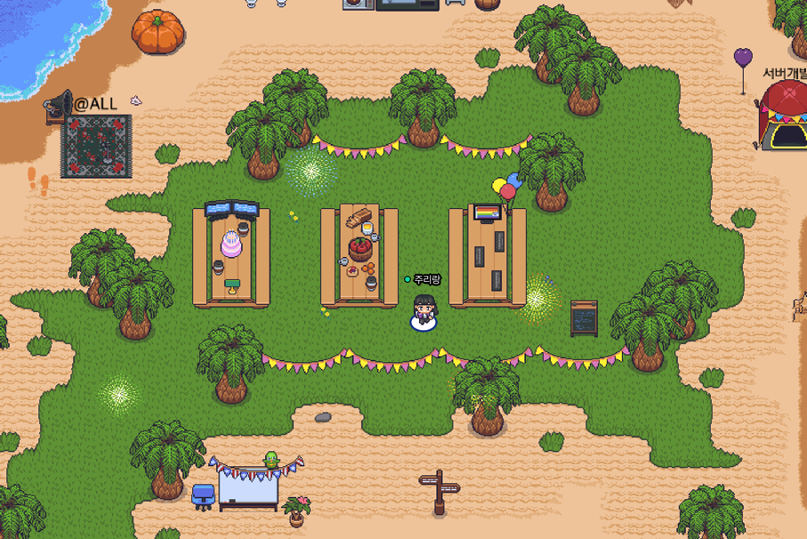
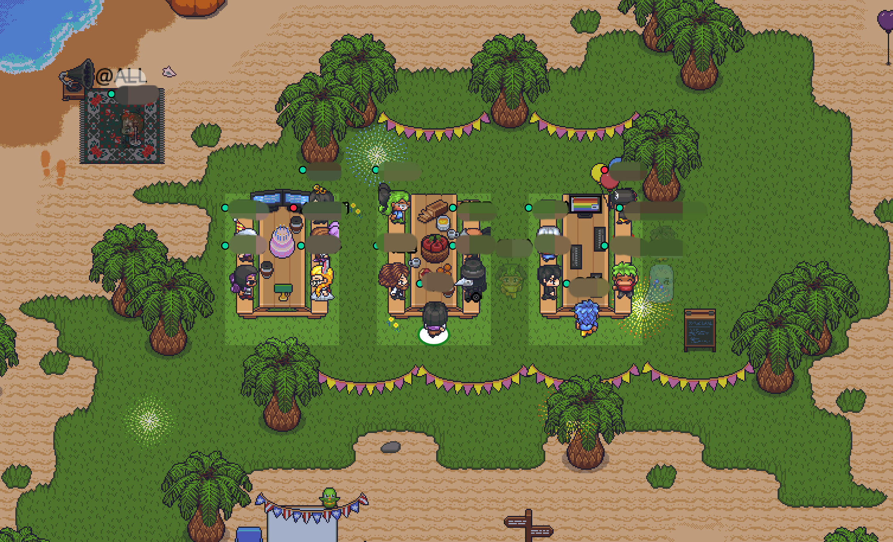
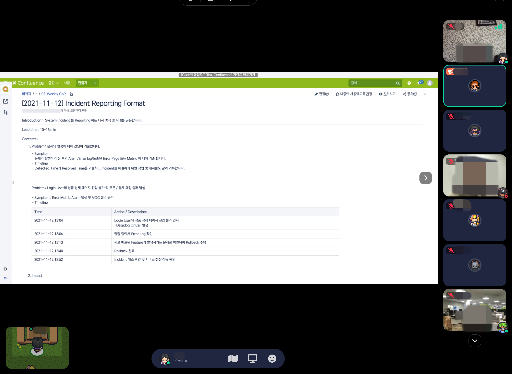
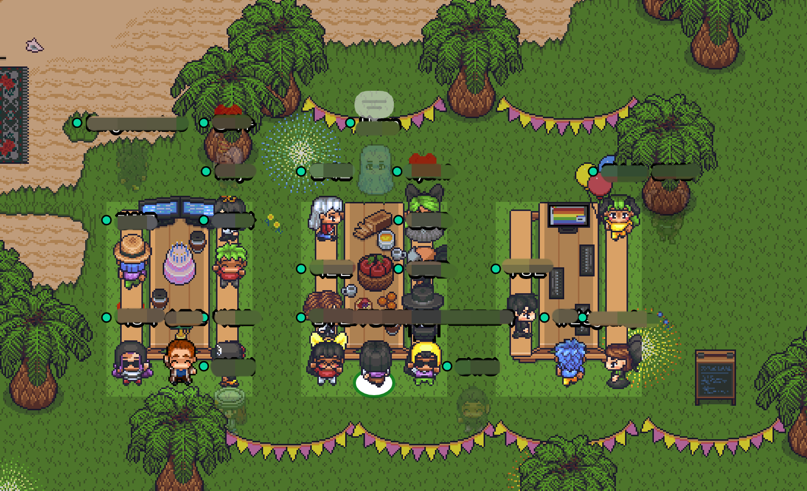

올-하 💚 안녕하세요! 올디브에서 프론트엔드 개발을 맡고 있는 주리랑입니다. 현재 올디브에서는 Tech Session 을 진행하고 있는데요! 제가 운영진으로 참여하여 진행하는
Friday Tech Sesison에 대해  이야기해보고자 합니다.
 

#### 올디브에서 하는 Tech Session은?
올디브에서 현재 사용하고 있는 혹은 앞으로 도입할 기술들 그리고 더 나아가 어떠한 업무 프로세스를 가질지 등 다양한 주제로 발표하는 Tech Sessoin 입니다.

그나저나 왜 Friday Tech Session인지 궁금하지 않으신가요? 저희는 금요일 5시에 (퇴근 전) 캐주얼하게 10-15분 정도 Tech Session을 운영하는 방향으로 결정했습니다 ㅎㅎ

그렇다면 올디브에서는 Tech Session을 어떻게 준비하고 진행할까요?

 

#### Friday Tech Session 준비 
현재 올디브는 자유롭게 재택근무를 진행하고 있는데요. 이러한 환경을 고려해서 저희는 게더타운에서 Tech Session을 진행하기로 결정했습니다!

저희는 기존에 게더타운을 통해서 화상회의, 스크럼 등 다양한 업무를 진행하고 있었는데요!

게더타운에서는 같은 공간에 있으면 화상회의와 자유로운 화면 공유도 가능합니다. 또한 어느 장소에 있더라도 발표자가 모두에게 화면 공유를 하며 발표를 할 수 있는 기능도 있습니다!
따라서 이 기능을 활용하여 Tech Session 을 진행하기로 하였습니다.

<figcaption>Tech Session을 위한 게더타운 꾸미기 완료!</figcaption>

이렇게 게더타운에서 Tech Session 을 발표할 준비가 완료됐습니다! 

 

#### 첫번재 Friday Tech Session 가보자고
🎉 첫번째 Tech Session의 주제는 바로바로 System Incident 를 Reporting 하는 방법입니다. 🎉

최근에 올디브의 구성원들이 이슈가 있으면 어떻게 Reporting을 하고 회고는 어떻게 하는게 좋을지에 대한 고민이 많았는데요! 
이러한 고민을 토대로 첫 주제를 <b>Issue Reporting & 회고</b>로 키워드로 잡았습니다.

따라서, 타사는 System Incident가 있을 때 어떤 양식을 사용하는지 공유하고, 올디브는 어떠한 방향으로 가는게 좋을지에 대한 내용을 얘기해보고자 합니다!

본격적인 Tech Session 시작 전 게더타운에 올디브의 구성원들이 모였습니다. 아래 사진의 ALL 공간에 있으면 모두에게 발표와 화면공유가 가능합니다!  
오늘의 발표자분꼐서 ALL 공간에서 준비를 하고 계시네요~!

<figcaption>Tech Session을 참석하기 위해 옹기종기 모인 올디브 구성원들</figcaption>

구성원들이 모여 Friday Tech Sessoin을 시작했습니다! 발표자분께서 화면 공유를 통해 발표를 진행하고 있는데요!

현재 올디브에서는 Confluence로 모든 문서를 작성하고 있습니다.  Session이 끝난 후에도 내용들은 다시 볼 수 있게 자료를 Confluence에 작성했습니다.
또한 작성한 문서를 토대로 발표를 진행하고 있습니다!

<figcaption>모두의 초상권은 소중합니다.</figcaption>

발표가 끝난 후 Q&A 시간을 진행했습니다. 

<figcaption>과연 유령은 무슨 질문을 했을까</figcaption>

#### Tech Session 진행 회고
이렇게 올디브의 첫번째 Tech Session 이 끝났습니다! 

비대면으로 진행을 하다보니 최대한 많은 구성원들이 불편함이 없도록 많은 부분들은 준비하고 테스트를 해보았는데요! 
실제로 세션을 진행하며 더 많은 인원들이 게더타운에 접속하다보니, 접속 오류나 소리가 들리지 않았던 점들이 있었습니다.
(테스트는 5명,,, 현재 올디브 구성원들은 43명,,,)

그래서 Tech Session을 진행하고 운영하며 겪었던 점을, Tech Session에서 공유된 방법대로 회고를 해보려고 합니다 ㅎㅎ

>1. Problem
   1. Symptom
      - 게더타운 내 ALL 공간에서 발표를 하면 발표자는 다른 구성원들의 소리가 들리지 않음
2. Impact
   1. 발표자의 질의응답 시간에 구성원들의 소리가 들리지 않아 구성원들의 공간으로 움직여 질의 응답 시간이 길어짐
3. Resolution
   1. 보다 큰 테이블을 배치해여, 테이블에 있는 발표자와 구성원들이 자유롭게 얘기하는 환경 구축

 

#### 마치며
오늘의 Tech Session 의 주제는 실수했다는 것을 자책하고 비판/비난하는 것이 아닌, 
문제가 있었던 점을 인정하고 그것이 어떤 이유였는지를 판단하여 더 좋은 방향으로 가기 위한 방법을 찾는 것이라고 생각을 했는데요! 위의 회고를 토대로 앞으로 올디브들의 다양한 생각과 기술들을 공유하는 Tech Session 을 더 잘 진행할 수 있을 것 같습니다:)  

또한 올디브는 Tech Session 을 지속적으로 진행하며 다양한 개발 경험과 기술 등을 공유할 예정입니다!

그럼 저는 다음에 더 좋은 글로 찾아뵙겠습니다! 다음에 또 만나요! 💚💚