출처 : UI/UX디자인팀
 
 

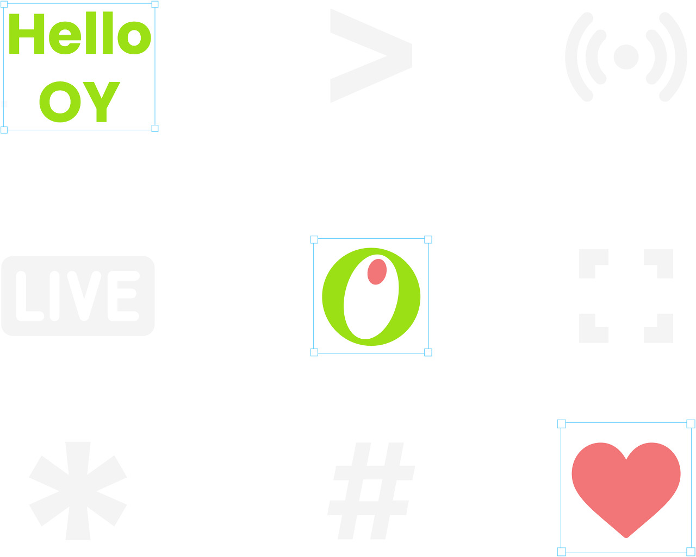
 
여러분은 첫 출근이라고 하면 어떤 것이 떠오르시나요?

앞으로 함께 할 회사와 팀원들에 대한 첫인상이 새겨지는 만큼 첫 출근날은 설렘과 걱정이 가득한 날이죠.   
기업에 새로 입사한 구성원에게 필요한 것은 단순 '웰컴' 뿐 아니라 동료와 조직 문화에
적응할 수 있도록 돕는 가이드일 거라 생각합니다.   
 
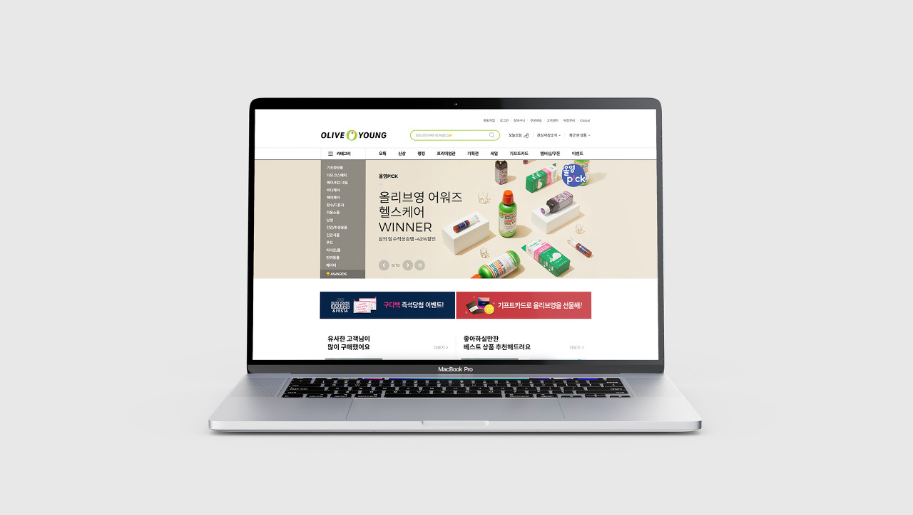 
 
최근, 온라인몰의 성장에 따라 많은 신규 구성원들이 올리브영 디지털사업본부에 입사하고 있습니다.  
새로운 모습으로 변화하는 본부를 기념하고 입사자들의 온보딩을 응원하기 위해
키트 제작 프로젝트에 돌입했습니다.   
 
 
## 디지털사업본부의 키트를 만들다

디지털사업본부 키트 제작 프로젝트에는 네 가지 목표가 있습니다.   
    
   

위 4가지 목표에 따라 신규 입사자에겐 환영을, 기존 구성원에겐 감사의 의미를 담은
두 가지 버전의 키트를 제작하기 때문에   
이를 통합하여 디지털사업본부 키트라고 부르기로 했습니다.   
 
 
## 디지털사업본부의 아이덴티티

올리브영은 온, 오프라인 채널을 통해 새로운 라이프스타일 상품과 쇼핑 경험을 제공하고 있습니다.

디지털사업본부는 그중 온라인 채널을 담당하고 있어요. 저희 본부는 데이터 분석, 온라인 콘텐츠 및
온라인몰 기획, UI/UX디자인, 개발 등   
IT 베이스의 다양한 팀들이 모여 고객의 니즈를 충족하는
라이프스타일 플랫폼을 만들고 있습니다.   
니즈에 발 빠르게 대응하기 위해
애자일한 업무 시스템을 구축했고, 효율적으로 업무할 수 있는 환경으로 변화하고 있습니다.
    

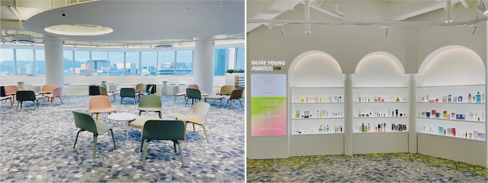   

몇 달 전 디지털사업본부 소통 프로그램에서, 본부를 한 가지 키워드로 표현해보는
설문을 진행한 적이 있습니다.   
그 결과, 많이 나온 답변 중 하나가 '수평적인 환경'이었습니다.
트렌디한 프로덕트는 수평적인 환경과 자유로운 분위기에서 나온다고 생각하는데요,   
누구나 적극적으로 자신의 의견을 개진하고, 할로윈 행사에 코스튬으로 자신의 개성을
자유롭게 표현하는 구성원들의 모습이 그 예라고 볼 수 있죠.

신규 입사자가 이러한 디지털사업본부의 문화에 적응할 수 있도록
본부 아이덴티티와 실용적 구성품을 담아 키트를 제작했습니다.

CJ 올리브영 디지털사업본부의 키트를 공개합니다!   
 
 
## 우리는 디지털사업본부입니다
 
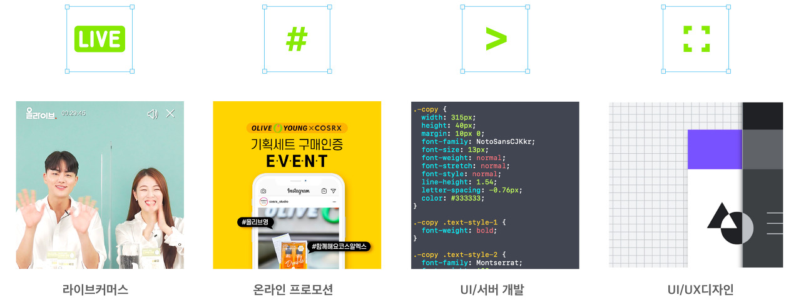
 
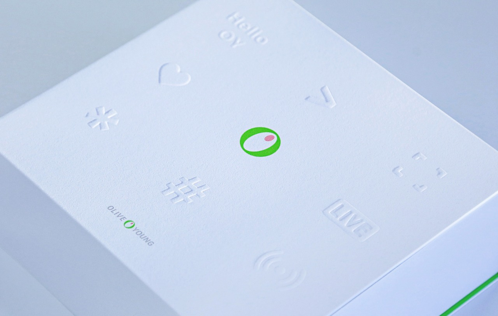   

 
IT가 기반인 본부의 아이덴티티를 키트에 담기 위해 아이콘 UI와 코드 기호 형상을 디자인 컨셉으로  
선정했습니다. 키트 상단의 라이브 커머스, 해시태그, 디자인 프레임, 코드 등은 다양한 팀으로 구성된   
디지털사업본부와 여러 서비스를 기반으로 성장하는 올리브영을 의미합니다.

올리브영 로고와 각 아이콘들이 구별이 되면서도 서로를 돋보이게 해주기 위해 형압을 활용했습니다.  
모든 구성품에 아이콘을 활용하고, 작은 안내도 코드로 표현하여 키트 곳곳에서
올리브영 디지털사업본부를 경험할 수 있도록 하였습니다.   
 
 
## 당신의 첫 발걸음이 한결 가벼울 수 있도록
 
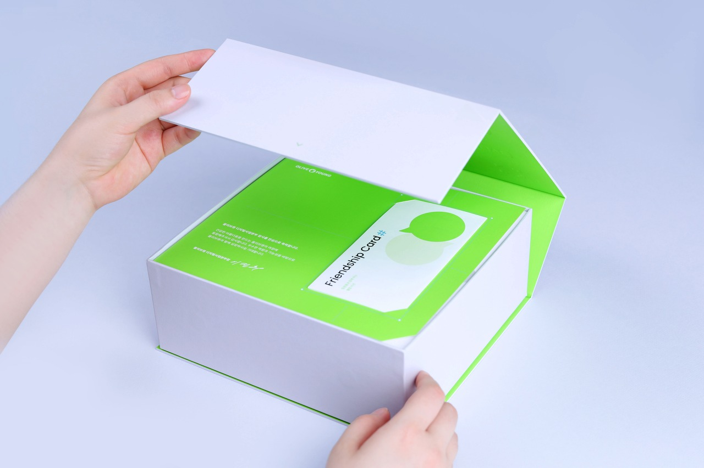
 
입사자 전용 키트를 열면 환영 문구와 함께 리플렛이 가장 먼저 보입니다.  
저희는 보다 재치있는 온보딩을 위해 리플렛과 가이드북을 제작했습니다.   

 
### Friendship Card

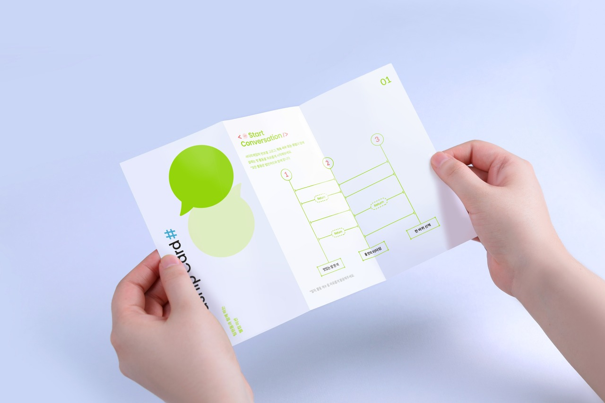
 
팀원들과의 시작을 돕는 리플렛으로 '프렌드십 카드'라고 이름 붙였습니다.
프렌드십 카드엔 두 가지 섹션이 있습니다.   
Start Conversation에는
'맛있는 밥 한 끼, 둘만의 티타임, 한 바퀴 산책'이 적힌 사다리 타기 게임이 있습니다.   
낯선 환경에서 신규 입사자가 구성원들과 자연스럽게 친해질 수 있는 계기를 제공합니다.

 
### MBTI Self Test

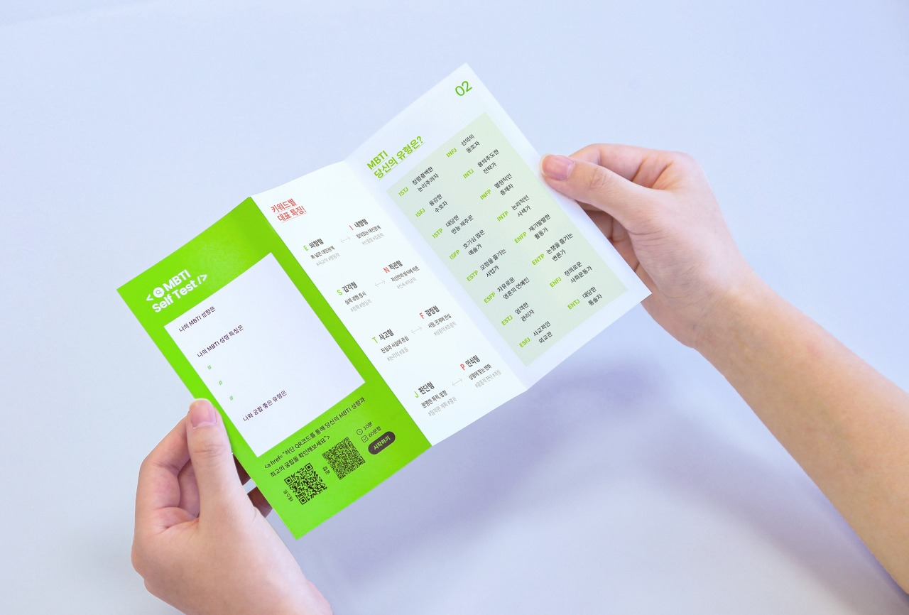
 
요즘 자기소개에 빠질 수 없는 게 바로 MBTI죠.
디지털사업본부의 MBTI에 대한 관심을 본부 곳곳에서 볼 수도 있답니다.   
Self MBTI Test는 MBTI라는 대화거리를 제공하는 역할을 합니다.
서로의 유형을 알고, 가장 궁합이 잘 맞는 팀원도 찾아보며 프렌드십을 쌓는 기회가 될 겁니다.   
 
 
### 올영생활백서

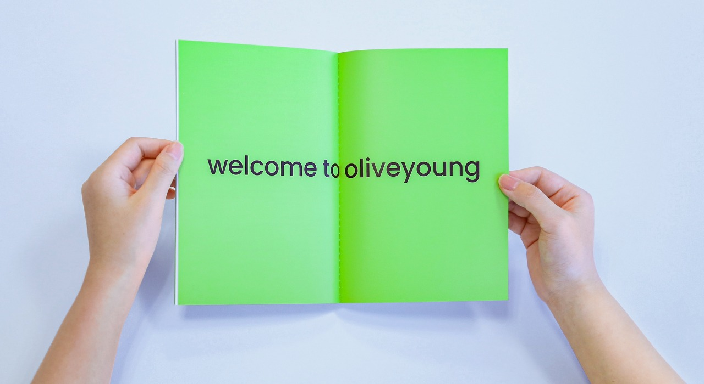
 
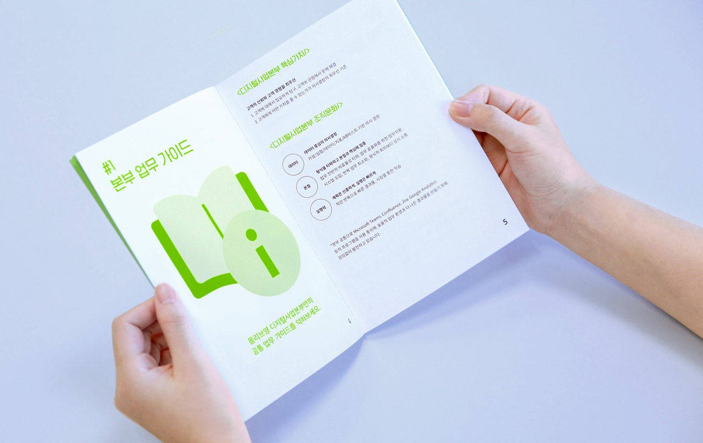
 
팀원들과의 만남 후 이제 조직 문화 적응이 필요하겠죠?  
리플렛이 꽂힌 간지를 들면 올영생활백서라는 가이드북이 보입니다.   
 
일반적인 가이드북이 아닌 기존 구성원들의 경험을 기반으로 입사 초기 가장 헷갈렸거나
알아두면 좋은 팁들을 모아둔 생활백서입니다.   
메일 서명을 넣는 방법, 생활 보안 준수 방법,
복지 포인트로 5성급 호텔 이용하는 방법, 제휴 음식점 리스트 등 다양한 꿀팁들이 있습니다.
 
 
### Sticker Pack

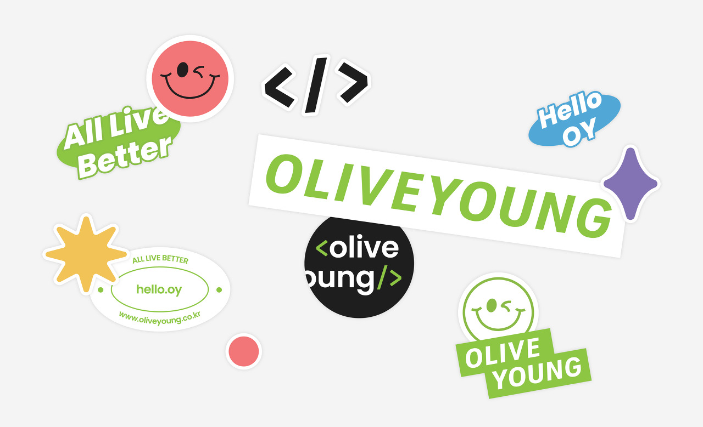
 
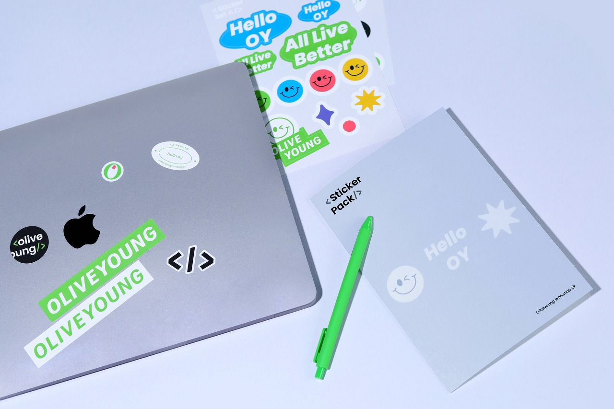
 
가이드북과 함께 디지털사업본부를 표현한 리무버블 스티커도 준비했답니다.   
깔끔하게 뗄 수 있는 스티커로 제작했으니 자유롭게 사무용품을 꾸미고 자신의 개성을 표현해보세요!   
 
 

## 올리브영답게, 디사본답게

올리브영  디지털사업본부는  한  가지 핵심  가치와  세  가지 조직 문화를 주축으로 운영되고 있습니다.
그  중  일부를  선별하여  키트에  메세지로  담았습니다.

### Think User Experience

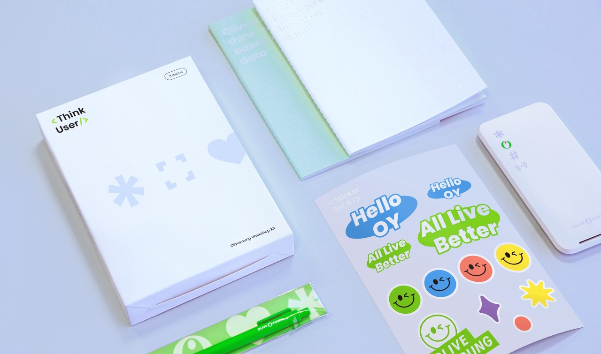
 
**사용자  경험에  대한  새로운  아이디어를  놓치지  말자 &#124; 노트 2권과  펜**

라이프스타일  시장에서  문제를  해결하고  차별화된  경험을  제공하기  위해선  아이디어  공유와  실현이  가장  중요합니다.   
올리브영  디지털사업본부는  투명하고  자유로운  업무  시스템을  위해  애자일  환경을  구축  및  개선해나가고  있습니다.   
구성원  모두  고객  경험을  위한  아이디어를  자유롭게  제안하고  주체적으로  업무를  수행하는데  도움이  되었으면  좋겠습니다.

 
**온라인몰에  대해  끊임없이  관찰할  수  있도록 &#124; 버티컬  무선  충전  패드**

디지털사업본부가  가장  중요하게  여기는  가치는  고객  즉, 유저입니다.   
우리는  유저가  어떤  니즈를  갖고  있는지  집요하게  탐구하고  데이터를  기반으로  문제를  해결하고  있습니다.   
무선  충전  패드는  온라인몰을  이용하는  유저  데이터와  방전되지  않는  구성원들의  열정을  의미합니다.
 
 
### Clear Communication in Work

 
**노트북으로  언제, 어디서나  소통할  수  있도록 &#124; 마우스패드**

올리브영  디지털사업본부는  형식을  타파하고  본질에  집중하는  것을  지향하고  있습니다.   
커뮤니케이션도  마찬가지랍니다. 많은  기업에서  불필요한  페이퍼  워크로  인해  업무  진행에  불편을  겪고  있습니다.   
저희는  문제와  현황에  신속히  대응하기  위해  불필요한  문서작업이나  포멀한  회의를  줄이고,   
상시  소통을  할  수  있도록  업무  환경을  개선하고  있습니다.

 
**클리어한  만남과  소통이  유지되도록 &#124; 휴대용  손소독제**

투명한  업무  진행과  명확한  소통을  위해 Confluence, Jira 등의  툴을  활용하고  있습니다.   
팀  내외적으로  업무  진행  상황이  공유되기  때문에  업무  효율  증가뿐  아니라   
재택이나  거점  오피스의  비대면  근무  환경에서도  원활하게  협업할  수  있습니다.

 
**상처를  주지  않는  부드러운  의사소통을  지향하며 &#124; 핸드크림**

배려와  이해는  팀워크를  다지고  좋은  결과물을  만드는  중요한  힘입니다.   
문제  해결과  혁신을  위해  각자  자신의  자리에서  최선을  다하고  있다는  점을  이해하고   
부드러운  의사소통하는  것은  지향하고  있습니다.

 

### Keep Your Health and Beauty
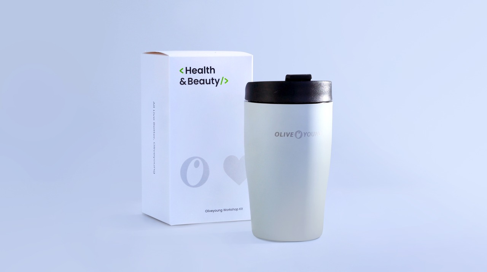
 
**뛰어난  성과는  건강한  몸과  마음에서부터 &#124; 텀블러**

각자에게  맞는  라이프스타일과  적절한  휴식은  뛰어난  성과를  만드는  힘입니다. 올리브영은  오전 8~10시  사이에  출근,   
오후 5~7시  사이에  퇴근하는  탄력근무제와  주 40시간  내  근무시간을  자유롭게  조정하는  유연근무제를  시행하고  있습니다.   
그  뿐  아니라  눈치  보지  않고  사용하는  연차, 장기근속자를  위한 2주  유급  휴가  제공합니다.   
건강한  몸과  에너지로  더  나은  고객  경험을  만들  수  있기를  응원합니다.

 
 

## All Live Better, Oliveyoung
 
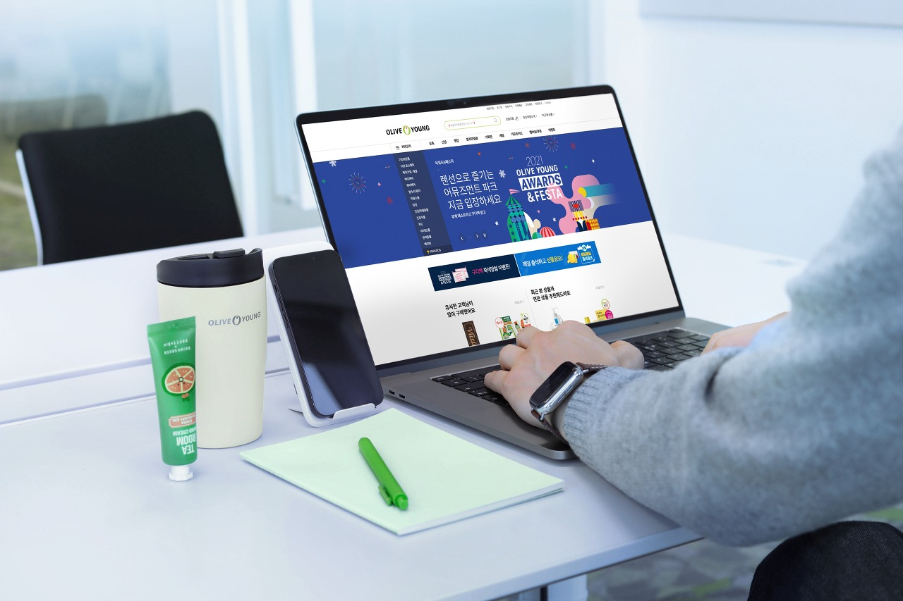
 
올리브영  디지털사업본부의  정체성을  담아  제작한  키트는  본부  구성원들과  입사자들에게  전달되었습니다.   
앞으로  더욱  성장하는  디지털사업본부를  함께  만들어  나가면  좋겠습니다!

---

All Live Better이라는  슬로건  하에  새로운  라이프스타일  플랫폼을  만들어나가는   
올리브영의  여정에  함께  하실  분들은  채용  페이지와  블로그를  확인해주세요!

 
 
[CJ 채용페이지 바로가기](https://recruit.cj.net/)

[원티드 바로가기](https://www.wanted.co.kr/company/23419)

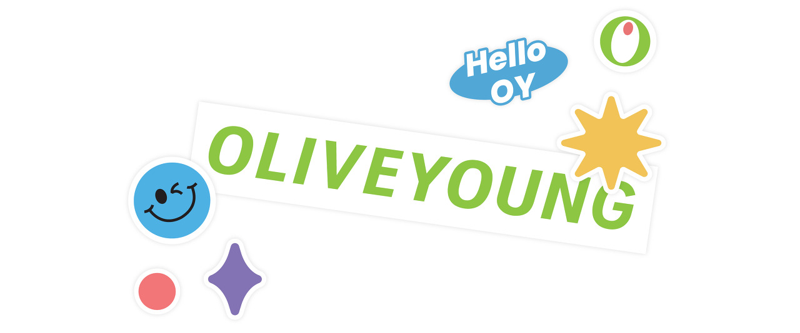