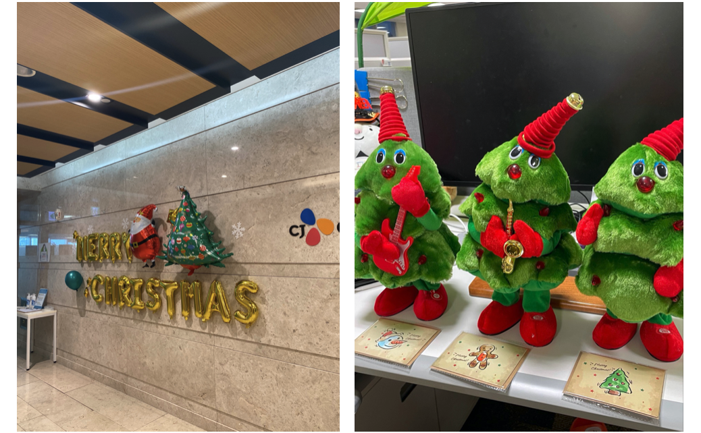
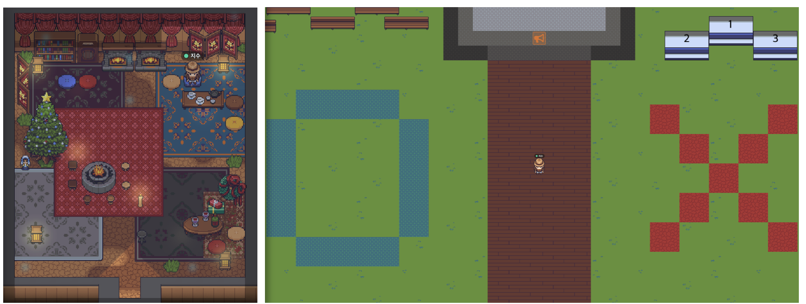
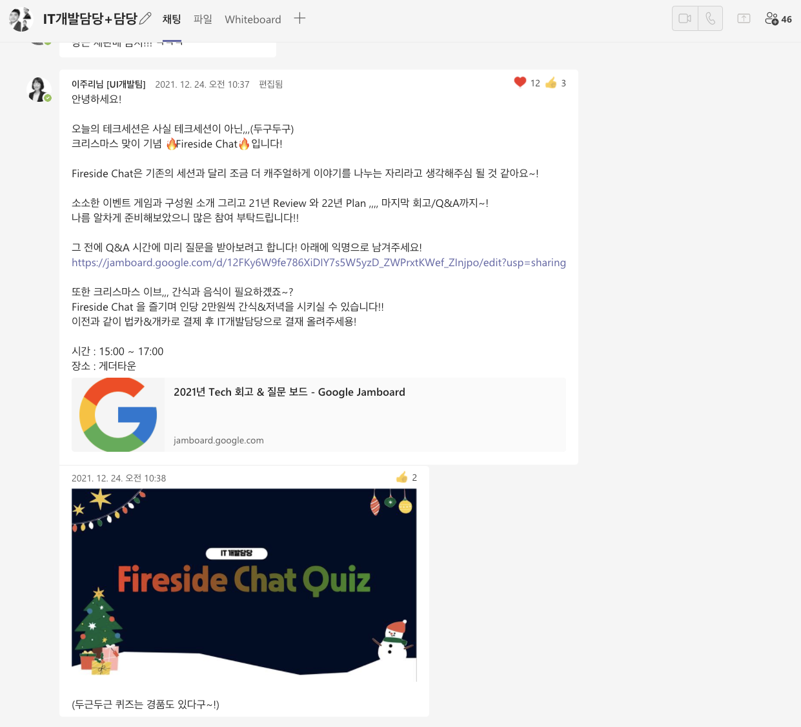
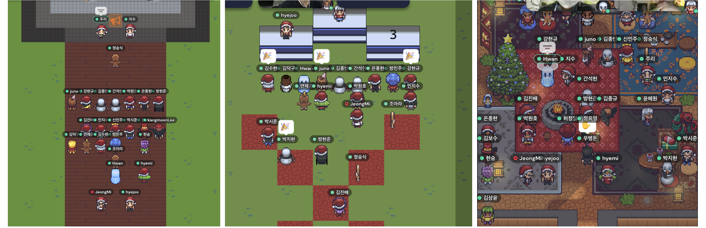
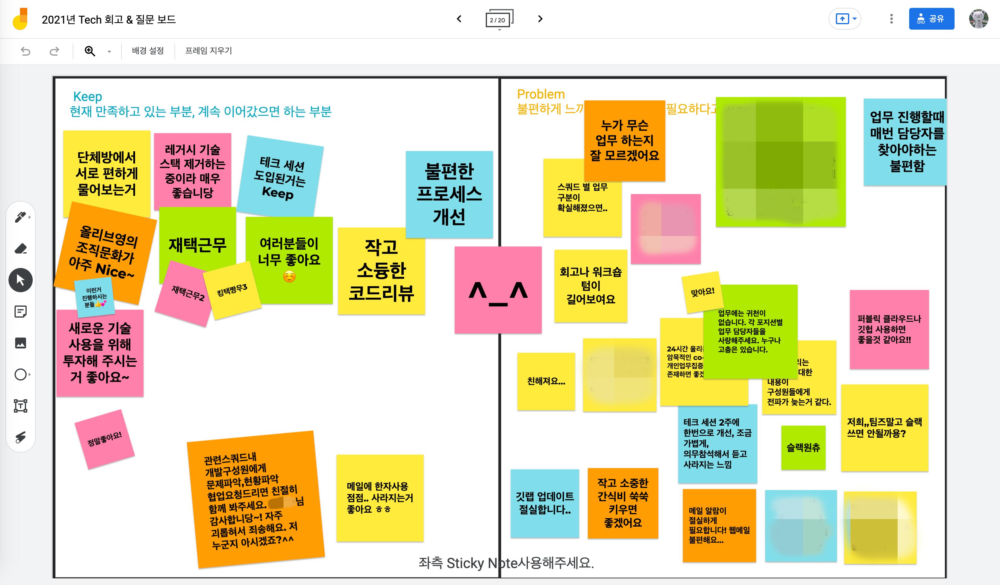

올-하 💚 안녕하세요! 올디브에서 프론트엔드 개발을 맡고 있는 주리랑입니다. 

어느새 2021년이 지나고 2022년 새해가 찾아왔습니다. 
2021년 한 해 모든 올디브 구성원들 그리고 올디브에 관심을 가져주시고 기술 블로그를 찾아주셨던 여러분 모두 감사하다는 말씀 드리고 싶습니다 :)
또한 2022년에는 많은 포스팅과 다양한 변화가 있을 예정이기에 앞으로도 많관부 ~ 💚

다가오는 2022년을 잘 맞이하고 더욱 더 즐겁게 개발하기 위해서는 2021년에 어떤 일이 있었는지 돌아보는 것이 중요하다고 생각하는데요!
그래서 2021년에는 올디브에 어떤 일이 있었는지 한번 알아보고자 합니다. 

 

### 올디브의 2021년은?
2021년은 올디브에게 많은 변화가 있었던 한 해였습니다. 어떤 변화가 있었는지 알아볼까요?
 
#### 1. 채용
뭐니 뭐니 해도 가장 큰 변화는 역시나 많은 분이 올디브에 합류를 해주신 것입니다!
 요즘 좋은 동료가 최고의 복지라는 말이 있는 것처럼 2021년도에는 정말 좋은 분들이 올디브의 구성원으로 합류해주셨습니다.

또한 iOS/Android App 개발, DBA, QA Manager, 퍼블리셔, DevOps 등 다양한 직군과 기존 Back-end/Front-end 개발자분들도 채용을 많이 진행했습니다.
 더욱더 막강해진 올디브는 현재 정말 많은 것들을 준비하고 있습니다 🔥 

#### 2. 올영세일 
매년 올리브영은 총 4번의 올영세일을 진행합니다. 오프라인/온라인 모두 진행하게 되는데요!

온라인몰을 담당하고 있는 올디브들의 노력은 특히나 올영세일 때 빛을 발했습니다. 사용자들이 올영세일 때 더 편하게 쇼핑을 즐길 수 있도록 인프라, 서버, 화면 등등 개선 작업을 수행했습니다. 또한 좋은 기획과 마케팅을 토대로 여러 협업 부서와 온라인몰 사용성 증대를 위해 열심히 달려왔습니다.

많은 분의 노력 때문일까요? 2021년 올영세일은 매번 기네스를 달성하며 좋은 성과를 보였습니다. 기네스를 달성할 때마다 올디브들도 다음 세일을 기대하며 더욱더 열심히 개선할 수 있었던 것 같습니다!

2022년의 올영세일도 더욱더 잘될 것이라 믿으며 올디브들도 성능 개선을 위해 지금도 힘을 쓰고 있습니다!

#### 3. 업무&조직의 변화
개발조직뿐만이 아닌 PO, 디자인 등 조금 더 기능적인 조직 그리고 업무 방식을 바꾸기 위해 함께 노력했습니다.

2021년부터는 <strong>Squad</strong>라는 조직으로 PO와 개발자, 디자이너가 Agile 하게 업무를 진행하고자 했습니다.
Agile 하게 업무를 진행하는 것이 다들 처음이었기에 Agile 코치를 섭외하여 코칭도 받고 다양한 시도를 해보았습니다.  

또한 Confluence를 통해 문서를 작성하여 히스토리를 관리하며 조금 더 업무의 효율성을 높였습니다. Jira를 사용하여 모든 협업부서가 개발 건에 대해 이슈 관리를 진행하였습니다.

이렇게 적고 보니 작년에 정말 많은 시도를 했었는데요. 다들 이러한 시도를 거리낌 없이 시행하고 더 나아가 아이디어를 내면서 우리가 할 수 있는 좋은 방식은 무엇인가를 고민했던 것 같습니다.

2022년에도 효율적이고 다 같이 즐겁게 일하기 위해 올디브뿐만 아니라 본부 내에서도 여러 시도를 진행할 예정입니다!

 
### 올디브만의 Party
이렇게 2021년 무엇을 했나 한번 돌아보았는데요. 많은 것들을 시도해보고 좋은 성과를 얻었던 것 같습니다. 숨 가쁘게 달려온 2021년의 올디브! 연말을 맞아 맛있는 것도 먹고 즐겁게 얘기하는 시간이 필요할 것 같은데요!

그래서 바로바로 올디브만의 파티인 🔥Fireside Chat🔥 을 진행하기로 했습니다!

<figcaption>쓸쓸한 회사는 트리삼형제와 산타&루돌프가 지킵니다</figcaption>

#### Fireside Chat
올디브만의 Party 컨셉은 <strong>🔥Fireside Chat🔥 </strong>입니다!

저는 연말과 크리스마스라는 단어를 생각하면 한 손에는 코코아,, 그리고 따뜻한 모닥불을 보며 이야기를 나누는 모습이 연상이 되는데요.
여기서 착안하여 올디브의 구성원들과 따뜻한 게더타운의 공간에서 여러 이야기를 캐주얼하게 나누는 컨셉을 잡았습니다!

또한 단순히 이야기만 하는 것은 재미없잖아요! 다양한 게임을 통해 구성원들의 친밀도도 높이고 TMI도 알아가고 더불어 여러 경품도 받아갈 수 있는 깜짝 이벤트도 준비했답니다. 
물론 2021년 올디브의 좋았던 점, 개선할 점 등을 얘기하는 회고시간과 리더분들에게 궁금한 점을 물어보는 시간도 있답니다 :)

그 전에 물론 당연히 게더타운을 꾸미러 가봅니다 ..! 

<figcaption>올디브에는 게꾸 장인이 있습니다.</figcaption>

불멍할 수 있는 따뜻한 공간과 OX 퀴즈를 위한 공간까지 모두 준비가 되었습니다! 
올디브에게 공지 후 본격적인 Fireside Chat을 시작해봅니다.

 

<figcaption>Tech Session을 가장한 즐거운 Fireside Chat</figcaption>

<figcaption>회고 전 다양한 이벤트로 분위기를 Up! Up!</figcaption>

 

다같이 핸드폰으로 게임도 하고 OX Quiz 도 풀며 아이스브레이킹을 진행했습니다. 이후 2021년 Tech 회고시간과 Q&A 시간을 가지며 그간 궁금했던 부분들 그리고 무엇을 진행했는지 되돌아보았습니다.
특히 회고시간에는 각 구성원들의 느낀점, 좋았던 점 그리고 불편했던 점을 다같이 이야기 했습니다. 올디브들이 어떤 생각을 가지고 있는지 그리고 어떤 것을 해보고 싶은지를 알 수 있었던 뜻깊은 시간이었습니다 :)

이렇게 모든 올디브 구성원들과 함께 Fireside Chat을 진행하며 2021년의 마지막을 마무리 할 수 있었습니다.

 

### 마무리
각자의 자리에서 그리고 또 다 같이 열심히 달려온 올디브 구성원들을 위해 잠깐이지만 즐겁게 지냈으면 하는 바람으로 준비한 Fireside Chat! 2022년에는 더욱더 즐겁게 개발하며 더욱더 성장할 올디브를 기대해주세요 :)

그럼 저는 다음에 더 좋은 글로 찾아뵙겠습니다! 다음에 또 만나요! 💚💚